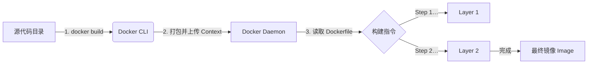

## 0. 机制

`docker build` 是将**代码**转化为**镜像**的编译过程。

它的核心工作流是 C/S 架构（客户端 - 服务器）：

1. **打包上下文**：Docker CLI 会将指定目录下的所有文件打包（类似 zip）。
2. **发送传输**：将打包好的文件发送给 Docker Daemon（守护进程）。
3. **逐层构建**：Daemon 读取 `Dockerfile`，按照指令一步步执行，每一步生成一个缓存层。



---

## 1. 基础命令标准

最常用的构建命令格式如下，切记不要漏掉最后的点。

```bash
# 格式：docker build -t [名称:标签] [上下文路径]
docker build -t my-app:v1.0 .
```

| 参数部分 | 说明 |
| :--- | :--- |
| `-t my-app:v1.0` | **Tag (打标)**：指定生成镜像的名称和版本。如果不写标签，默认是 `latest`。 |
| `.` | **Context (上下文)**：告诉 Docker 在哪个目录下寻找文件。**非常重要**。 |
| `-f Dockerfile.dev` | **File (指定文件)**：默认读取名为 `Dockerfile` 的文件。如果你的文件叫 `Dockerfile.dev`，需用此参数指定。 |

---

## 2. 构建上下文 (Context)

初学者最容易误解的概念是命令最后的那个 `.`。

它不是指 Dockerfile 所在的目录，而是指**构建上下文的根目录**。

**场景**：你的项目里有一个 2GB 的 `video.mp4` 测试文件，虽然你的 Dockerfile 里根本没用到它（没写 `COPY video.mp4 …`），但执行 `docker build .` 时依然非常慢。

**原因**：Docker CLI 会先把当前目录下**所有**文件打包发送给 Docker Daemon。

**解决**：使用 `.dockerignore` 文件。

**最佳实践**：
在项目根目录新建 `.dockerignore`（语法类似 `.gitignore`）：

```text
.git
node_modules
*.mp4
temp/
```

---

## 3. 缓存利用技巧

构建速度快不快，全看缓存用得好不好。Docker 会检查每一行指令，如果指令没变且文件没变，就直接使用之前的缓存层（Using cache）。

**失效规则**：一旦某一层发生变化，它**之后的所有层**缓存全部失效，必须重新运行。

**优化案例 (Node.js/Python)**：
**错误写法**（代码改动会导致依赖重新安装）：

```dockerfile
COPY . .
RUN npm install  # 代码一改，COPY 层变了，这一层也被迫重跑，浪费时间
```

**正确写法**（依赖层独立缓存）：

```dockerfile
COPY package.json .
RUN npm install  # 只要 package.json 没变，这层直接用缓存，秒过
COPY . .         # 只有这里会重新执行
```

---

## 4. 构建参数 (ARG)

有时我们需要在构建时传入动态参数，比如版本号或临时的代理地址，但又不想写死在 Dockerfile 里。

**Dockerfile 写法**：

```dockerfile
# 定义参数，可设置默认值
ARG APP_VERSION=1.0
RUN echo "Building version $APP_VERSION"
```

**命令行传参**：

```bash
# 覆盖默认值
docker build --build-arg APP_VERSION=2.5 -t my-app:2.5 .
```

**注意**：`ARG` 仅在构建（Build）阶段有效，容器运行（Run）时就没了。如果要在运行时使用，需要配合 `ENV`。

---

## 5. 多阶段构建 (Multi-stage)

这是生产环境瘦身镜像的关键。

**场景**：Golang 或 Java 项目，编译环境需要安装几百 MB 的编译器（GCC, Maven），但最终运行只需要一个几 MB 的二进制文件。

**解决方案**：在一个 Dockerfile 里写两个 `FROM`。前一个负责编译，后一个负责运行，只把编译结果拿过来。

```dockerfile
# --- 第一阶段：编译者 ---
FROM golang:1.19 AS builder
WORKDIR /app
COPY . .
# 编译出二进制文件 my-server
RUN go build -o my-server main.go

# --- 第二阶段：运行者 ---
# 使用极小的基础镜像 (Alpine)
FROM alpine:latest
WORKDIR /root/
# 关键操作：只从 builder 阶段复制编译好的文件，丢弃源代码和编译器
COPY --from=builder /app/my-server .
CMD ["./my-server"]
```

**效果**：镜像体积从 800MB (Golang 环境) 缩减到 10MB (Alpine + 二进制)。
