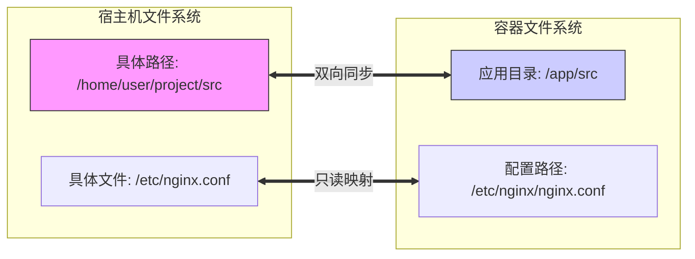

## 0. 机制

Bind Mount（绑定挂载）是将宿主机的 **任意文件或目录** 直接映射到容器内部。

- **特点**：完全由用户控制宿主机的具体路径。
- **区别**：与 Volume（由 Docker 自动管理路径）不同，Bind Mount 依赖于宿主机的文件系统结构。
- **覆盖逻辑**：如果容器内的挂载点原本有文件，挂载后会被宿主机的文件**遮挡（Shadowing）**，就像把一张新地毯铺在了地板上。



---

## 1. 基础语法与规则

使用 `-v` 或 `--volume` 参数，格式遵循严格的 `宿主机路径:容器路径:选项`。

**关键规则**：
1. **绝对路径**：宿主机路径必须是绝对路径（如 `/home/user/…`），不能是相对路径。通常配合 `$(pwd)` 使用。
2. **自动创建**：如果宿主机路径不存在，Docker 会自动创建一个（通常是 root 权限的空目录），这往往是导致错误的根源。

| 组成部分 | 说明 | 示例 |
| :--- | :--- | :--- |
| **源路径** | 宿主机上的实际位置 | `$(pwd)/src` 或 `/opt/data` |
| **目标路径** | 容器内的挂载点 | `/app` 或 `/etc/mysql/my.cnf` |
| **选项** | 读写权限控制 (可选) | `ro` (只读), `rw` (默认读写) |

---

## 2. 核心场景 A：开发环境代码热更新

这是 Bind Mount 最好用的应用场景。

**痛点**：每次改一行代码都要 `docker build` 重新打镜像，效率极低。

**解法**：将本地代码目录挂载进容器。你在 IDE 里保存代码，容器里立即生效（配合 Nodemon/Django 等的热重载功能）。

```bash
# 进入项目根目录
cd my-node-project

# 启动开发容器
# -v $(pwd):/app  -> 将当前目录挂载到容器的 /app
# -w /app         -> 设置工作目录为 /app
docker run -d \
  --name dev-server \
  -p 3000:3000 \
  -v $(pwd):/app \
  -w /app \
  node:18 npm start
```

---

## 3. 核心场景 B：单文件配置注入

有时我们不需要挂载整个目录，只想替换某个特定的配置文件。

**场景**：修改 Nginx 的默认配置，但不想重新构建镜像。

```bash
# 仅仅替换 nginx.conf，并设置为只读 (:ro)
# 防止容器内的进程意外修改了宿主机的原文件
docker run -d \
  --name my-nginx \
  -v /home/ops/nginx.conf:/etc/nginx/nginx.conf:ro \
  nginx
```

---

## 4. Docker in Docker

很多 CI/CD 工具（如 Jenkins, Portainer）需要操作 Docker 自身。

通过挂载 **Docker Socket**，可以让容器内的进程控制宿主机的 Docker 守护进程。

```bash
# 将宿主机的 Docker 通信管道挂载进去
docker run -d \
  -v /var/run/docker.sock:/var/run/docker.sock \
  portainer/portainer
```

*警示：这意味着容器获得了宿主机的 root 级控制权，务必谨慎使用。*

---

## 5. 常见坑点

### 坑点 1：原有文件消失了

- **现象**：容器镜像里原本在 `/app` 下有代码，挂载了本地的一个空目录 `$(pwd)/empty` 到 `/app` 后，容器里变成空的了，应用启动报错。
- **原因**：Bind Mount 的**遮挡机制**。宿主机的目录（即使是空的）会覆盖容器内的对应目录。
- **解决**：确保挂载的宿主机目录里有完整的文件，或者不要覆盖关键的系统目录。

### 坑点 2：权限拒绝 (Permission Denied)

**现象**：容器启动报错 `touch: cannot touch '/app/log': Permission denied`。

**原因**：
- 宿主机目录属于用户 A (uid=1000)。
- 容器内进程属于用户 B (uid=999 或 root)。
- Docker 进程无法将数据写入宿主机目录。

**解决**：
1. **开发环境**：简单粗暴地给宿主机目录放权，不推荐生产环境使用。

	```bash
    chmod -R 777 ./logs
    ```

2. **生产环境**：在 Dockerfile 中创建与宿主机 UID 相同的用户，或启动时指定 UID。

	```bash
    # 以当前用户的 ID 启动容器
    docker run -u $(id -u):$(id -g) -v …
    ```

### 坑点 3：Windows 路径问题

在 Windows (Git Bash / PowerShell) 下，路径格式与 Linux 不同。

- **Git Bash**: 需使用双斜杠 `//c/Users/…` 或防止转义。
- **PowerShell**: `$(pwd)` 获取的对象可能包含换行符，建议使用 `${PWD}`。

	```powershell
    docker run -v ${PWD}:/app …
    ```
