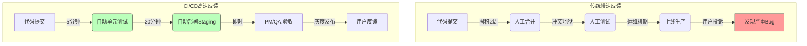

## 0. 核心价值

CI/CD 的本质不只是自动化，而是**时间压缩**。它致力于将错误发现的时间点从 " 数周后 " 前移至 " 数分钟内 "。

$$
\text{Value} = \frac{\text{Code Quality}}{\text{Feedback Latency}}
$$

- **传统模式**：开发 -> 囤积代码 -> 痛苦合并 -> 人工部署 -> 发现 Bug。
- **CI/CD 模式**：提交 -> 自动测试 -> 自动部署 -> 实时反馈。

---

## 1. 流程对比可视化

使用 Mermaid 展示反馈环是如何被物理缩短的：



---

## 2. CI：开发侧反馈

**持续集成 (Continuous Integration)** 解决的是 " 代码能不能跑 " 的问题。

- **场景**：刚写完一个核心函数，但不小心引入了一个空指针异常。
- **无 CI**：QA 两天后测出来，得重新回忆两天前的逻辑，上下文切换成本极高。
- **有 CI**：提交代码后 3 分钟，Slack/钉钉 机器人报警：" 构建失败 "。还没切换窗口，直接顺手修了。

**关键原则**：
1. **主干健康**：CI 挂了是最高优先级事故，必须立即修复或回滚，严禁在 CI 挂红时提交新代码。
2. **速度至上**：集成反馈必须在 **10 分钟** 内完成，否则开发者会失去等待的耐心。

---

## 3. CD：业务侧反馈

**持续交付/部署 (Continuous Delivery/Deployment)** 解决的是 " 用户觉得好不好用 " 的问题。这里有两个容易混淆的概念：

| 概念 | 持续交付 (Delivery) | 持续部署 (Deployment) |
| :--- | :--- | :--- |
| **定义** | 代码随时**可**发布 | 代码通过测试即**自动**发布 |
| **最后一步** | 人工点击 " 部署 " 按钮 | 自动化流水线完成 |
| **适用场景** | 企业软件、App (需审核)、复杂系统 | SaaS、Web 网站、微服务 |
| **反馈对象** | 内部 QA、产品经理 (UAT 环境) | 真实用户 (生产环境) |

---

## 4. 流水线配置实战

以 GitHub Actions 为例，展示一个完整的自动化反馈链路代码：

```yaml
name: CI/CD Pipeline

on: [push] # 触发条件：任何代码提交

jobs:
  build-and-test:
    runs-on: ubuntu-latest
    steps:
      # 1. 获取代码
      - uses: actions/checkout@v3
      
      # 2. 环境准备 (反馈速度优化点：利用缓存)
      - name: Setup Node
        uses: actions/setup-node@v3
        with:
          node-version: '18'
          cache: 'npm'
          
      # 3. 快速反馈层：静态检查 & 单元测试
      - run: npm ci
      - run: npm run lint  # 格式检查
      - run: npm test      # 逻辑检查

  deploy-staging:
    needs: build-and-test # 只有测试通过才部署
    if: github.ref == 'refs/heads/main'
    runs-on: ubuntu-latest
    steps:
      # 4. 业务反馈层：自动部署到测试环境
      - name: Deploy to Staging
        run: ./deploy.sh staging
        env:
          API_KEY: ${{ secrets.STAGING_KEY }}
      
      # 5. 通知反馈：发送消息到聊天软件
      - name: Notify Team
        run: curl -X POST -d '{"text":"🚀 Staging 环境已更新，请验收!"}' ${{ secrets.SLACK_WEBHOOK }}
```

---

## 5. 效能度量标准 (DORA)

如果不能度量，就无法改进。Google DORA 团队提出的四个黄金指标，直接反映了反馈环的效率：

1. **部署频率**：
	- *含义*：多久发一次？
	- *目标*：按需发布。
2. **变更前置时间**：
	- *含义*：代码从 Commit 到跑在生产环境需要多久？
	- *目标*：< 1 小时。**这是反馈环最核心的物理长度。**
3. **变更失败率**：
	- *含义*：部署后导致服务不可用的比例。
	- *目标*：< 15%。
4. **平均恢复时间 (MTTR)**：
	- *含义*：搞挂了多久能修好？
	- *目标*：< 1 小时（依赖快速回滚能力）。
