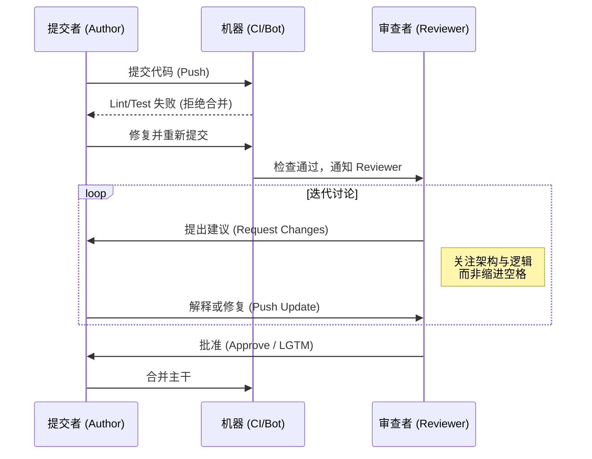

## 0. 人机职责

在人工介入之前，必须先通过机器过滤。

| 检查层级    | 执行者           | 关注内容                    | 典型工具                        |
| :------ | :------------ | :---------------------- | :-------------------------- |
| **基础层** | CI/Pre-commit | 格式化、拼写、未使用的变量、基础类型错误    | Eslint, Prettier, SonarQube |
| **逻辑层** | 单元测试          | 核心算法正确性、边界条件、异常处理       | Jest, JUnit, Go Test        |
| **架构层** | **Reviewer**  | 可读性、可扩展性、设计模式、安全性、命名准确性 | **人工审查**                    |

---

## 1. 提交流程规范

高质量的 PR 是高效审查的前提。一个 PR 最好只专注解决一个问题。超过 400 行代码的变更，审查效果会断崖式下跌。

**标准 PR 描述模板**：拒绝 "Fix bug" 这种毫无意义的描述。

```markdown
## 变更背景 (Why)
用户在弱网环境下点击支付会导致双重扣款。

## 解决方案 (How)
1. 引入幂等 Key (`idempotency_key`) 机制。
2. 支付按钮点击后立即 Disable。

## 影响范围 (Scope)
- 涉及模块：支付网关、前端 Checkout 页面
- 数据库变更：无

## 测试截图 (Evidence)
[GIF/截图：展示防抖动效果]
```

---

## 2. 审查交互流

使用 Mermaid 展示一个健康的 CR 闭环流程：



---

## 3. 评论沟通

CR 是异步沟通，文字没有语气，容易引发防御心理。

### 场景一：指出代码问题

- **暴力沟通**: " 你这写的什么垃圾？这里会空指针异常。"
- **非暴力沟通**: " 这里如果没有数据返回，`user.id` 可能会抛出异常。建议加一个 `Optional` 判空处理，你觉得呢？"

### 场景二：区分阻塞与非阻塞

使用前缀标明严重程度，提高效率。

```text
[Blocker] 这里的 SQL 没有索引，上线会拖垮数据库，必须修复。
[Nit] (Nitpick) 变量名 user_list 建议改为 users，不改也可以合并。
[Question] 这里为什么要用递归？有没有考虑栈溢出的风险？
```

### 代码演示：重构建议

直接给出代码片段往往比文字描述更清晰。

```javascript
// Reviewer 建议：
// 可以使用 lodash 的 get 方法简化层级判断
// const id = _.get(response, 'data.user.id', null);

if (response && response.data && response.data.user) {
  const id = response.data.user.id;
  // …
}
```
