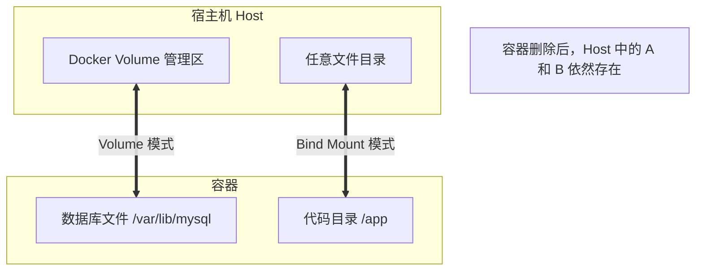

# Docker Volume (数据卷)

## 0. 机制

容器的核心理念是 " 用完即焚 "，其文件系统是临时的。一旦容器被删除，里面的所有数据（日志、数据库记录、上传的文件）都会瞬间消失。

**数据卷（Volume）** 是 Docker 为了解决**数据持久化**而设计的机制。它可以将宿主机的文件系统映射到容器内部。

- **容器**：像一个酒店房间。退房（删除容器）后，房间会被重置，你留下的垃圾（数据）会被清理掉。
- **数据卷**：像一个保险箱。无论你换多少次房间（重启/重建容器），保险箱里的东西（数据）一直都在，甚至可以给下一个人用。



---

## 1. 三种挂载模式对比

Docker 提供了三种方式将数据挂载到容器中，初学者最容易混淆前两种。

| 模式              | 标志                    | 存储位置 (Linux)               | 适用场景      | 优点                      | 缺点           |
| :-------------- | :-------------------- | :------------------------- | :-------- | :---------------------- | :----------- |
| **Volume (推荐)** | `-v name:/path`       | `/var/lib/docker/volumes/` | 数据库、持久化存储 | Docker 托管，权限管理好，跨平台<br> | 在宿主机上查看不直观   |
| **Bind Mount**  | `-v /host:/container` | 用户指定的任意路径                  | 开发环境代码热更新 | 改代码立即生效<br>             | 依赖宿主机路径，迁移性差 |
| **tmpfs**       | `--tmpfs`             | 内存中                        | 敏感信息、高速缓存 | 速度极快，重启即失<br>           | 不持久化         |

---

## 2. 常用操作命令

Volume 是 Docker 的一等公民，有专门的命令集进行管理。

```bash
# 1. 创建一个数据卷
docker volume create my-data

# 2. 查看所有数据卷
docker volume ls

# 3. 查看数据卷详情 (最常用，查看物理路径 Mountpoint)
docker volume inspect my-data

# 4. 删除指定数据卷 (注意：容器正在使用时无法删除)
docker volume rm my-data

# 5. 清理所有未被容器使用的数据卷 (释放磁盘神器)
docker volume prune
```

---

## 3. 实战场景演练

### 场景 A：数据库持久化 (Volume)

这是 Volume 最经典的使用场景。你希望升级 MySQL 容器版本时，原来的数据还在。

```bash
# 1. 创建命名卷 (如果不存在会自动创建)
# 格式：-v [卷名]:[容器内路径]
docker run -d \
  --name mysql-prod \
  -e MYSQL_ROOT_PASSWORD=secret \
  -v mysql-data:/var/lib/mysql \
  mysql:5.7

# 2. 验证：
# 即使执行 docker rm -f mysql-prod 删除容器
# 下次再用同样的 -v mysql-data:... 启动，数据依然都在
```

### 场景 B：代码实时开发 (Bind Mount)

你正在开发一个 Node.js 或 Python 网站，希望在电脑上用 VS Code 修改代码后，容器里的服务能立即响应，而不需要每次都重建镜像。

```bash
# 格式：-v [宿主机绝对路径]:[容器内路径]
# $(pwd) 表示当前目录
docker run -d \
  --name dev-web \
  -p 8080:80 \
  -v $(pwd)/src:/app/src \
  my-web-app

# 此时修改本地 src/index.html，刷新浏览器 http://localhost:8080 即可看到变化
```

### 场景 C：配置文件共享

你需要将宿主机的 `nginx.conf` 覆盖容器内的默认配置。

```bash
# 挂载单个文件
docker run -d \
  --name my-nginx \
  -p 80:80 \
  -v /home/user/nginx.conf:/etc/nginx/nginx.conf:ro \
  nginx

# :ro 表示 Read-Only (只读)，防止容器意外修改宿主机配置文件
```

---

## 4. 数据备份与迁移

Volume 的物理位置由 Docker 管理，不像 Bind Mount 那样可以直接复制文件夹。我们需要用一种特殊的技巧来备份。

**核心思路**：启动一个临时容器，同时挂载数据卷和当前目录，通过临时容器把数据打包出来。

### 备份

将 `my-db-data` 卷的数据打包成 `backup.tar` 保存到当前目录。

```bash
docker run --rm \
  -v my-db-data:/volume \
  -v $(pwd):/backup \
  alpine tar cvf /backup/backup.tar /volume
```

### 恢复

将 `backup.tar` 解压回 `my-db-data` 卷。

```bash
docker run --rm \
  -v my-db-data:/volume \
  -v $(pwd):/backup \
  alpine tar xvf /backup/backup.tar -C /volume --strip-components=1
```

---

## 5. 权限问题

在使用 Bind Mount 时，经常遇到 `Permission denied` 错误。

**原因**：
宿主机当前用户（如 uid=1000）与容器内运行进程的用户（如 uid=0 或 uid=999）不一致，导致容器无法写入挂载的目录。

**解决方案**：
1. **粗暴法**：`chmod 777` 宿主机目录（不安全，仅限测试）。
2. **优雅法**：在 `docker run` 时指定用户 ID，使其与宿主机一致。

	```bash
    docker run -u $(id -u):$(id -g) -v $(pwd):/app my-image
    ```
