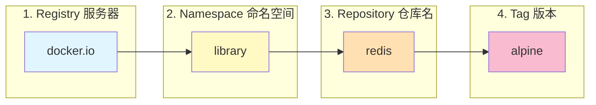

## 0. 核心定义

如果说 **镜像 (Image)** 是手机里的 App 安装包，那么 **仓库 (Repository)** 就是 **应用商店**。

它是集中存放镜像文件的地方。在多人协作或跨服务器部署时，我们不能总是拿着 U 盘拷贝镜像，而是通过仓库进行分发。

**三个易混淆的概念层级：**

| 概念 | 英文 | 解释 | 举例 |
| :--- | :--- | :--- | :--- |
| **注册服务器** | Registry | 存放很多仓库的具体**服务器地址**。 | `docker.io` (默认), `gcr.io` (Google), 公司内部的 Harbor |
| **仓库** | Repository | 存放某一类镜像的**集合**，通常包含多个版本。 | `nginx`, `mysql`, `my-project/backend` |
| **标签** | Tag | 仓库中具体的**版本号**。 | `latest`, `1.21`, `alpine` |

---

## 1. 镜像地址解构

当我们执行 `docker pull` 时，实际上是在使用一个完整的 URL 地址。

**完整格式：** `[Registry地址 /] [命名空间 /] 仓库名 : [标签]`



**默认省略规则**：
- 如果你不写 Registry，默认为 `docker.io` (Docker Hub)。
- 如果你不写 Namespace 且是官方镜像，默认为 `library`。
- 如果你不写 Tag，默认为 `latest`。
- 所以 `docker pull redis` 等同于 `docker pull docker.io/library/redis:latest`。

---

## 2. 核心操作流程

场景：你在开发机构建好了一个镜像，现在需要推送到公司服务器，供测试人员下载使用。

### 2.1 登录 (Login)

就像提交代码到 GitHub 需要登录一样，推送镜像也需要身份认证。

```bash
# 登录 Docker Hub
docker login

# 登录私有仓库 (如阿里云或公司内部 Harbor)
docker login registry.example.com
# 输入用户名和密码
```

### 2.2 标记 (Tag)

需要给本地镜像 " 贴 " 上远程仓库的地址标签，Docker 才知道往哪里推。

```bash
# 语法：docker tag [本地镜像ID或名称] [远程仓库完整地址]

# 假设本地有个镜像叫 my-app:v1
# 我要把它推到阿里云的命名空间 my-team 下
docker tag my-app:v1 registry.cn-hangzhou.aliyuncs.com/my-team/my-app:v1
```

### 2.3 推送 (Push)

上传镜像到远端。

```bash
docker push registry.cn-hangzhou.aliyuncs.com/my-team/my-app:v1
```

### 2.4 拉取 (Pull)

在测试服务器上下载该镜像。

```bash
docker pull registry.cn-hangzhou.aliyuncs.com/my-team/my-app:v1
```

---

## 3. 仓库类型对比

根据数据的敏感程度和网络环境，选择不同的仓库方案。

| 类型 | 代表产品 | 场景特点 | 优缺点 |
| :--- | :--- | :--- | :--- |
| **公共仓库** | **Docker Hub** | 开源软件、基础镜像 (Python/Node)。 | ✅ 全球最大，免费。<br>❌ 国内访问慢，私有项目需付费。 |
| **云厂商托管** | AWS ECR, 阿里云 ACR | 企业生产环境。 | ✅ 集成度高，不需要维护服务器。<br>❌ 绑定云厂商，需付费。 |
| **自建私有库** | **Harbor**, Nexus | 银行、政企内网，数据极其敏感。 | ✅ 数据完全自己掌控，RBAC 权限管理。<br>❌ 需要运维团队维护服务器。 |

---

## 4. 实战配置：镜像加速器

由于网络原因，直接从 Docker Hub 拉取镜像在国内经常超时。配置**镜像加速器**是装机后的第一件大事。

通过修改 Docker 守护进程的配置文件 `daemon.json` 来实现。

**操作步骤 (Linux 为例)：**

1. 新建或编辑文件 `/etc/docker/daemon.json`。
2. 加入如下 JSON 内容使用阿里云、网易或腾讯云的加速地址：

```json
{
  "registry-mirrors": [
    "https://mirror.ccs.tencentyun.com",
    "https://hub-mirror.c.163.com"
  ]
}
```

重启 Docker 服务生效：

```bash
sudo systemctl daemon-reload
sudo systemctl restart docker
```

详情可参见：[Docker 国内镜像加速配置](Docker%20国内镜像加速配置.md)
