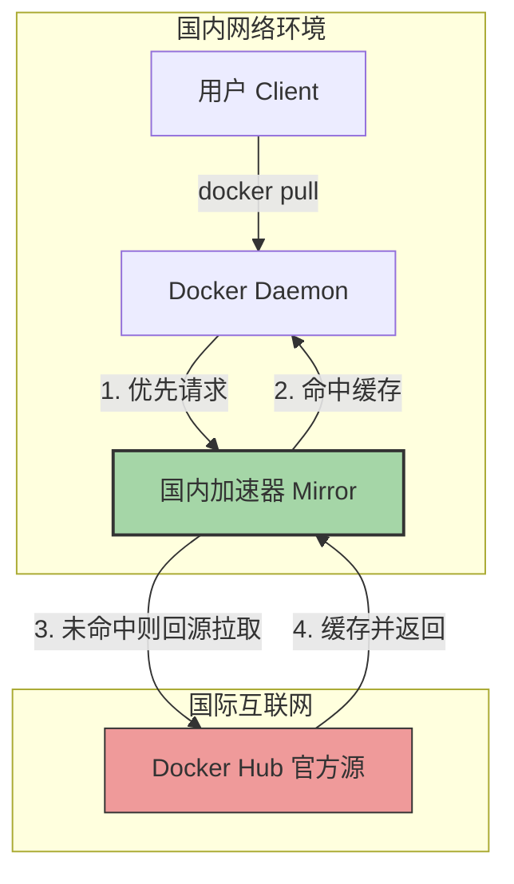

## 0. 痛点

由于网络环境的特殊性，国内用户直接从 Docker Hub (`docker.io`) 拉取镜像时，常遇到以下场景：

- **连接超时**：`dial tcp: i/o timeout`
- **下载龟速**：进度条长时间卡在几 KB/s
- **构建失败**：CI/CD 流水线因拉不到基础镜像而报错

**解决方案**：配置**Registry Mirror (镜像加速器)**。相当于在用户和 Docker Hub 之间加了一个国内的中转。

---

## 1. 原理图解

配置后，Docker Daemon 会优先请求国内加速器，只有当加速器中没有该镜像时，才会回源到 Docker Hub。



---

## 2. Linux 服务器配置

这是最常见的生产环境场景（CentOS, Ubuntu, Debian）。

### 2.1 配置文件修改

Docker 的守护进程配置位于 `/etc/docker/daemon.json`。如果文件不存在，需要手动创建。

**推荐镜像源列表** - 按稳定性排序：
1. **阿里云个人加速器**：需登录阿里云容器镜像服务获取专属地址，格式为 `https://<你的ID>.mirror.aliyuncs.com`。
2. **腾讯云内网/公网**：`https://mirror.ccs.tencentyun.com`。
3. **网易云**：`https://hub-mirror.c.163.com`。
4. **百度云**：`https://mirror.baidubce.com`。

**一键配置脚本**：

```bash
# 1. 创建目录
sudo mkdir -p /etc/docker

# 2. 写入配置 (这里以混合配置为例，增加冗余度)
# 注意：生产环境建议申请自己的阿里云加速地址替换第一项
sudo tee /etc/docker/daemon.json <<-'EOF'
{
  "registry-mirrors": [
    "https://mirror.ccs.tencentyun.com",
    "https://hub-mirror.c.163.com",
    "https://mirror.baidubce.com"
  ]
}
EOF

# 3. 重新加载配置并重启服务
sudo systemctl daemon-reload
sudo systemctl restart docker
```

---

## 3. 桌面端配置

针对开发者的本地环境（Windows/Mac）。

### 3.1 Docker Desktop

1. 打开 Docker Desktop 界面。
2. 点击右上角齿轮图标 **Settings**。
3. 选择左侧导航栏 **Docker Engine**。
4. 在右侧 JSON 编辑框中，添加 `"registry-mirrors"` 字段。
5. 点击右下角 **Apply & restart**。

```json
{
  "builder": {
    "gc": {
      "defaultKeepStorage": "20GB",
      "enabled": true
    }
  },
  "experimental": false,
  "registry-mirrors": [
    "https://mirror.ccs.tencentyun.com",
    "https://hub-mirror.c.163.com"
  ]
}
```

---

## 4. 验证配置

配置完成后，必须确认加速器是否生效。

执行以下命令：

```bash
docker info
```

在输出信息的末尾，寻找 `Registry Mirrors` 字段。如果看到你配置的地址，说明成功。

**成功输出示例：**

```text
...
 Registry Mirrors:
  https://mirror.ccs.tencentyun.com/
  https://hub-mirror.c.163.com/
 Live Restore Enabled: false
...
```

---

## 5. 备选方案：代理模式

*注意：2024 年之后，部分公共镜像源可能出现不稳定的情况。如果镜像源依然拉取失败，最彻底的方案是配置 HTTP 代理。*

这是让 Docker 守护进程直接通过代理服务器（VPN）访问 Docker Hub。

**Systemd 代理配置步骤：**

```bash
# 1. 创建 systemd 配置目录
sudo mkdir -p /etc/systemd/system/docker.service.d

# 2. 写入代理配置 (假设你的代理运行在本地 7890 端口)
sudo tee /etc/systemd/system/docker.service.d/http-proxy.conf <<-'EOF'
[Service]
Environment="HTTP_PROXY=http://127.0.0.1:7890"
Environment="HTTPS_PROXY=http://127.0.0.1:7890"
Environment="NO_PROXY=localhost,127.0.0.1,docker-registry.somecorporation.com"
EOF

# 3. 重启生效
sudo systemctl daemon-reload
sudo systemctl restart docker
```
