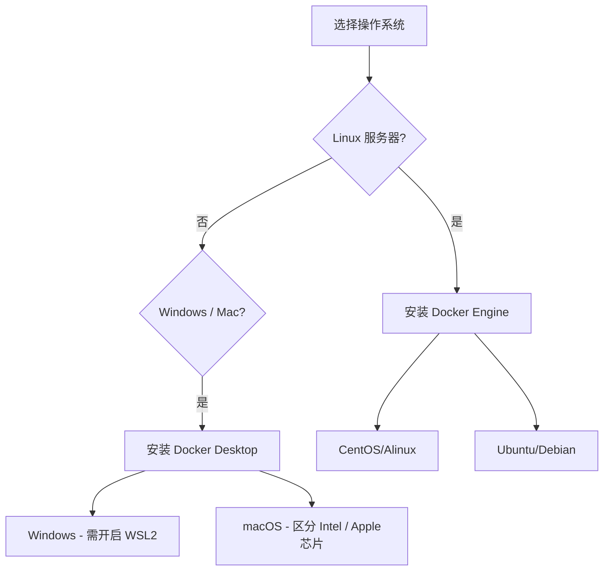

## 0. 版本选择策略

Docker 的安装方式取决于你的操作系统和使用场景。

**核心区别：**
- **Docker Engine (Linux)**：纯命令行版本。**生产环境服务器**的标准选择。资源占用少。
- **Docker Desktop (Win/Mac)**：带有图形界面 (GUI) 的集成环境。**开发人员本地电脑**的标准选择。



---

## 1. Linux 环境安装

这是生产环境最常见的场景。为了保证下载速度和稳定性，强烈建议使用国内镜像源（如阿里云）来替换官方源。

### 1.1 前置清理

防止旧版本冲突，先卸载可能存在的旧版本。

```bash
# Ubuntu/Debian
sudo apt-get remove docker docker-engine docker.io containerd runc

# CentOS/RHEL
sudo yum remove docker docker-client docker-client-latest docker-common docker-latest docker-latest-logrotate docker-logrotate docker-engine
```

### 1.2 CentOS / Alibaba Cloud Linux

使用 `yum` 包管理器安装。

```bash
# 1. 安装必要的工具包
sudo yum install -y yum-utils

# 2. 设置镜像仓库 (使用阿里云源，解决国内下载慢的问题)
sudo yum-config-manager \
    --add-repo \
    https://mirrors.aliyun.com/docker-ce/linux/centos/docker-ce.repo

# 3. 安装 Docker Engine (社区版 CE)
sudo yum install -y docker-ce docker-ce-cli containerd.io

# 4. 启动 Docker 并设置开机自启
sudo systemctl start docker
sudo systemctl enable docker
```

### 1.3 Ubuntu / Debian

使用 `apt` 包管理器安装。

```bash
# 1. 更新索引并安装依赖
sudo apt-get update
sudo apt-get install -y ca-certificates curl gnupg

# 2. 添加 Docker 官方 GPG 密钥
sudo install -m 0755 -d /etc/apt/keyrings
curl -fsSL https://download.docker.com/linux/ubuntu/gpg | sudo gpg --dearmor -o /etc/apt/keyrings/docker.gpg
sudo chmod a+r /etc/apt/keyrings/docker.gpg

# 3. 设置仓库 (推荐使用清华源或阿里源以加速)
# 这里以阿里源为例
echo \
  "deb [arch=$(dpkg --print-architecture) signed-by=/etc/apt/keyrings/docker.gpg] https://mirrors.aliyun.com/docker-ce/linux/ubuntu \
  $(. /etc/os-release && echo "$VERSION_CODENAME") stable" | \
  sudo tee /etc/apt/sources.list.d/docker.list > /dev/null

# 4. 安装 Docker
sudo apt-get update
sudo apt-get install -y docker-ce docker-ce-cli containerd.io docker-buildx-plugin docker-compose-plugin

# 5. 启动
sudo systemctl start docker
sudo systemctl enable docker
```

---

## 2. Windows 环境安装

现代 Windows 开发推荐使用 **WSL 2 (Windows Subsystem for Linux 2)** 架构，性能接近原生 Linux。

**步骤：**

1. **开启 WSL 2 功能**：
	- 确保 Windows 10 版本 2004+ 或 Windows 11。
	- 以管理员身份运行 PowerShell：`wsl --install`。
2. **下载安装包**：
	- 访问 [Docker Desktop for Windows 官网](https://www.docker.com/products/docker-desktop/) 下载 `.exe` 文件。
3. **安装配置**：
	- 运行安装程序。
	- **务必勾选**："Use WSL 2 instead of Hyper-V" (推荐)。
4. **重启**：安装完成后电脑会自动重启。
