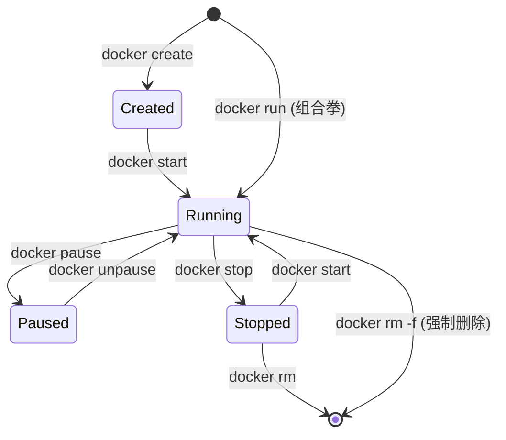

## 0. 核心定义

容器是镜像的**运行实例**。

如果说镜像（Image）是静止的 " 程序代码 " 或 " 类（Class）"，那么容器（Container）就是正在运行的 " 进程 " 或 " 对象（Object）"。

**核心特性：**
- **临时性**：容器设计为随时可以被删除和重建。不要在容器内保存重要数据（除非挂载了卷）。
- **可写层**：容器在只读的镜像之上，覆盖了一层可读写的顶层。你在容器内新建文件、修改配置，都发生在这个临时层中。
- **隔离性**：虽然多个容器共享宿主机内核，但它们在网络、文件系统、进程空间上是彼此隔绝的。

---

## 1. 生命周期管理

理解容器就是理解它的状态流转。从创建到销毁，容器经历不同的状态。



| 状态 | 说明 | 对应场景 |
| :--- | :--- | :--- |
| **Running** | 运行中 | 进程正在前台或后台活跃工作。 |
| **Exited** | 已退出 | 进程执行完毕（如脚本跑完）或意外崩溃。 |
| **Paused** | 暂停 | 进程挂起，CPU 停止计算，但内存保留（类似电脑睡眠）。 |

---

## 2. 启动与运行 (CRUD)

`docker run` 是最复杂也是最常用的命令，它实际上是 `create` + `start` + `pull` (如果本地没有镜像) 的组合。

### 2.1 启动命令剖析

假设我们要启动一个 Nginx 服务器：

```bash
# 典型启动命令
docker run -d -p 80:80 --name my-nginx nginx:latest
```

**参数详解：**

| 参数       | 全称                        | 作用                                                   | 场景举例                          |
| :------- | :------------------------ | :--------------------------------------------------- | :---------------------------- |
| `-d`     | `--detach`                | **后台运行**。让容器在后台默默工作，不占用当前的命令行窗口。                     | 启动 Web 服务、数据库。                |
| `-p`     | `--publish`               | **端口映射**。格式：`宿主机端口:容器端口`。                            | 想要通过 `localhost:80` 访问容器内的网站。 |
| `--name` | `--name`                  | **指定名称**。如果不写，Docker 会随机生成一个搞笑的名字（如 `sad_einstein`）。 | 方便后续管理，不用去记复杂的 ID。            |
| `-it`    | `--interactive` + `--tty` | **交互模式**。分配一个伪终端并保持输入打开。                             | 启动 Ubuntu 这种系统镜像进去敲命令时使用。     |

### 2.2 停止与删除

```bash
# 温柔地停止（发送 SIGTERM 信号，给程序处理善后的机会）
docker stop my-nginx

# 强制停止（直接断电，发送 SIGKILL）
docker kill my-nginx

# 删除已停止的容器
docker rm my-nginx

# 一条龙：强制停止并删除正在运行的容器
docker rm -f my-nginx

# 清理大师：删除所有处于停止状态的容器（慎用）
docker container prune
```

---

## 3. 进阶：进入容器内部

当容器在后台运行（`-d`）时，我们有时需要进去查看配置文件或调试网络。

**场景**：Nginx 启动了，但配置好像不对，我想进去看看 `/etc/nginx/nginx.conf`。

### 3.1 错误方式：SSH

**不要**试图在容器里安装 SSH 服务。容器不是虚拟机。

### 3.2 正确方式：docker exec

`exec` 命令允许你在正在运行的容器中开启一个新的进程（通常是 Shell）。

```bash
# 格式：docker exec -it [容器名/ID] [命令]
# /bin/bash 是常用的 Shell，如果是 Alpine 镜像通常用 /bin/sh
docker exec -it my-nginx /bin/bash
```

*执行后，你的命令行前缀会变成类似 `root@a1b2c3d4:/#`，说明你已经 " 穿越 " 到了容器内部。输入 `exit` 即可退出，容器不会停止。*

---

## 4. 日志与监控

容器里的程序通常将日志输出到 " 标准输出 (stdout)"，而不是写到文件里。

```bash
# 查看容器日志（排错神器）
docker logs my-nginx

# 实时追踪日志（类似 tail -f）
docker logs -f my-nginx

# 查看容器资源占用（CPU/内存）
docker stats

# 查看容器内的进程列表
docker top my-nginx
```

---

## 5. 单进程原则

$$
One Container = One Process
$$

这是 Docker 容器与传统虚拟机最大的区别，也是初学者最容易犯的错误。

- **反模式**：在一个容器里同时运行 Nginx + Python App + MySQL + CronJob，并用 Supervisor 管理。这样做会导致容器变得极其臃肿，且难以横向扩展。
- **最佳实践**：
	- 容器 A：只跑 Web Server。
	- 容器 B：只跑 Database。
	- 两者通过 Docker Network 通信。

**原因**：容器的生命周期是绑定在 PID 1（主进程）上的。如果主进程挂了，容器就挂了。如果是多进程，Docker 很难监控到某个子进程的状态。
