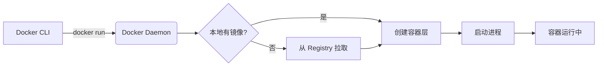

## 0. 机制

容器的运行本质上是**镜像（Image）的实例化**过程。如果把镜像比作 " 类（Class）" 或 " 安装包 "，那么容器就是 " 对象（Object）" 或 " 运行中的程序 "。

`docker run` 命令并非单一操作，它实际上是在后台连续执行了三个步骤：

1. **检测/拉取**：检查本地是否有指定镜像，没有则从仓库下载。
2. **创建**：基于镜像创建一个容器实例（`docker create`）。
3. **启动**：运行该容器实例（`docker start`）。



---

## 1. 基础模式

最简单的启动方式，适用于快速验证环境。

**场景**：你需要确认 Docker 是否安装成功，或者运行一个脚本后立即退出。

```bash
# 格式：docker run [IMAGE_NAME]
docker run hello-world
```

**运行逻辑**：
1. Docker 启动容器。
2. 执行镜像内定义的默认命令（如打印一段文本）。
3. 命令执行完毕，容器自动停止（Exited），但不会被删除。

---

## 2. 常用参数详解

在生产或开发中，我们通常需要配置网络、存储和后台运行。以下是高频参数对照表：

| 参数 | 简写 | 作用 | 场景示例 |
| :--- | :--- | :--- | :--- |
| `--detach` | `-d` | **后台运行**模式，不阻塞当前终端 | 运行 Nginx、MySQL 等服务 |
| `--publish` | `-p` | **端口映射** `宿主机端口:容器端口` | 将容器的 80 端口暴露给电脑的 8080 |
| `--name` | N/A | **指定名称**，方便后续管理 | 给容器起名 `my-web` 而非随机名 |
| `--volume` | `-v` | **挂载数据卷** `宿主机路径:容器路径` | 将代码文件或数据库文件保存在本机 |
| `--env` | `-e` | **设置环境变量** | 设置数据库密码、时区等配置 |
| `--rm` | N/A | **退出后自动删除** | 临时测试工具，用完即焚 |

---

## 3. 实战场景演练

### 场景 A：启动一个 Web 服务器 (Nginx)

你需要启动一个 Nginx 服务，并希望通过浏览器访问它，同时希望它在后台默默运行。

```bash
# 启动 Nginx，映射本机 8080 到容器 80，命名为 my-nginx
docker run -d -p 8080:80 --name my-nginx nginx

# 验证：在浏览器访问 http://localhost:8080
```

### 场景 B：启动一个数据库 (MySQL)

你需要一个 MySQL 数据库进行开发，数据需要持久化保存，且需要设置 root 密码。

```bash
# 启动 MySQL 5.7，设置 root 密码，并挂载数据到本地
docker run -d \
  --name dev-mysql \
  -p 3306:3306 \
  -e MYSQL_ROOT_PASSWORD=my-secret-pw \
  -v /Users/data/mysql:/var/lib/mysql \
  mysql:5.7
```

### 场景 C：临时调试工具 (Alpine)

你需要进入一个干净的 Linux 环境测试网络连通性，测试完不需要保留环境。

```bash
# -i (交互式) -t (伪终端) --rm (退出即删)
docker run -it --rm alpine sh

# 进入后执行 ping baidu.com，输入 exit 退出后容器自动消失
```

---

## 4. 运行状态管理

容器启动后，可能需要查看日志、进入容器内部或控制其开关。

### 查看运行情况

```bash
# 查看正在运行的容器
docker ps

# 查看所有容器（包括已停止的）
docker ps -a
```

### 查看日志

当容器以后台模式（`-d`）运行时，看不到输出信息，需使用日志命令。

```bash
# 查看 my-nginx 的日志
docker logs my-nginx

# 实时追踪日志（类似 tail -f）
docker logs -f my-nginx
```

### 进入容器内部

如果需要修改配置文件或手动执行 SQL。

```bash
# 在运行中的容器内启动一个 bash 终端
docker exec -it my-nginx bash
# 如果容器也是 Alpine 等精简版，可能需要用 sh
# docker exec -it my-nginx sh
```

---

## 5. 生命周期控制

区分 `run` 和 `start` 的关键在于容器是否存在。

| 操作         | 命令                         | 说明                   |
| :--------- | :------------------------- | :------------------- |
| **新建并启动**  | `docker run …`           | 针对**新**容器，从镜像开始      |
| **停止**     | `docker stop [NAME/ID]`    | 优雅停止（发送 SIGTERM）     |
| **启动已停止的** | `docker start [NAME/ID]`   | 针对**旧**容器，保留之前的数据和配置 |
| **重启**     | `docker restart [NAME/ID]` | 相当于 stop + start     |
| **强制停止**   | `docker kill [NAME/ID]`    | 立即结束进程（发送 SIGKILL）   |
