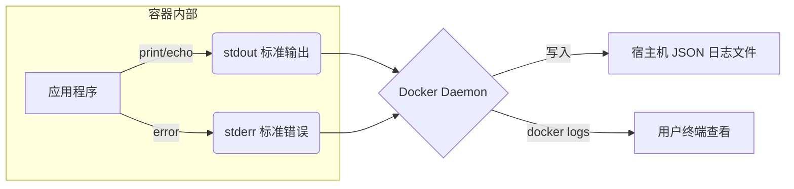

## 0. 机制

Docker 的日志机制非常直观：它会自动捕获容器内主进程（PID 1）的**标准输出 (stdout)** 和 **标准错误 (stderr)**。

这就好比 Docker 在后台一直帮盯着屏幕，并把屏幕上出现的所有文字都录制下来保存成文件。因此，**应用本身不需要配置写入文件**，只需把日志打印到控制台即可。



---

## 1. 基础快照查看

适用于容器已经停止，或者想查看过去发生了什么。

**场景**：容器启动失败直接退出了，你需要知道报错信息。

```bash
# 查看 my-app 的所有历史日志
docker logs my-app

# 查看包含时间戳的日志（方便排查具体什么时间出的错）
docker logs -t my-app
```

---

## 2. 实时追踪

类似于 Linux 的 `tail -f` 命令，适用于开发调试或监控实时流量。

**场景**：你正在调试 API 接口，希望一边在 Postman 发请求，一边看服务器打印的请求日志。

```bash
# -f (follow): 持续输出新产生的日志，Ctrl+C 退出
docker logs -f my-web
```

---

## 3. 精准过滤与排查

生产环境的日志量通常非常大，直接看全量日志会被刷屏。需要配合参数进行切片查看。

### 按行数/时间过滤

| 参数 | 作用 | 场景示例 |
| :--- | :--- | :--- |
| `--tail` | 仅查看最后 N 行 | `docker logs --tail 20 my-db` (只看最近的错误) |
| `--since` | 仅查看指定时间之后的日志 | `docker logs --since 30m my-web` (查看最近 30 分钟) |
| `--until` | 仅查看指定时间之前的日志 | `docker logs --until "2023-10-01" my-web` |

### 配合 Grep 搜索关键信息

**场景**：你想查找日志中所有的 "Error" 或 "Exception" 记录。

```bash
# 结合 Linux 管道命令使用
docker logs my-app 2>&1 | grep "Error"

# 说明：
# 2>&1 是将标准错误也重定向到标准输出，确保所有报错都能被 grep 抓到
```

---

## 4. 日志清理与存储位置

默认情况下，Docker 使用 `json-file` 驱动，将日志保存在宿主机的磁盘上。

**物理位置**：
通常位于 `/var/lib/docker/containers/[容器ID]/[容器ID]-json.log`。

**痛点**：如果不加限制，日志文件会无限增长，最终**占满服务器硬盘**。

**解决方案**：
在启动容器时限制日志大小（或在 `daemon.json` 全局配置）。

```bash
# 启动时限制：最多保留 3 个文件，每个最大 10MB
docker run -d \
  --log-opt max-size=10m \
  --log-opt max-file=3 \
  nginx
```
