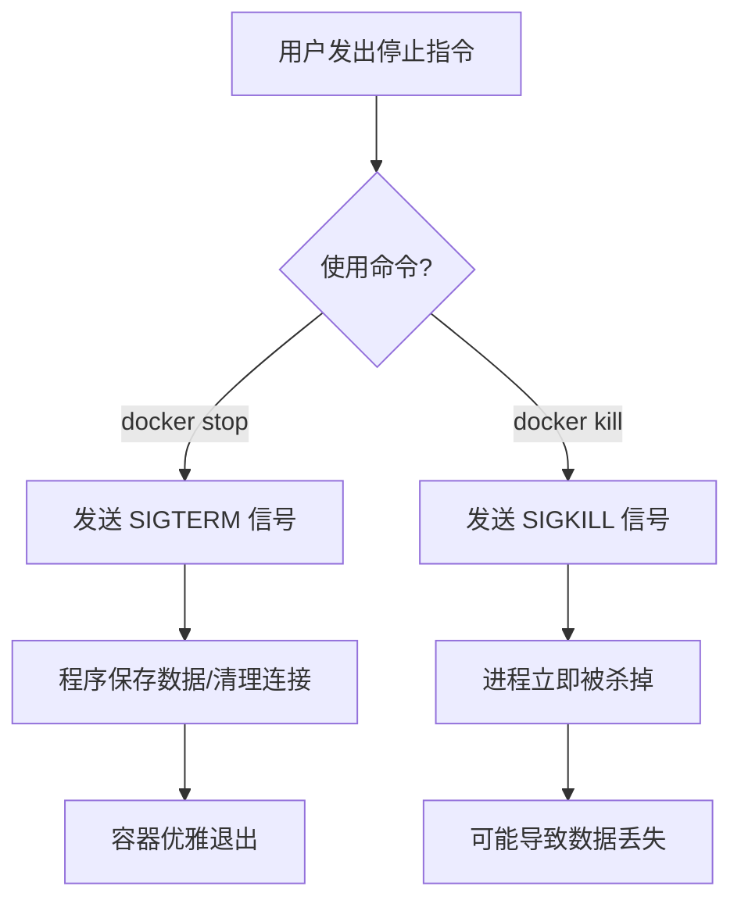

## 0. 状态逻辑

容器的生命周期管理主要围绕 " 查看 " 与 " 控制 " 两个维度。理解容器的状态有助于快速定位问题。

容器主要有以下三种状态，类似于手机 App 的运行逻辑：

- **Up (运行中)**：正在占用 CPU 和内存执行任务。
- **Exited (已退出)**：任务完成或出错停止，但容器文件系统保留（类似于手机后台杀掉 App，但 App 还在手机里）。
- **Created (已创建)**：分配了配置但从未启动过。

---

## 1. 查看容器列表

`docker ps` 是最常用的高频命令，用于获取容器的 ID、名称和端口信息。

| 命令 | 作用 | 典型场景 |
| :--- | :--- | :--- |
| `docker ps` | 列出**正在运行**的容器 | 检查服务是否启动成功，查看映射端口 |
| `docker ps -a` | 列出**所有**容器（含已停止） | 找回刚才报错退出的容器 ID，查看退出码 |
| `docker ps -q` | 仅列出容器 **ID** |通常配合脚本使用，如批量停止 |

**输出字段解读示例**：

```bash
CONTAINER ID   IMAGE     STATUS             PORTS                    NAMES
a1b2c3d4e5f6   nginx     Up 5 minutes       0.0.0.0:80->80/tcp       my-web
# STATUS: "Up" 表示运行中；"Exited (0)" 表示正常退出；"Exited (137)" 通常是被强制杀掉
```

---

## 2. 查看运行状态

仅看列表不足以排查问题，需要深入内部查看日志或资源占用。

### 查看应用日志

当容器启动了但服务不可用（例如 Nginx 跑起来了但网页打不开），**不要**立即重启，先看日志。

```bash
# 查看标准输出日志（Snapshot）
docker logs my-web

# 实时追踪日志（类似 tail -f，调试神器）
docker logs -f my-web

# 查看最近 50 行日志
docker logs --tail 50 my-web
```

### 查看资源占用

服务器变慢时，检查是哪个容器吃光了 CPU 或内存。

```bash
# 实时显示容器资源使用情况（类似 Linux 的 top）
docker stats

# 输出示例：
# CONTAINER ID   NAME      CPU %     MEM USAGE / LIMIT
# a1b2c3d4e5f6   my-web    0.00%     2.4MiB / 7.7GiB
```

---

## 3. 停止容器机制

停止容器有两种方式：一种是礼貌停止，一种是暴力拔线。



### 优雅停止 (推荐)

给容器内的进程预留时间（默认 10 秒）来处理善后工作，如保存文件、断开数据库连接。

```bash
# 停止指定容器
docker stop my-web

# 等待时间过长可手动指定秒数（例如等待 30 秒）
docker stop -t 30 my-web
```

### 强制停止 (紧急)

当容器死锁、无响应时使用。相当于直接拔掉电脑电源。

```bash
docker kill my-web
```

---

## 4. 批量操作技巧

在开发环境中，经常会产生大量临时容器，一个个 ID 复制粘贴去停止非常低效。可以使用 Shell 嵌套命令进行批量处理。

**场景**：下班了，要把电脑上所有运行的 Docker 容器全部关掉。

```bash
# 逻辑：先列出所有运行中的容器 ID，然后传给 stop 命令
docker stop $(docker ps -q)
```

**场景**：清理环境，停止并强制删除所有容器（慎用）。

```bash
# -f 表示强制删除运行中的容器
docker rm -f $(docker ps -aq)
```
