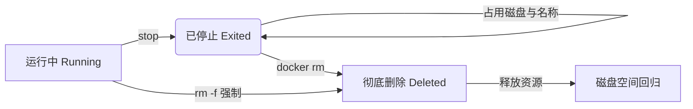

## 0. 机制

容器停止（Stop）后，它并没有消失，而是变成了 " 已退出（Exited）" 状态。

这就像电脑回收站里的文件，虽然不再运行，但**依然占用磁盘空间**（尤其是容器的可写层数据）并占据名字空间。

清理的核心目标是：**释放磁盘空间**与**保持环境整洁**。



---

## 1. 单个清理

适用于精准删除某个不再需要的特定容器。

**基本规则**：
1. 默认只能删除**已停止**的容器。
2. 如果容器正在运行，Docker 会报错保护，防止误删。

```bash
# 1. 删除已停止的容器
docker rm my-nginx

# 2. 强制删除正在运行的容器 (相当于 stop + rm)
# 场景：容器卡死或想要快速重置
docker rm -f my-nginx
```

---

## 2. 批量清理技巧

开发过程中，经过一天的调试，可能积累了数十个无效容器。一个个 ID 复制粘贴删除非常低效。

### 清理所有已停止的容器

这是最常用的命令。

```bash
# docker ps -a (列出所有) -q (只显示ID) -f (过滤状态为 exited)
docker rm $(docker ps -aq -f status=exited)
```

### 清理所有容器 (含运行中)

**高危操作**，通常用于重置整个开发环境。

```bash
# -f 强制删除
docker rm -f $(docker ps -aq)
```

---

## 3. 系统级清理 (Prune)

Docker 官方提供了更智能的 `prune`（修剪）命令，相当于 " 一键清理大师 "。

| 命令范围 | 命令 | 作用 | 风险等级 |
| :--- | :--- | :--- | :--- |
| **仅容器** | `docker container prune` | 删除所有**已停止**的容器 | ⭐⭐ (中) |
| **全系统** | `docker system prune` | 删除停止的容器 + **悬空镜像** + 未使用的网络 | ⭐⭐⭐ (高) |
| **核弹级** | `docker system prune -a` | 上述内容 + **所有未被使用**的镜像 | ⭐⭐⭐⭐ (极高，需重新下载镜像) |

**场景**：
磁盘空间报警，发现 Docker 占用了几十 GB，且不需要保留旧数据。

```bash
docker system prune
# 系统会提示确认：
# WARNING! This will remove:
#   - all stopped containers
#   - all networks not used by at least one container
#   - all dangling images
# Are you sure you want to continue? [y/N]
```

---

## 4. 自动清理

最好的清理是不产生垃圾。对于临时任务，建议在启动时使用 `--rm` 参数。

**场景**：
你需要用 Python 容器执行一个简短的脚本，或者用 Alpine 测试一下网络连通性。任务结束退出终端后，你不希望这个容器留下来。

```bash
# 退出容器后，Docker 会自动执行删除操作
docker run -it --rm python:3.9 python -c "print('Hello')"

# 此时执行 docker ps -a，找不到刚才的容器记录
```
