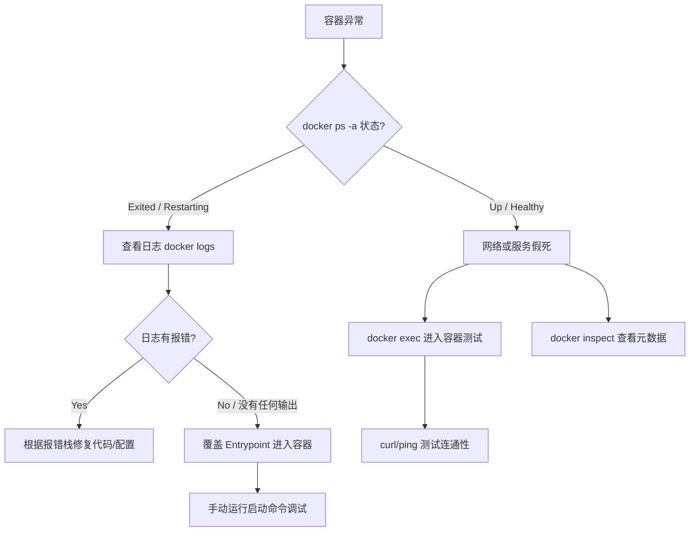

## 0. 排查思路

当 Docker 容器出现异常时，应遵循从状态检查到内部调试的标准流程。盲目重启通常无法解决根源问题。



---

## 1. 容器无法启动

容器启动即退出，或陷入无限重启循环。

### 常见场景

- **应用程序崩溃**：代码未处理异常导致进程退出。
- **前台进程缺失**：Docker 容器必须有一个前台进程（PID 1）保持运行。若只运行后台守护进程（如 `systemctl` 或 `service start`），容器会认为任务结束而自动退出。
- **配置缺失**：环境变量或配置文件未正确挂载。

### 排查手段

1. **查看实时日志**：

	```bash
    # 查看最后 100 行并持续追踪
    docker logs --tail 100 -f <container_id>
    ```

2. **交互式调试**：
	当容器一启动就挂，导致无法 `exec` 进入时，通过覆盖入口点（Entrypoint）强行进入：

	```bash
    # 覆盖原有的启动命令，强制以 sh 启动，保持容器存活
    docker run -it --rm --entrypoint /bin/sh <image_name>
    ```

	进入后，手动执行原本的启动命令，即可看到转瞬即逝的报错信息。

---

## 2. 网络连接拒绝

宿主机无法访问容器端口，或容器之间无法通信。

### 场景一：宿主机访问失败

- **现象**：`docker run -p 8080:80` 启动后，宿主机访问 `localhost:8080` 报错。
- **核心原因**：容器内应用监听了 `127.0.0.1` 而非 `0.0.0.0`。
- **解释**：
	- `127.0.0.1` 仅限容器内部访问（Loopback）。
	- `0.0.0.0` 允许接收来自任何网卡（包括 Docker 网桥）的流量。
- **修复**：修改应用配置文件（如 Flask/Express/Go），将 Listen Address 改为 `0.0.0.0`。

### 场景二：容器互联失败

- **现象**：后端容器连不上数据库容器。
- **排查**：不要在容器内使用 `localhost` 访问另一个服务。应使用 **Docker Service Name**（Docker Compose 中定义的服务名）。

	```yaml
    services:
      web:
        …
        environment:
          # 错误：DB_HOST=localhost (localhost 是 web 容器自己)
          # 正确：DB_HOST=db (Docker 内置 DNS 解析)
          - DB_HOST=db
      db:
        image: mysql
    ```

---

## 3. 存储卷权限问题

挂载宿主机目录到容器后，应用因权限不足崩溃。

### 常见场景

宿主机当前用户是 `ubuntu` (UID 1000)，容器内运行用户是 `root` 或特定用户（如 `postgres` UID 999）。当宿主机目录权限严格时，容器内可能无法写入。

### 解决方案

1. **开发环境暴力解法**：
	直接放开宿主机目录权限。

	```bash
    chmod -R 777 ./data
    ```

2. **生产环境规范解法**：
	在 Dockerfile 中创建与宿主机 UID 一致的用户，或在运行时指定用户 ID。

	```yaml
    # docker-compose.yml
    services:
      app:
        image: my-app
        #以此 UID:GID 运行容器进程
        user: "1000:1000" 
        volumes:
          - ./logs:/app/logs
    ```

---

## 4. 镜像构建失败

`docker build` 时找不到文件。

### 常见错误

```text
COPY failed: stat /var/lib/docker/tmp/docker-builder…/config.json: no such file or directory
```

### 核心概念：构建上下文

Docker 是 C/S 架构。构建时，CLI 会将当前目录下的所有文件打包发送给 Docker Daemon。

- **错误操作**：
	在 `/app/docker` 目录下执行构建，试图 COPY 上级目录 `/app/src` 的文件。
	*Dockerfile*: `COPY ../src /app` (这是无效的，因为 `../src` 不在上下文中)。
- **正确操作**：
	退回到项目根目录 `/app` 执行构建，并指定 Dockerfile 位置。

	```bash
    # 在项目根目录执行
    docker build -f docker/Dockerfile -t my-app:v1 .
    ```

	此时 `.` 代表上下文是整个项目根目录。

---

## 5. 资源限制导致被杀

容器运行一段时间后突然消失，没有日志堆栈。

### 诊断

查看容器退出状态码：

```bash
docker inspect <container_id> --format='{{.State.ExitCode}}'
```

- **Exit Code 137**：表示 `SIGKILL` (128 + 9)。通常是因为内存超出限制（OOM），被 Linux 内核的 OOM Killer 杀掉了。

### 排查与解决

1. **验证状态**：

	```bash
    docker inspect <container_id> | grep OOMKilled
    # 如果显示 true，确诊为内存溢出
    ```

2. **实时监控**：

	```bash
    docker stats
    ```

3. **修复**：
	- 检查代码是否存在内存泄漏。
	- 在 `docker-compose.yml` 中适当增加限制或设置保留内存（Reservation）。

	```yaml
    deploy:
      resources:
        limits:
          memory: 512M
    ```

---

## 6. 常用诊断命令速查

| 命令 | 用途 | 典型场景 |
| :--- | :--- | :--- |
| `docker logs -f` | 实时追踪日志 | 容器启动报错、业务逻辑异常 |
| `docker inspect` | 查看详细元数据 | 查 IP 地址、查挂载路径、查 OOM 状态 |
| `docker exec -it <id> sh` | 进入容器内部 | 查文件是否存在、测试内部网络 (curl/nslookup) |
| `docker stats` | 实时资源监控 | CPU 飙高、内存泄漏排查 |
| `docker system df` | 查看磁盘占用 | 磁盘爆满排查 (清理无用镜像/Volumes) |
| `docker network inspect` | 查看网络详情 | 确认容器是否在同一个 Bridge 网络中 |
