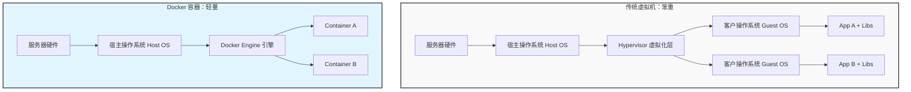

## 0. 本质定义

Docker 是一个开源的应用容器引擎。

**核心隐喻：集装箱（Shipping Container）**

在 Docker 出现之前，软件部署就像古代运输：

- 搬运易碎品（Python 环境）需要稻草填充。
- 搬运液体（Database）需要木桶。
- 不同货物混装容易互相污染，且在不同交通工具（开发机、测试机、生产服务器）上搬运标准不一。

Docker 创造了标准化的**数字集装箱**：

1. **标准化封装**：无论里面装的是 Java、Python 还是 Node.js，外部接口统一。
2. **环境隔离**：集装箱之间互不影响。
3. **一次构建，到处运行**：解决了 " 在我电脑上能跑，在服务器上跑不起来 " 的经典环境一致性问题。

---

## 1. 架构对比

Docker 容器与传统虚拟机（Virtual Machine, VM）的最大区别在于**轻量级**。



| 特性 | 虚拟机 (VM) | Docker 容器 |
| :--- | :--- | :--- |
| **重量级** | 重（包含完整的 Guest OS，GB 级别） | 轻（共享 Host OS 内核，MB 级别） |
| **启动速度** | 分钟级 | 秒级 |
| **性能损耗** | 较高（经过虚拟化层） | 极低（接近原生性能） |
| **隔离性** | 强（硬件级隔离） | 较强（进程级隔离） |

---

## 2. 核心组件

理解 Docker 需要掌握四个核心概念，它们构成了从开发到部署的闭环。

| 组件       | 英文名        | 概念类比                 | 解释                          |
| :------- | :--------- | :------------------- | :-------------------------- |
| **镜像**   | Image      | 类 (Class) / 安装盘      | 只读模板。包含了运行程序所需的所有代码、依赖库和配置。 |
| **容器**   | Container  | 实例 (Object) / 运行中的进程 | 镜像的运行实例。它是可写的，包含应用实际运行时的状态。 |
| **仓库**   | Registry   | 代码仓库 / 应用商店          | 存放镜像的地方。最常用的是 Docker Hub。   |
| **构建文件** | Dockerfile | 施工图纸 / 配方            | 一个文本文件，包含构建镜像的一系列指令。        |

---

## 3. 实战场景：Python Web 应用

假设我们需要部署一个简单的 Python Flask 网站。

### 3.1 编写 Dockerfile

在项目根目录下创建一个名为 `Dockerfile` 的文件：

```dockerfile
# 1. 选择基础镜像：好比选择地基，这里选用了精简版的 Python 3.9
FROM python:3.9-slim

# 2. 设置工作目录：进入容器内的 /app 文件夹
WORKDIR /app

# 3. 复制文件：将当前电脑目录下的所有文件，拷贝到容器的 /app 中
COPY . .

# 4. 安装依赖：在容器内执行命令安装 Flask
RUN pip install flask

# 5. 暴露端口：告诉 Docker 这个容器会监听 5000 端口
EXPOSE 5000

# 6. 启动命令：容器启动时执行的默认操作
CMD ["python", "app.py"]
```

### 3.2 对应的 Python 代码 (app.py)

```python
from flask import Flask
app = Flask(__name__)

@app.route('/')
def hello():
    return "Hello Docker! 环境配置不再是噩梦。"

if __name__ == '__main__':
    # 必须设置为 host='0.0.0.0' 才能被容器外部访问
    app.run(host='0.0.0.0', port=5000)
```

---

## 4. 常用操作指令

基于上述场景的生命周期管理操作。

### 4.1 构建与运行

```bash
# 1. 构建镜像 (Build)
# -t 给镜像起名为 my-flask-app, "." 表示 Dockerfile 在当前目录
docker build -t my-flask-app .

# 2. 运行容器 (Run)
# -d: 后台运行 (Detached)
# -p: 端口映射 (宿主机端口:容器端口)，访问电脑的 8080 就会转发到容器的 5000
docker run -d -p 8080:5000 --name web_container my-flask-app
```

### 4.2 查看与调试

```bash
# 查看正在运行的容器
docker ps

# 查看所有容器（包括已停止的）
docker ps -a

# 查看容器日志 (Debug 神器)
docker logs web_container

# 进入正在运行的容器内部 (类似 SSH)
docker exec -it web_container /bin/bash
```

### 4.3 清理

```bash
# 停止容器
docker stop web_container

# 删除容器
docker rm web_container

# 删除镜像
docker rmi my-flask-app
```

---

## 5. 数据持久化

**问题**：容器一旦删除，里面的文件（如数据库数据、日志）就会消失。
**方案**：使用 **Volume (挂载卷)**。

将宿主机的文件夹 " 打通 " 到容器内部，实现数据与容器生命周期解绑。

```bash
# 运行数据库容器，并将数据保存到宿主机的 ./db_data 目录
docker run -d \
  -v $(pwd)/db_data:/var/lib/mysql \
  -e MYSQL_ROOT_PASSWORD=secret \
  mysql:5.7
```

*此时，即使删除了 mysql 容器，`./db_data` 中的数据依然存在。*
