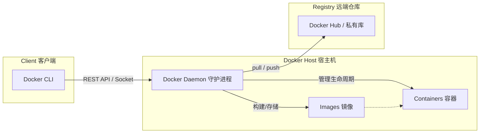
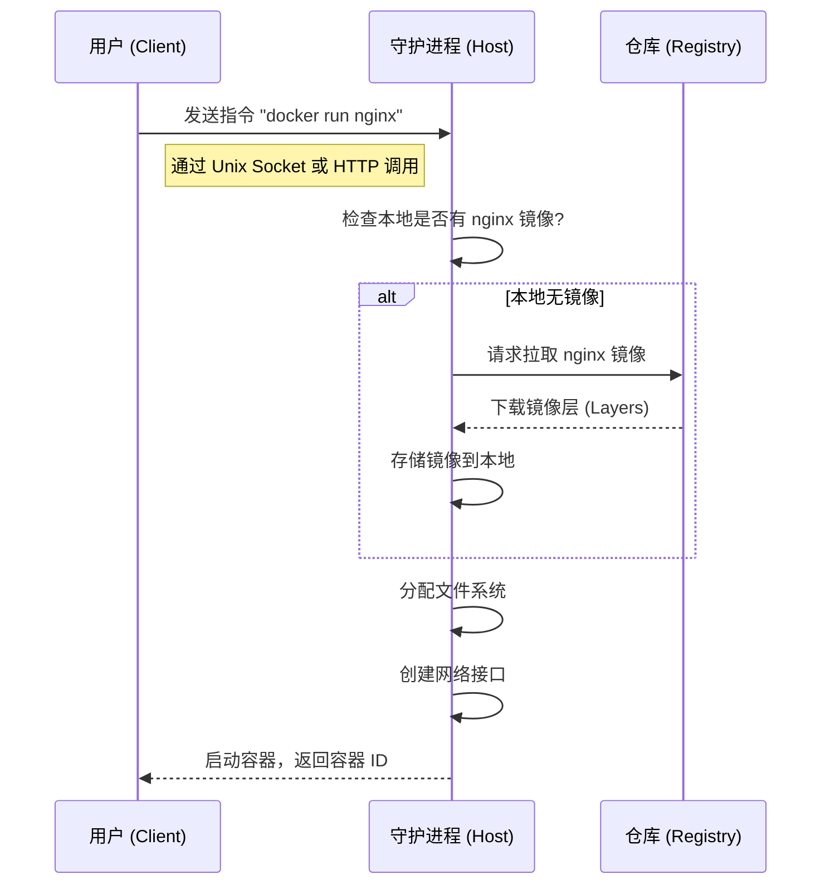
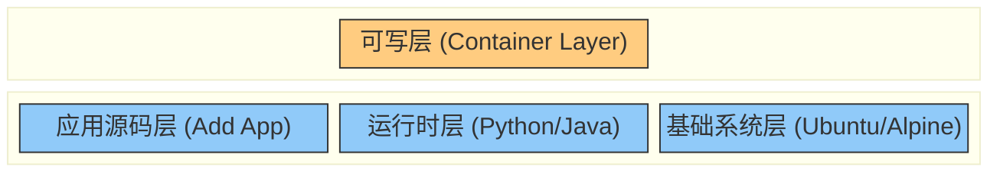

## 0. 核心模型

Docker 采用标准的 **C/S (Client-Server)** 架构。

这就好比去餐厅吃饭：

- **Client (客户端)**：你是顾客，只负责点菜（下指令），不负责做菜。
- **Host/Daemon (守护进程)**：是厨师，负责做菜（接收指令，完成繁重的构建、运行和分发工作）。
- 两者可以在同一台机器上（你在自家厨房），也可以跨网络进行（远程点餐）。



---

## 1. 三大核心组件

理解架构即理解这三个组件如何协同工作。

| 组件           | 进程名/实体     | 职责类比  | 核心功能                                                  |
| :----------- | :--------- | :---- | :---------------------------------------------------- |
| **Client**   | `docker`   | 遥控器   | 用户与 Docker 交互的入口。将命令（如 `docker build`）通过 API 发送给守护进程。 |
| **Daemon**   | `dockerd`  | 中央控制器 | 驻留在宿主机的后台进程。监听 API 请求，管理镜像、容器、网络和存储卷。                 |
| **Registry** | Hub/Harbor | 物流中心  | 集中存储镜像的服务。公有的是 Docker Hub，企业通常搭建私有仓库 Harbor。          |

---

## 2. 典型执行流程

以执行命令 `docker run nginx` 为例，观察数据流如何在架构中流转。



---

## 3. 底层技术基石

Docker 并非凭空创造的技术，而是建立在 Linux 内核特性的基础之上。Daemon 通过这些技术实现 " 隔离 " 与 " 限制 "。

### 3.1 Namespace (命名空间)

**作用：** 实现**环境隔离**。

**场景：** 就像将每个人关进独立的房间。
- **PID Namespace**：容器内的进程看自己是 PID 1（老大），看不到宿主机的其他进程。
- **Net Namespace**：容器有独立的 IP、端口，不与宿主机冲突。
- **Mnt Namespace**：容器有独立的文件系统挂载点，看不到宿主机的 C 盘/D 盘。

### 3.2 Cgroups (控制组)

**作用：** 实现**资源限制**。

**场景：** 给房间安装水电表，并设置上限。
- 防止某个容器吃光服务器的 CPU 或 内存，导致死机。
- 如果一个容器内存使用超过设定限额（如 512MB），会被内核 OOM (Out of Memory) 杀掉。

### 3.3 UnionFS (联合文件系统)

**作用：** 实现**分层存储**。

**场景：** 类似于 Photoshop 的图层。

---

## 4. 镜像分层架构

这是 Docker 轻量级的核心秘密。

镜像不是一个单一的大文件，而是一堆**只读层 (Read-only Layers)** 的叠加。当容器启动时，Docker 仅仅是在这堆只读层上面加了一层薄薄的**可写层 (Writable Layer)**。



**实战意义：**
1. **复用**：如果多个镜像都基于 `Ubuntu`，那么宿主机只需要存储一份 `Ubuntu` 的底层数据。
2. **写时复制 (CoW)**：修改容器内的文件时，Docker 不会修改镜像，而是把文件从底层复制到最上面的 " 可写层 " 进行修改。

```bash
# 查看镜像分层历史
docker history nginx:latest
```
