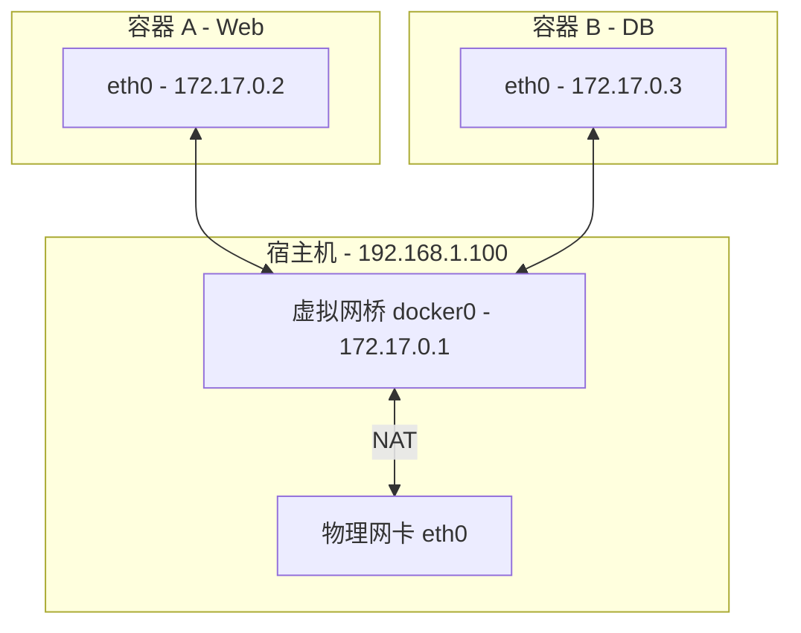

## 0. 机制

Docker 的网络子系统核心目标是解决**隔离**与**通信**的矛盾。默认情况下，每个容器都有自己独立的 " 网络栈 "（网卡、IP 地址、路由表、防火墙规则）。

可以将 Docker 宿主机想象成一个**虚拟路由器**：

- 它会在内部构建一个局域网。
- 容器是连接在这个局域网里的独立电脑。
- 通过 NAT（网络地址转换）技术，容器可以访问外网，外网也能通过端口映射访问容器。



---

## 1. Bridge 模式 (默认)

这是 Docker 的默认模式（桥接模式）。如果不指定 `--net`，容器就会自动连到名为 `docker0` 的虚拟网桥上。

**特点**：
- 容器有独立的 IP（通常是 `172.17.x.x`）。
- 容器与宿主机网络隔离。
- 外部访问必须通过 `-p` 进行端口映射。

**场景**：
绝大多数标准应用（Nginx, Redis, MySQL）。

```bash
# 标准启动，默认就是 bridge 模式
# 必须映射端口，否则外部无法访问
docker run -d -p 8080:80 nginx
```

---

## 2. Host 模式 (高性能)

这种模式下，容器**不再拥有独立的网络栈**，而是直接共用宿主机的网络。

**特点**：
- 容器没有自己的 IP，直接使用宿主机的 IP。
- **没有端口映射**：容器监听 80 端口，就是宿主机的 80 端口。
- 性能最好（省去了 NAT 转换的损耗）。

**场景**：
- 对网络性能极其敏感的应用（如高频交易、流媒体）。
- 端口数量巨大且不固定的应用（如 VoIP 语音服务）。

**风险**：
端口冲突。如果宿主机已经运行了 Nginx 占用了 80，再启动一个 Host 模式的 Nginx 容器会直接报错。

```bash
# --network host
# 注意：此时 -p 参数无效，因为不需要映射
docker run -d --network host nginx
```

---

## 3. Container 模式 (寄生/Sidecar)

这是一个非常特殊的模式，常被称为 "Sidecar（边车）模式 " 的基础。

它的逻辑是：**新容器加入到另一个已存在容器的网络栈中**。

**特点**：
- 两个容器共享同一个 IP、同一个 localhost、同一套端口范围。
- 两者之间可以通过 `127.0.0.1` 直接通信，就像同一个进程里的不同线程一样。

**场景**：
- **调试**：生产容器没有安装 curl/ping，你可以启动一个携带调试工具的容器，附身到生产容器上进行抓包。
- **日志收集/监控**：监控组件（Agent）通过 localhost 抓取主应用的指标。

```bash
# 1. 先启动一个主应用
docker run -d --name main-app nginx

# 2. 启动一个调试容器，附身到 main-app 上
# 此时在 debug 容器里访问 localhost:80，看到的就是 main-app 的网页
docker run -it --network container:main-app alpine sh
```

---

## 4. None 模式 (极致隔离)

容器只有本地回环接口（loopback），没有网卡，没有 IP，**完全断网**。

**场景**：
- **高安全任务**：处理绝密数据（如生成私钥、密码散列），防止数据泄露。
- **离线批处理**：只需要计算 CPU，不需要任何 IO 交互。

```bash
docker run --network none busybox ip a
# 输出里只有 127.0.0.1
```

---

## 5. 自定义网络最佳实践

在生产环境中，**强烈建议**使用自定义的 Bridge 网络，而不是默认的 `docker0`。

**核心优势**：DNS 解析——服务发现。
- **默认 bridge**：容器间只能通过 IP 通信（IP 可能会变），不能通过 " 容器名 " 通信。
- **自定义 network**：容器之间可以直接 ping `容器名`，Docker 会自动解析 IP。

**实战操作**：搭建一个 Web 服务连接数据库。

```bash
# 1. 创建专用网络
docker network create my-net

# 2. 启动数据库，加入网络
docker run -d --name db --network my-net mysql

# 3. 启动 Web，加入同一网络
# 代码里连接数据库时，Host 直接填 "db" 即可，不需要填 IP
docker run -d --name web --network my-net my-web-app

# 验证：在 web 容器里 ping db，是可以通的
docker exec -it web ping db
```

---

## 6. 模式对比总结

| 模式 | 标志参数 | IP 地址 | 端口映射 | 适用场景 |
| :--- | :--- | :--- | :--- | :--- |
| **Bridge** | `--net bridge` | 独立 IP | 需要 `-p` | 标准 Web 服务、数据库 |
| **Host** | `--net host` | 宿主机 IP | 无需 (共用) | 高性能、复杂端口应用 |
| **Container**| `--net container:id`| 共享目标 IP | 共享目标端口 | 调试、Sidecar 监控 |
| **None** | `--net none` | 无 | 无 | 密钥生成、离线计算 |
| **Custom** | `--net my-net` | 独立 IP + DNS | 需要 `-p` | **微服务互联 (推荐)** |
