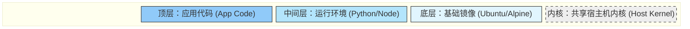

## 0. 核心定义

Docker 镜像是一个**只读的模板**，是创建容器的基础。

**通俗类比：**
- **游戏存档**：你无法修改 " 存档文件 " 本身，只能读取存档开始游戏。你在游戏里的新操作属于运行时的状态，不会自动写回旧存档。
- **类 (Class)**：面向对象编程中的 " 类 "。它是静态的代码定义，而容器则是 `new` 出来的 " 对象 "。
- **千层蛋糕**：由多层文件系统叠加而成，每一层都包含了软件运行所需的一部分。

---

## 1. 分层原理 (Layered Storage)

镜像并非一个单一的大文件，而是由一组文件系统层（Layers）组成的。这是 Docker 高效的核心。

### 1.1 结构图示



### 1.2 为什么设计成分层？

**场景：** 假设你有 10 个不同的 Python 应用。
- **传统方式**：每个应用都打包一套完整的 Linux + Python 环境。浪费 10 倍磁盘空间。
- **Docker 方式**：10 个应用都基于同一个 `python:3.9` 基础镜像。底层（Linux + Python）只存储一份，只有最上层的 " 应用代码 " 是独立的。

**特性总结：**
- **复用性**：层级共享，节省磁盘和网络带宽。
- **只读性**：镜像构建完成后，任何一层都不能被修改。
- **写时复制 (CoW)**：容器启动时，Docker 会在镜像顶部加一层 " 薄薄的读写层 "。如果容器要修改镜像里的文件，会先将文件 " 复制 " 到读写层再修改，原镜像文件保持不变。

---

## 2. 标识与版本 (Tag)

我们在拉取镜像时，通过 `Repository:Tag` 的格式来唯一定位。

**格式：** `[仓库地址/][用户名/]软件名:标签`

| 组成部分 | 示例 | 说明 |
| :--- | :--- | :--- |
| **Repository** | `mysql` | 镜像名称。 |
| **Tag** | `5.7` | 版本号。如果不写，默认是 `latest`。 |
| **完整示例** | `mysql:5.7` | 明确指定使用 MySQL 5.7 版本。 |
| **完整示例** | `my-registry.com/team/app:v1` | 私有仓库中的特定版本。 |

在 Docker Hub 上经常看到类似 `node:14-alpine` 的命名：

- **alpine**：基于 Alpine Linux 构建。特点是**极其精简**（通常只有 5MB），适合生产环境。
- **slim**：精简版，去掉了很多非必要的工具（如 vim, curl），体积较小。
- **latest**：最新版。*生产环境尽量避免使用，因为它的版本号是不稳定的。*

---

## 3. 生命周期管理指令

镜像管理的 CRUD（增删改查）。

```bash
# 1. 获取镜像 (Download)
# 从 Docker Hub 拉取 redis 的 alpine 版本
docker pull redis:alpine

# 2. 查看镜像 (List)
# 查看本地有哪些镜像，以及它们的大小
docker images

# 3. 搜索镜像 (Search)
# 在命令行搜索公共镜像
docker search mysql

# 4. 删除镜像 (Remove Image)
# 注意是 rmi (remove image) 不是 rm
docker rmi redis:alpine

# 5. 导出/导入 (离线传输场景)
# 将镜像保存为 tar 包（适合内网环境传输）
docker save -o my-app.tar my-app:v1
# 加载 tar 包
docker load -i my-app.tar
```

---

## 4. 构建镜像：Dockerfile 简述

镜像是通过 `docker build` 命令根据 `Dockerfile` 生成的。

每一条 Dockerfile 指令（如 `RUN`, `COPY`）通常都会生成一个新的镜像层。

**优化构建体积的准则：**
1. **选对底座**：优先使用 `alpine` 版本基础镜像。
2. **清理垃圾**：安装完软件后立即清理缓存。
3. **合并指令**：由于每条指令是一层，尽量将多个 `RUN` 合并为一条。

**反例（生成 3 层，体积大）：**

```dockerfile
FROM ubuntu
RUN apt-get update
RUN apt-get install -y nginx
RUN rm -rf /var/lib/apt/lists/*
```

**正例（生成 1 层，体积小）：**

```dockerfile
FROM ubuntu
# 使用 && 连接命令，在同一层内完成安装和清理
RUN apt-get update && \
    apt-get install -y nginx && \
    rm -rf /var/lib/apt/lists/*
```
