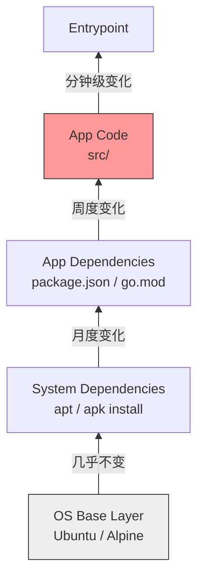

## 0. 分层模型

Docker 镜像本质上是只读文件系统的叠加（UnionFS）。构建优化的核心在于最大化缓存复用率。

$$
\text{Image Size} = \sum_{i=0}^{n} \text{Layer}_i \quad (\text{Delete in } L_{i+1} \neq \text{Free Space in } L_i)
$$

- **写时复制 (CoW)**：下层的修改会生成新的文件副本在上层，导致体积膨胀。
- **缓存失效**：一旦某一层发生变化，其后所有层（$L_{i+1} \dots L_n$）的缓存全部失效，必须重新构建。

---

## 1. 缓存亲和性排序

构建速度优化的第一原则是：**将变化最不频繁的指令放在最前面**。

理想的分层结构具有倒金字塔稳定性：



**实战反模式对比**：

- **错误做法**：先 COPY 代码，再安装依赖。改了一行代码，导致 `npm install` 重新跑一遍，构建慢如蜗牛。
- **正确做法**：先 COPY 依赖描述文件，安装依赖，最后 COPY 代码。

```dockerfile
# 优化前：任何代码修改都会破坏缓存
COPY . .
RUN npm install

# 优化后：只有 package.json 变了才重跑 npm install
COPY package.json .
COPY package-lock.json .
RUN npm install
COPY . .
```

---

## 2. 多阶段构建

这是**减小镜像体积**的实用技术。它解决了 " 编译环境 " 与 " 运行环境 " 分离的问题。

**场景**：Go 语言应用。编译需要 Go 编译器（500MB+），但运行只需要一个二进制文件（10MB）。

**代码演示**：

```dockerfile
# --- 阶段一：构建者 (Builder) ---
# 包含编译器、源代码、各种工具，体积巨大
FROM golang:1.20-alpine AS builder

WORKDIR /app
COPY go.mod go.sum ./
RUN go mod download
COPY . .
# 编译出二进制文件 myapp
RUN go build -o myapp main.go

# --- 阶段二：运行者 (Runner) ---
# 从零开始，只包含极简的 OS
FROM alpine:latest

WORKDIR /root/
# 关键：只从 builder 阶段拷贝编译好的二进制文件
# 之前的源代码、Go编译器统统丢弃
COPY --from=builder /app/myapp .

CMD ["./myapp"]
```

---

## 3. 链式指令减少层数

在 Docker 1.10 之前，每一个指令都会增加一层。虽然现代 Docker 只有 `RUN`, `COPY`, `ADD` 会创建层，但合并指令依然是保持整洁的最佳实践。

**原理**：在同一层内删除临时文件，才能真正减少体积。如果在下一层删除，只是 " 隐藏 " 了文件，磁盘空间依然被占用。

**操作**：使用 `&&` 连接命令，并在行尾清理缓存。

```dockerfile
# 错误：生成了 3 层，apt 缓存留在了 Layer 1 中，无法被 Layer 3 删除
RUN apt-get update
RUN apt-get install -y nginx
RUN rm -rf /var/lib/apt/lists/*

# 正确：生成 1 层，安装完立即清理，不留垃圾
RUN apt-get update && \
    apt-get install -y nginx && \
    rm -rf /var/lib/apt/lists/*
```

---

## 4. 基础镜像选型

| 镜像类型 | 典型 Tag | 大小 | 适用场景 | 缺点 |
| :--- | :--- | :--- | :--- | :--- |
| **标准版** | `ubuntu:22.04`<br>`node:18` | 100MB+ | 开发环境、传统应用迁移 | 体积大，包含大量无用软件，攻击面大 |
| **Alpine** | `node:18-alpine` | < 10MB | **生产环境首选**、微服务 | 使用 musl libc 而非 glibc，某些 C++ 依赖可能兼容性报错 |
| **Distroless** | `gcr.io/distroless/static` | < 2MB | 极致安全、高机密环境 | **没有 Shell**，无法 `docker exec` 进入调试，只能看日志 |

---

## 5. 上下文控制 (.dockerignore)

**痛点**：每次运行 `docker build .`，Docker CLI 都会把当前目录下所有文件打包发送给 Docker Daemon。如果目录下有 `.git` (可能几百 MB) 或 `node_modules`，发送过程就会卡顿。

**解法**：使用 `.dockerignore` 显式排除无关文件。

**`.dockerignore` 模板**：

```text
# 排除版本控制历史
.git
.gitignore

# 排除本地依赖（应该在容器内重新安装）
node_modules
vendor

# 排除文档和测试报告
*.md
coverage
docs
```
