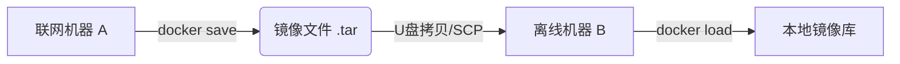

## 0. 场景

在大多数情况下，我们依赖网络仓库（Registry）来分发镜像。但在以下场景中，我们需要 " 物理搬运 " 镜像：

1. **物理隔离环境（Air-gapped）**：服务器在银行、军工或工厂内网，完全没有互联网连接，无法 `docker pull`。
2. **取证与备份**：保留某个时刻容器的完整文件系统快照。
3. **临时传输**：通过 USB 优盘将开发环境拷贝给坐在旁边的同事。

这类似于：把 Steam 上的游戏（在线下载）打包成一个 `.iso` 安装盘（离线文件），用 U 盘拷到另一台没网的电脑上安装。



---

## 1. 镜像迁移

这是最标准的迁移方式，它保存的是镜像本身，包含完整的层和构建历史。

**场景**：你需要把本地下载好的 `redis:alpine` 搬运到离线服务器上。

### 导出 (Save)

```bash
# 将 redis 镜像打包成 tar 文件
# -o 表示输出到指定文件
docker save -o redis_backup.tar redis:alpine

# 进阶技巧：结合 gzip 压缩以减小体积（推荐）
docker save redis:alpine | gzip > redis_alpine.tar.gz
```

### 导入 (Load)

在目标机器上执行：

```bash
# 从 tar 文件恢复镜像
docker load -i redis_backup.tar

# 如果是 gzip 压缩过的文件
docker load < redis_alpine.tar.gz

# 验证
docker images
```

---

## 2. 容器快照

这是针对正在运行的容器的操作。它会将容器当前的文件系统所有的层级历史丢弃，变成一个扁平的文件。

**场景**：你在一个 Ubuntu 容器里手动安装了 vim、gcc，修改了配置文件，想把这个现场保存下来作为基础镜像分发。

### 导出 (Export)

注意：对象是容器 ID，不是镜像名。

```bash
# 1. 先查看容器 ID
docker ps
# 2. 将容器当前状态导出
docker export my-running-container > my_system_snapshot.tar
```

### 导入 (Import)

导出的 tar 包在导入时，会变成一个新的**镜像**。

```bash
# 将快照导入为镜像，并指定新的名字和标签
# 格式：cat 文件 | docker import - [镜像名]:[标签]
cat my_system_snapshot.tar | docker import - my-custom-ubuntu:v1.0

# 验证
docker images
# 你会发现该镜像非常干净，没有 Dockerfile 的构建历史
```

---

## 3. 核心区别辨析

这是 Docker 中最高频的坑，**务必区分** `save` 和 `export`。

| 维度 | docker save | docker export |
| :--- | :--- | :--- |
| **操作对象** | 镜像 (Images) | 容器 (Containers) |
| **文件内容** | 包含完整层级信息、元数据、构建历史 | 仅包含当前文件系统快照 (丢失层级) |
| **体积** | 较大 (因为包含历史层) | 较小 (扁平化，丢弃了历史) |
| **回滚能力** | 支持 (可以查到各层变动) | 不支持 (只有最终状态) |
| **对应命令** | `docker load` | `docker import` |
| **典型用途** | 离线环境部署、完整备份 | 制作基础镜像、将环境固化 |

>**避坑指南**：如果你尝试用 `docker load` 去加载一个由 `docker export` 生成的文件，或者反过来，Docker 通常会报错或无法识别元数据。**原汤化原食**是基本原则。

---

## 4. 批量迁移技巧

如果需要一次性搬运几十个镜像，一个个 save 效率太低。

**场景**：将本机所有名字中包含 `k8s` 的镜像打包。

```bash
# 1. 批量保存
# 使用 shell 命令获取列表并传给 save
# 注意：docker save 可以一次接多个镜像名
docker save -o k8s_images.tar $(docker images | grep k8s | awk '{print $1":"$2}')

# 2. 批量加载
# 直接 load 这个大文件即可，Docker 会解析出里面的所有镜像
docker load -i k8s_images.tar
```
