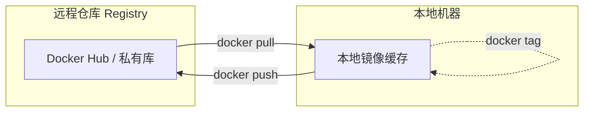

## 0. 机制

镜像的拉取（Pull）与推送（Push）类似于代码仓库（Git）的机制。

- **Registry (仓库)**：存放镜像的云端服务，类似于 GitHub 或 App Store。最著名的是 Docker Hub。
- **Repository (镜像库)**：具体的某个软件集合，如 `nginx` 或 `mysql`。
- **Tag (标签)**：软件的版本号，如 `latest`, `1.21`, `alpine`。

**命名规范**是推送的关键。只有贴上了正确的 " 地址标签 "，Docker 才知道要把镜像送到哪里。

标准格式：`[仓库地址]/[用户名/项目组]/[镜像名]:[版本号]`



---

## 1. 拉取镜像

将远程仓库的镜像下载到本地。

**场景**：你需要部署一个 Python 3.9 的环境。

```bash
# 默认拉取最新版 (latest)，生产环境不推荐，因为版本不确定
docker pull python

# 推荐：指定明确版本
docker pull python:3.9-slim

# 格式解读：
# python      -> 镜像名
# :3.9-slim   -> Tag (版本)，slim 表示精简版
```

**常见 Tag 后缀含义**：

| 后缀 | 说明 | 适用场景 |
| :--- | :--- | :--- |
| `latest` | 最新稳定版 | 开发尝鲜，**生产环境慎用** |
| `alpine` | 基于 Alpine Linux，体积极小 (约 5MB) | 构建微服务，追求极致轻量 |
| `slim` | 精简版，去除了文档和非必要工具 | 一般生产环境 |
| `windowsserver` | 基于 Windows 内核 | .NET Framework 应用 |

---

## 2. 镜像打标

在推送之前，必须给镜像改名或贴标签。

`docker tag` **不会**复制镜像数据，它只是给同一个镜像 ID 起了一个别名（类似文件系统的硬链接）。

**场景**：你构建了一个本地镜像 `my-app`，现在要把它上传到你的 Docker Hub 账号 `johndoe` 下，并标记为 `v1.0`。

```bash
# 语法：docker tag [现有镜像] [目标镜像名]

# 将本地的 my-app 标记为 johndoe 的 v1.0 版本
docker tag my-app johndoe/my-app:v1.0

# 此时执行 docker images，你会看到两个名字指向同一个 Image ID
```

---

## 3. 登录认证

默认拉取公开镜像不需要登录，但**推送**必须验证身份。

**场景**：你需要将公司内部镜像推送到私有仓库。

```bash
# 登录 Docker Hub
docker login

# 登录阿里云/腾讯云/私有仓库
# docker login [仓库地址]
docker login registry.cn-hangzhou.aliyuncs.com

# 输入用户名和密码（推荐使用 Access Token 而非账号密码）
# 成功后提示：Login Succeeded
```

*注：凭证通常保存在 `~/.docker/config.json` 中。*

---

## 4. 推送镜像

将本地标记好的镜像上传到远程。

**场景**：代码测试通过，将 `v1.0` 版本发布到仓库，供服务器下载部署。

```bash
# 推送刚才打好标的镜像
docker push johndoe/my-app:v1.0

# 输出示例：
# The push refers to repository [docker.io/johndoe/my-app]
# 5b1f32c: Pushed (如果层已存在，会显示 Layer already exists)
# v1.0: digest: sha256:xxxx size: 1234
```

**增量推送机制**：
Docker 利用分层存储，如果远程仓库已经有了基础镜像（比如 Linux 内核层），`push` 时只会上传你修改过的应用层代码，速度通常很快。

---

## 5. 私有仓库实战

在企业中，很少直接推送到 Docker Hub，而是使用阿里云 CR、AWS ECR 或 Harbor。

**场景**：推送到阿里云私有仓库。

```bash
# 1. 登录
docker login registry.cn-hangzhou.aliyuncs.com

# 2. 打标 (注意必须带上前缀地址)
docker tag my-app:latest registry.cn-hangzhou.aliyuncs.com/my-company/my-app:prod-2023

# 3. 推送
docker push registry.cn-hangzhou.aliyuncs.com/my-company/my-app:prod-2023
```
