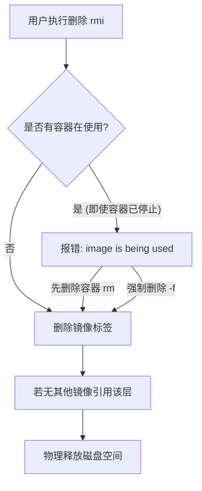

## 0. 机制

镜像（Image）是 Docker 的静态资产，存储在硬盘上。

管理镜像的核心难点在于理解**依赖关系**：

1. **分层存储**：多个镜像可能共享同一个基础层（如都基于 Ubuntu），删除一个镜像不一定会释放所有空间。
2. **引用保护**：如果有一个容器（哪怕是停止状态）是基于某镜像创建的，Docker 默认**禁止**删除该镜像，以防止系统崩溃。



---

## 1. 查看镜像列表

最基础的操作，用于盘点本地有哪些镜像。

**场景**：你需要确认刚刚拉取的 `nginx` 是否下载完毕，或者看看哪个镜像占用了最大的空间。

```bash
# 列出本地所有镜像
docker images

# 输出字段解读：
# REPOSITORY    TAG       IMAGE ID       CREATED         SIZE
# nginx         latest    605c77e624dd   2 months ago    141MB
# redis         alpine    3900ab967286   2 weeks ago     32.3MB
```

**常用过滤技巧**：

```bash
# 只显示镜像 ID (常用于批量操作脚本)
docker images -q

# 查找特定名字的镜像 (如 python)
docker images | grep python
```

---

## 2. 深度探查

列表只能看到表面信息，如果需要知道镜像内部的具体构造或配置，需要更深入的命令。

### 查看构建历史 (History)

**场景**：你发现一个镜像体积异常大，想知道是哪一步操作导致了体积膨胀。

```bash
# 查看镜像的分层构建记录
docker history nginx:latest

# 结果会显示每一层的大小和对应的 Dockerfile 指令
```

### 查看详细元数据 (Inspect)

**场景**：你需要知道这个镜像默认暴露了什么端口，或者它的启动命令（Entrypoint）是什么。

```bash
# 返回 JSON 格式的详细配置信息
docker inspect nginx:latest

# 技巧：配合 grep 快速查找环境变量
docker inspect nginx:latest | grep ENV -A 5
```

---

## 3. 删除镜像机制

删除镜像使用的是 `rmi` (Remove Image)，注意与删除容器的 `rm` 区分。

### 正常删除

只有当镜像没有被任何容器引用时，才能顺利执行。

```bash
# 格式：docker rmi [镜像名:标签] 或 [镜像ID]
docker rmi nginx:latest
```

### 强制删除

**场景**：你有一个基于 `my-app:v1` 的容器正在运行，或者已经停止但没删除。此时你想强行删掉镜像重新构建。

```bash
# -f (force) 强制删除
# 注意：这会导致对应的容器虽然还能运行，但依赖的镜像会变成 <none> 状态
docker rmi -f my-app:v1
```

---

## 4. 清理虚悬镜像 (Dangling)

在构建镜像的过程中，经常会出现名称为 `<none>`，标签也为 `<none>` 的镜像。

**成因**：当你重复构建同一个标签（如 `v1.0`）时，新镜像占据了 `v1.0` 的名字，旧的镜像就被 " 剥夺政治权利 "，变成了无名氏（虚悬镜像）。

**场景**：开发过程中反复 build，磁盘空间被这些废弃的中间产物占满。

```bash
# 查看所有的虚悬镜像
docker images -f "dangling=true"

# 一键清理所有虚悬镜像 (推荐常备)
docker image prune

# 输入 y 确认后，Docker 会释放这些无用空间
```

---

## 5. 批量清空

**场景**：彻底重置 Docker 环境，删除本地所有镜像。

```bash
# 逻辑：列出所有 ID -> 传给 rmi -> 强制执行
docker rmi -f $(docker images -qa)
```
