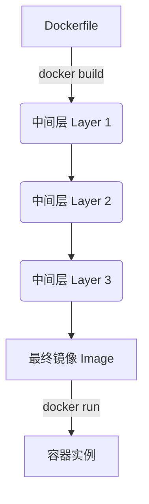

## 0. 机制

Dockerfile 是构建镜像的**自动化脚本**，可以将其理解为一张烹饪菜谱。

- **原料**：基础镜像 (`FROM`)。
- **处理**：安装依赖、编译代码 (`RUN`)。
- **摆盘**：配置环境变量、暴露端口 (`ENV`, `EXPOSE`)。
- **上菜**：启动服务 (`CMD`, `ENTRYPOINT`)。

Docker 读取这些指令，**自上而下**依次执行，每执行一条指令就会创建一个新的**镜像层（Layer）**。



---

## 1. 指令速查表

按照构建的生命周期，将常用指令分为四类。

| 类别 | 指令 | 关键作用 | 典型场景 |
| :--- | :--- | :--- | :--- |
| **基础** | `FROM` | **指定基础镜像** | `FROM node:18-alpine` (必须是第一条指令) |
| | `LABEL` | 添加元数据 | `LABEL maintainer="dev@company.com"` |
| **环境** | `WORKDIR` | **设置工作目录** (类似 `cd`) | `WORKDIR /app` (后续命令都在此目录下执行) |
| | `ENV` | 设置环境变量 | `ENV PORT=8080` (运行时可用，构建时也可用) |
| | `ARG` | 构建参数 | `ARG VERSION=1.0` (仅在 `docker build` 过程中有效) |
| **文件** | `COPY` | **复制文件**到容器 | `COPY . /app` (最常用) |
| | `ADD` | 高级复制 (自动解压/下载) | `ADD data.tar.gz /data` (仅在需要解压时使用) |
| **运行** | `RUN` | **构建时执行** (安装软件) | `RUN apt-get update && apt-get install -y vim` |
| | `CMD` | **启动时默认命令** | `CMD ["node", "app.js"]` (可被 `docker run` 覆盖) |
| | `ENTRYPOINT`| **启动时执行程序** (不可覆盖) | `ENTRYPOINT ["nginx", "-g", "daemon off;"]` |
| **配置** | `EXPOSE` | 声明端口 (仅文档作用) | `EXPOSE 80` (提示用户应该映射哪个端口) |
| | `VOLUME` | 声明匿名卷 | `VOLUME /var/lib/mysql` (持久化数据路径) |

---

## 2. 核心辨析：RUN vs CMD vs ENTRYPOINT

这是 Dockerfile 中最容易混淆的三个指令，理解它们的执行时机至关重要。

| 指令 | 执行时机 | 作用 | 形象比喻 |
| :--- | :--- | :--- | :--- |
| **RUN** | **构建镜像时** (Build) | 安装软件、配置环境、生成文件 | **厨房备菜**：切菜、炒菜、装盘 |
| **CMD** | **启动容器时** (Run) | 容器启动后的**默认**操作，**容易被覆盖** | **默认推荐菜**：服务员推荐你吃 A，但你可以改吃 B |
| **ENTRYPOINT** | **启动容器时** (Run) | 容器的**固定**入口程序，**难以覆盖** | **门票**：进门必须先检票，这一步省不掉 |

**代码对比**：

```dockerfile
# 场景 1：使用 CMD (灵活性高)
FROM ubuntu
CMD ["echo", "Hello World"]
# 运行 docker run my-image -> 输出 "Hello World"
# 运行 docker run my-image echo "Bye" -> 输出 "Bye" (CMD 被覆盖)

# 场景 2：使用 ENTRYPOINT (强制性高)
FROM ubuntu
ENTRYPOINT ["echo"]
CMD ["Hello World"]
# 运行 docker run my-image -> 输出 "Hello World" (ENTRYPOINT + CMD)
# 运行 docker run my-image "Bye" -> 输出 "Bye" (ENTRYPOINT + 用户参数)
```

---

## 3. 文件操作：COPY vs ADD

虽然都能把文件放进镜像，但官方推荐优先使用 `COPY`。

- **COPY**：所见即所得。它只能复制本地文件（Context 上下文）到容器内。
	- *推荐场景*：复制代码、配置文件。
- **ADD**：功能更强，但行为复杂。
	- **自动解压**：如果源文件是 `.tar.gz`，ADD 会自动将其解压到目标目录。
	- **远程下载**：源路径可以是 URL（不推荐，建议用 `curl/wget` 替代以控制层级）。
	- *推荐场景*：仅在确实需要自动解压压缩包时使用。

---

## 4. 实战范例

一个标准的 Python Web 应用 Dockerfile 模板，展示了各指令的组合。

```dockerfile
# 1. 尽量选择体积小的基础镜像 (alpine 或 slim)
FROM python:3.9-slim

# 2. 设置工作目录，避免文件散落在根目录
WORKDIR /app

# 3. 性能优化：先复制依赖描述文件，单独安装依赖
# 这样如果代码变了但依赖没变，Docker 会利用缓存跳过这一步
COPY requirements.txt .

# 4. 执行命令 (构建时)
# --no-cache-dir 减少镜像体积
RUN pip install --no-cache-dir -r requirements.txt

# 5. 设置环境变量
ENV FLASK_APP=app.py
ENV PORT=5000

# 6. 复制剩余源代码
COPY . .

# 7. 声明端口 (给运维人员看的文档)
EXPOSE 5000

# 8. 启动命令 (运行时)
# 使用数组格式 ["executable", "param1", "param2"] 避免 Shell 信号转发问题
CMD ["python", "app.py"]
```

---

## 5. 编写原则

1. **减少层级**：每一个 `RUN` 都会增加一层。尽量用 `&&` 连接命令。
	- Bad:

		```dockerfile
        RUN apt-get update
        RUN apt-get install -y vim
        ```

	- Good:

		```dockerfile
        RUN apt-get update && apt-get install -y vim
        ```

2. **清理缓存**：在同一个 `RUN` 指令中安装完软件后，立即清理缓存（如 `rm -rf /var/lib/apt/lists/*`），以减小镜像体积。
3. **.dockerignore**：务必在项目根目录创建 `.dockerignore` 文件，排除 `.git`、`node_modules`、`__pycache__` 等文件，避免它们被 `COPY . .` 指令带入镜像，导致构建缓慢且镜像臃肿。
