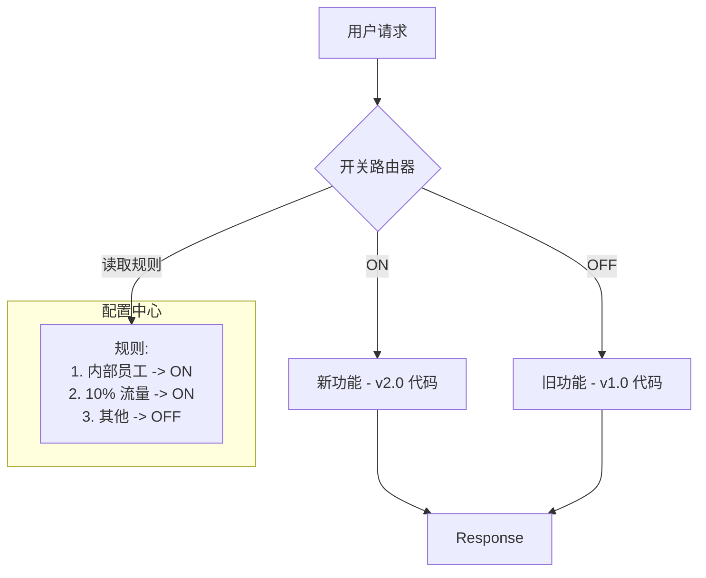

## 0. 核心定义

**特性开关** (Feature Toggles / Feature Flags) 是一种软件开发技术，核心理念是将**代码部署 (Deployment)** 与 **功能发布 (Release)** 两个动作在物理上剥离。

- **部署 (Deploy)**：技术行为。将代码安装到生产环境服务器上。
- **发布 (Release)**：业务行为。让最终用户看到并使用新功能。

通过在代码中植入逻辑判断（`if/else`），即使新功能的代码已经运行在生产环境，也可以通过配置让它对用户不可见（Dark Launching）。它是 **主干开发 (TBD)** 和 **持续交付 (CD)** 的关键支撑技术。

---

## 1. 核心价值场景

### 场景一：黑盒发布 (Dark Launching)

**背景**：你需要重构核心支付接口，代码改动量大，不想维护长期的分支。
**做法**：你将代码合并上线，但默认开关是 `OFF`。生产环境只有你的测试账号能走到新逻辑，普通用户依然走旧逻辑。

### 场景二：金丝雀发布 (Canary Release)

**背景**：新功能不确定是否稳定，不敢全量推给 100% 用户。
**做法**：配置开关规则，只让 **1%** 的用户（或特定地区 IP）命中新功能。监控无报错后，逐步扩大比例到 100%。

### 场景三：运维熔断 (Kill Switch)

**背景**：新上线的推荐算法导致 CPU 飙升。
**做法**：运维人员不需要回滚代码，直接在控制台将该功能的开关置为 `OFF`，系统瞬间切回旧算法，服务恢复正常。

---

## 2. 代码实现原理

Feature Toggle 的本质是**动态的路由选择**。

### 基础版：硬编码配置

适用于简单的功能上线。

```javascript
// config.js
const flags = {
  NEW_CHECKOUT_PAGE: false // 修改此处重启服务即可切换
};

// CheckoutController.js
function handleCheckout(req, res) {
  if (flags.NEW_CHECKOUT_PAGE) {
    return renderNewPage();
  } else {
    return renderOldPage();
  }
}
```

### 进阶版：上下文感知 (Context-Aware)

适用于灰度发布或 A/B 测试，需要依赖专门的开关服务（如 LaunchDarkly 或自建 Redis/DB 配置）。

```javascript
// 伪代码示例
async function handleCheckout(user) {
    // 传入上下文：用户ID、会员等级、所在地区
    const context = {
        userId: user.id,
        isVip: user.isVip,
        region: 'CN-SH'
    };

    // 询问开关服务：这个用户该看哪个版本？
    const showNewUI = await toggleService.isEnabled('new-checkout-ui', context);

    if (showNewUI) {
        // 只有 VIP 且 ID 尾号为偶数的用户会进这里
        return newPaymentService.process();
    } else {
        return legacyPaymentService.process();
    }
}
```

---

## 3. 开关类型分类

根据生命周期和目的不同，开关分为四类（参考 Martin Fowler 模型）：

| 类型 | 生命周期 | 动态性 | 典型用途 |
| :--- | :--- | :--- | :--- |
| **Release Toggles** | 短期 (几天) | 低 (重启生效即可) | 配合 TBD 模式，隐藏未完成的功能。上线稳定后即删。 |
| **Experiment Toggles** | 中期 (几周) | 高 (针对请求级) | A/B Testing，测试用户对新功能的反馈（如按钮颜色）。 |
| **Ops Toggles** | 长期 | 高 (运行时切换) | 运维断路器、降级开关（如大促时关闭非核心功能）。 |
| **Permission Toggles** | 永久 | 高 (针对用户级) | 权限管理，例如 " 白银会员特权功能 "。 |

---

## 4. 逻辑流转图



---

## 5. 最佳实践与隐患

### 僵尸开关 (Zombie Flags)

Feature Toggles 最大的敌人是**技术债务**。

- **问题**：如果 Release Toggle 在功能上线稳定后没有被删除，代码中就会充斥着大量的 `if/else`。这被称为 " 开关地狱 "。
- **规范**：在创建开关的 Ticket 时，同时创建一个 " 清理开关 " 的后续 Ticket，并设定截止日期。

### 兜底策略 (Fallback)

开关服务本身也是一个依赖。如果获取开关配置的网络请求超时了，代码必须有默认行为（通常是默认关闭新功能，保证系统可用性）。

### 命名规范

不要使用模糊的命名。

- ❌ `enable_button`
- ✅ `enable_new_checkout_submit_button_v2` (包含具体功能和版本)
