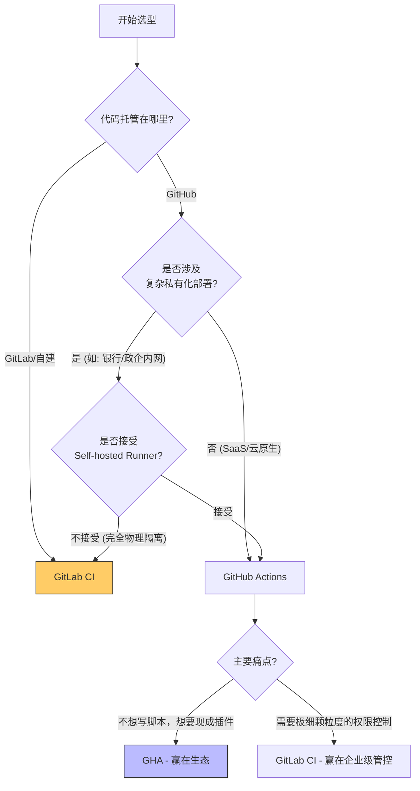

## 0. 权衡原则

在 GitHub Actions (GHA) 与 GitLab CI 之间做选择，本质上是在 **生态系统便利性** 与 **基础设施掌控力** 之间做选择。

- **GitLab CI**：**一体化巨石 (Monolith)**。原生集成极强，配置偏向 " 脚本化 "，适合私有化部署和强管控企业。
- **GitHub Actions**：**模块化乐高 (Modular)**。依赖庞大的 Marketplace 生态，配置偏向 " 组合化 "，适合开源项目和追求快速构建的团队。

---

## 1. 架构对比

两者的核心差异在于如何定义重用与执行。

| 特性维度      | GitLab CI                                                | GitHub Actions (GHA)                               |
| :-------- | :------------------------------------------------------- | :------------------------------------------------- |
| **复用单元**  | Templates (模板)<br>依赖 YAML `extends` 或 `include`，本质是文本复用。 | Actions (动作)<br>依赖代码封装 (JS/Docker)，本质是逻辑复用。        |
| **执行颗粒度** | Job (作业)<br>最小执行单元通常是 Job，内部运行 Shell 脚本。                 | Step (步骤)<br>在一个 Job 内可以组合多个独立的 Action。            |
| **平台绑定**  | 中<br>核心逻辑多为 Shell 脚本，迁移到 Jenkins 相对容易。                   | 高<br>大量使用 `uses: xxx/action`，一旦离开 GitHub，这些逻辑全部失效。 |
| **容器支持**  | 原生<br>每个 Job 直接运行在指定的 Docker Image 中。                    | 混合<br>支持 Docker 容器 Action，也支持主机环境运行。               |

---

## 2. 配置文件实战

**场景**：构建一个 Node.js 项目并上传构建产物。

### GitLab CI (`.gitlab-ci.yml`)

**特点**：Shell 脚本味重，显式依赖环境镜像。

```yaml
image: node:18-alpine

stages:
  - build

build_job:
  stage: build
  script:
    # 纯 Shell 命令
    - npm ci
    - npm run build
    - echo "Build finished"
  artifacts:
    paths:
      - dist/
```

### GitHub Actions (`.github/workflows/main.yml`)

**特点**：声明式引用，像搭积木一样引用社区能力。

```yaml
name: Build CI
on: [push]

jobs:
  build_job:
    runs-on: ubuntu-latest
    steps:
      # 直接引用社区 Action，无需自己写 git clone 脚本
      - uses: actions/checkout@v3
      
      # 引用环境设置 Action
      - uses: actions/setup-node@v3
        with:
          node-version: 18
          cache: 'npm'
          
      - run: npm ci
      - run: npm run build
      
      # 引用上传 Artifact Action
      - uses: actions/upload-artifact@v3
        with:
          path: dist/
```

---

## 3. 决策路径



---

## 4. 平台绑定风险 (Vendor Lock-in)

这是选择 GHA 时最大的隐忧。

### GitHub Actions 的陷阱

当习惯了使用 `uses: aws-actions/configure-aws-credentials@v2` 这样便捷的 Action 时，同时也正在丧失编写底层部署脚本的能力。

- **后果**：如果有一天公司决定迁移到 GitLab 或 Jenkins，就需要重写大量的流水线逻辑，因为那些 Action 在其他平台无法运行。

### GitLab CI 的优势

GitLab CI 的核心往往是 `script` 块中的 Bash 命令。

- **后果**：迁移时，你只需要把 `npm run build` 这样的命令复制到新平台的配置框里即可，因为 Bash 是通用的。

---

## 5. 生态与扩展性

### GHA: Marketplace 效应

GitHub 拥有全球最大的开源社区，这导致了几乎任何需求都有对应的 Action。

- *例子*：想发一条 Telegram 通知？直接搜 `appleboy/telegram-action`。
- *风险*：第三方 Action 的安全性。必须严格审查 `uses` 的版本号，建议使用 Commit Hash 而非 Tag。

### GitLab CI: Auto DevOps

GitLab 倾向于提供官方维护的、开箱即用的模板 (Auto DevOps)。

- *例子*：官方提供了一套标准的 `include` 模板，涵盖了从构建到 K8s 部署的全流程，但也因此显得厚重且难以定制。

---

## 6. 总结建议

1. **开源项目 / 个人项目**：**首选 GitHub Actions**。免费额度够用，配置简单，能白嫖社区生态。
2. **企业内网 / 大型单体应用**：**首选 GitLab CI**。Runner 的权限管理更细致，对 Docker/K8s 的原生集成更符合运维直觉。
3. **混合模式策略**：
	- 如果必须用 GHA 但又怕绑定，尽量将核心逻辑封装在 `Makefiles` 或 `Shell Scripts` 中。
	- 在 YAML 中只调用 `make build` 或 `./scripts/deploy.sh`，保持 YAML 层尽可能的薄。
