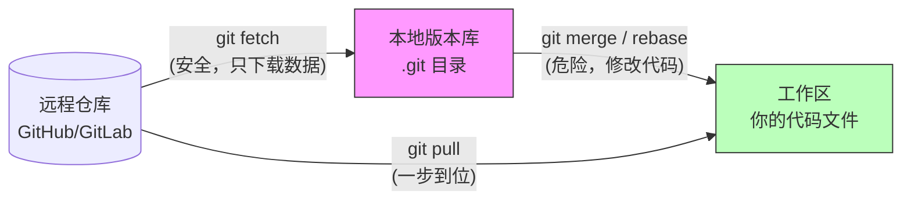

## 0. 基本概念

`git fetch` 是 Git 中最安全的网络操作。它的本质是**只同步信息，不修改文件**。

绝大多数新手混淆的公式：

$$
\text{git pull} = \text{git fetch} + \text{git merge}
$$

- **git fetch**: 将远程仓库的最新提交记录（Commit）和指针（Ref）下载到本地的 `.git/` 目录中，更新 `origin/main` 等远程追踪分支，但**绝对不会**触碰工作区文件。
- **git pull**: 下载后立即尝试将代码合并到你当前正在写的代码中，容易产生冲突。

---

## 1. 数据流向图

使用 Mermaid 展示 `fetch` 在 Git 三层架构中的作用范围：



---

## 2. 对比场景

**场景**：你需要知道同事是否修改了你正在写的文件，但你现在还不想合并他的代码，以免打断思路或产生冲突。

**操作**：先取回，再对比。

```bash
# 1. 悄悄把远程最新代码拉到本地数据库（工作区不受影响）
git fetch origin

# 2. 对比差异：看看我的代码(HEAD)和远程最新代码(origin/main)有什么不同
git diff HEAD origin/main

# 3. 或者只看 commit log，不看具体代码
git log HEAD..origin/main
```

---

## 3. 清理无效分支

**场景**：远程仓库的 Feature 分支已经被合并并删除了，但你本地运行 `git branch -r` 还能看到一大堆 `origin/feat-xxx`，干扰视线。

**操作**：使用修剪（Prune）参数。

```bash
# 同步数据，并自动删除远程已经不存在的分支引用
git fetch -p
# 或者全写
git fetch --prune
```

**一劳永逸配置**：如果不希望每次都加参数，可以设置默认开启：

```bash
git config --global fetch.prune true
```

---

## 4. 拉取特定 Pull Request

**场景**：在 GitHub/GitLab 上有一个别人的 PR，你需要拉到本地跑一下测试，但不想 check out 那个人的 fork 仓库。

**操作**：直接 Fetch 特定的 Ref 引用。

```bash
# 假设 PR ID 是 42
# 格式：git fetch origin pull/ID/head:本地新分支名

git fetch origin pull/42/head:pr-42-test
git checkout pr-42-test

# 现在你就在本地拥有了这个 PR 的代码，可以自由测试
```

---

## 5. 什么时候必须用 Fetch

建议在以下时刻强迫自己使用 `git fetch` 而不是 `git pull`：

1. **准备下班前**：只想看看今天团队更新了什么，不想解决冲突。
2. **网络环境差**：`fetch` 支持断点续传的概率更高，且失败了不会损坏工作区状态。
3. **高危操作前**：在执行 `git rebase` 之前，先 `fetch` 确保你的 `origin/main` 基底是最新的。

| 维度        | git fetch | git pull              |
| :-------- | :-------- | :-------------------- |
| **安全性**   | ⭐⭐⭐⭐⭐     | ⭐⭐                    |
| **工作区影响** | 无         | 可能会导致冲突标记 (`<<<<<<<`) |
| **网络流量**  | 一样        | 一样                    |
| **适用人群**  | 资深开发者、架构师 | 初学者、追求速度者             |
