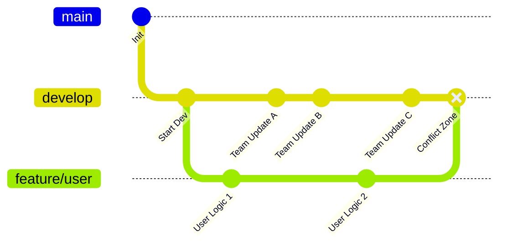

## 0. 核心痛点

Git Flow 虽然结构清晰，但其复杂的流转机制（特别是长生命周期的分支）非常容易导致**集成地狱 (Integration Hell)**。

当一个 Feature 分支开发时间过长，或者 Hotfix 没有及时同步时，合并时产生的冲突往往不是几行代码，而是整个逻辑架构的冲突。这被称为 " 版本地狱 " 的前奏。

---

## 1. 冲突高发场景

### 场景一：长寿分支的隔离 (The Long-Lived Feature)

**情境**：
小明开发 `feature/big-refactor`（重构底层）用了 3 周。
这 3 周内，`develop` 分支已经合并了 50 个其他功能的 PR。
**结果**：
当小明试图合并回 `develop` 时，发现 200 个文件有冲突。这是 Git Flow 中最常见的崩溃时刻。

### 场景二：被遗忘的 Hotfix (The Zombie Bug)

**情境**：
线上版本 v1.0 发现 Bug，在 `master` 上拉出 `hotfix/v1.0.1` 修复并上线。
**错误操作**：
运维只把 `hotfix` 合并回了 `master`，**忘记**合并回 `develop`。
**结果**：
团队继续在 `develop` 开发 v1.1。当 v1.1 发布上线时，那个在 v1.0.1 已经修好的 Bug 又复活了（Regression）。

---

## 2. 冲突解决策略

### 策略 A：勤奋同步 (Keep Up to Date)

不要等到开发结束才合并。在开发 Feature 时，**每天**都要把 `develop` 的最新代码合并进 Feature 分支。

```bash
# 在 feature 分支上
git fetch origin
git merge origin/develop
# 立即解决当天的冲突，而不是累积到最后一天
```

### 策略 B：变基 (Rebase) 的艺术

对于**本地**未公开的 Feature 分支，使用 `rebase` 而不是 `merge` 来同步 `develop`，可以保持提交历史是一条直线，更易于解决冲突。

$$
 \text{Rebase} = \text{重放历史} 
$$

> **警告**：严禁对已经 Push 到远程共享的分支执行 Rebase！

### 策略 C：开启 Rerere

Git 有一个隐藏功能 `rerere` (Reuse Recorded Resolution)，它能记住解决冲突的方法。如果同一个冲突在不同分支反复出现，Git 会自动帮你解决。

```bash
git config --global rerere.enabled true
```

---

## 3. 实战：处理复杂合并冲突

假设你在合并 `feature/login` 到 `develop` 时发生了冲突：

```bash
git checkout develop
git merge --no-ff feature/login

# 终端报错：
# CONFLICT (content): Merge conflict in src/auth.js
# Automatic merge failed; fix conflicts and then commit the result.
```

### 解决步骤代码块

```bash
# 1. 查看冲突文件
git status

# 2. 打开编辑器，手动修改代码
# 搜索 <<<<<<< HEAD, =======, >>>>>>> 标记
# HEAD 是 develop 的代码，下方是 feature/login 的代码

# 3. 修改完成后，标记为已解决
git add src/auth.js

# 4. (可选) 如果解决错了，想放弃合并，回到合并前
git merge --abort

# 5. 完成合并提交
git commit -m "Merge branch 'feature/login' into develop"
```

---

## 4. 视觉化：冲突是如何产生的

以下图表展示了 Feature 分支如何偏离主干，导致 " 剪刀差 " 越来越大。



---

## 5. 避免版本地狱的 Checklist

为了防止 Git Flow 变成灾难，请遵守以下铁律：

1. **Feature 分支寿命不超过 3 天**：如果任务太大，拆分成更小的 Task。
2. **Hotfix 双向同步**：修完 Bug 必须同时 Merge 到 `master` 和 `develop`。
3. **Release 期间禁入**：当 `release` 分支拉出后，严禁向 `develop` 提交非修复类代码，直到 Release 完成。
4. **语义化冲突检查**：不仅要检查代码文本冲突（Git 能提示），还要检查逻辑依赖冲突（比如 A 删除了函数，B 调用了函数，Git 不会报冲突，但运行会崩）。
