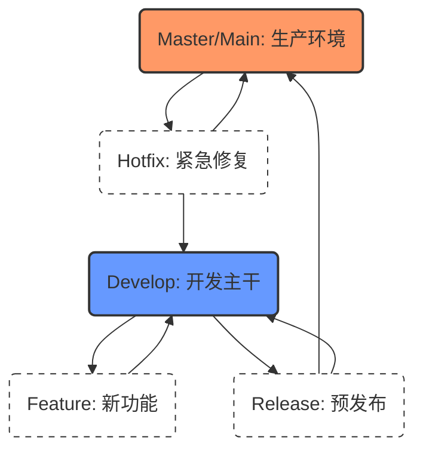

## 0. 核心分类体系

Git Flow 模型将分支划分为两个维度的 **5 种类型**。理解它们的关键在于搞清楚**生命周期**（存活多久）和**流转方向**（从哪来，回哪去）。

- **长期分支**：伴随项目一生，不会被删除。
- **短期分支**：临时存在，任务完成后即被删除。



---

## 1. 长期分支 (Long-lived)

这两个分支是项目的基石，严禁随意删除或重写历史。

### Master / Main (生产分支)

- **定义**：存放随时可供发布到生产环境的稳定代码。
- **规则**：
	- 严禁直接 Push 代码。
	- 只能通过 Release 或 Hotfix 分支合并进入。
	- 每次合并必须打上 Tag 标签（如 `v1.0.0`）。
- **场景**：用户在 App Store 下载到的那个版本，就是 Master 分支当前 HEAD 指向的代码。

### Develop (开发主干)

- **定义**：存放下一个版本功能的集散地。
- **规则**：
	- 包含所有已完成的 Feature。
	- 代码必须能编译通过，保持相对稳定（也就是 Nightly Build 的基础）。
- **场景**：每天下班前，所有开发人员将做好的功能合并到这里，第二天早上测试人员基于此分支进行集成测试。

---

## 2. 短期分支 (Short-lived)

这些分支用完即焚，旨在隔离干扰。

### Feature (功能分支)

- **来源**：`develop`
- **归宿**：`develop`
- **命名建议**：`feature/login-module`, `feature/ticket-1234`
- **场景**：你要开发 " 微信支付 " 功能，预计耗时 3 天。为了不影响同事开发 " 支付宝支付 "，你拉了一个 `feature/wechat-pay` 分支。开发完后合并回 `develop`，然后删除该分支。

### Release (预发布分支)

- **来源**：`develop`
- **归宿**：`master` **和** `develop`
- **命名建议**：`release/v1.2.0`
- **场景**：`develop` 上集齐了 v1.2 版本的所有功能。你拉出 `release/v1.2.0`，此时**冻结新功能开发**。测试发现一个文案错误，你直接在 Release 分支修复。确认无误后，合并发布，并同步回 `develop`。

### Hotfix (热修复分支)

- **来源**：`master` (注意这里！)
- **归宿**：`master` **和** `develop`
- **命名建议**：`hotfix/v1.1.1`
- **场景**：周五晚上线上版本（v1.1.0）出现崩溃。此时 `develop` 分支已经有了下一版 v1.2 的代码，不能直接用。必须从 `master` 拉出 `hotfix` 分支紧急修复，验证后合并上线，并把修复代码同步给正在开发的 `develop`。

---

## 3. 分支行为速查表

| 分支类型 | 来源 (Parent) | 合并去向 (Merge to) | 作用 | 典型生命周期 |
| :--- | :--- | :--- | :--- | :--- |
| **Master** | - | - | 生产环境快照 | 永久 |
| **Develop**| Master | - | 开发集成环境 | 永久 |
| **Feature**| Develop | Develop | 开发新特性 | 几天 - 几周 |
| **Release**| Develop | Master, Develop | 版本发布冲刺 | 几天 |
| **Hotfix** | Master | Master, Develop | 线上紧急救火 | 几小时 - 几以前 |

---

## 4. 关键代码演示

在实际操作中，为了保持历史清晰，合并短期分支时通常强制使用 `--no-ff` (No Fast Forward)。

```bash
# 1. Feature 流程
git checkout -b feature/new-ui develop  # 从 develop 创建
# … 开发 …
git checkout develop
git merge --no-ff feature/new-ui        # 关掉快进模式，保留分支历史节点
git branch -d feature/new-ui            # 删除

# 2. Hotfix 流程 (最容易错的)
git checkout -b hotfix/crash-fix master # 必须从 master 创建！
# … 修复 …
git checkout master
git merge --no-ff hotfix/crash-fix
git tag v1.0.1                          # 必须打 Tag

git checkout develop                    # 别忘了同步回开发分支！
git merge --no-ff hotfix/crash-fix
git branch -d hotfix/crash-fix
```
