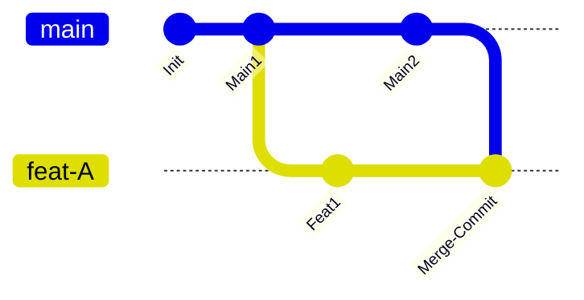

## 0. 理念对比

- **Merge**: 保留所有分支的真实发生时间和错综复杂的交叉点，强调真实性。
- **Rebase**: 将杂乱的提交整理成一条直线，强调可读性和整洁。

$$
\text{Repository Noise} \propto \frac{\text{Merge Commits}}{\text{Actual Code Changes}}
$$

当无效的 `Merge branch 'main' into …` 提交过多时，代码审查和回溯 Bug 的难度将指数级上升。

---

## 1. 黄金法则

在使用 Rebase 之前，必须注意：

> **永远不要在公共/共享分支（如 main, develop）上执行 Rebase。**

**理由**：Rebase 会修改 Commit ID。如果你修改了别人正在基于其开发的代码历史，会导致整个团队的仓库同步出现灾难性的冲突。

**场景模拟**：
1. A 把 `main` rebase 到了昨天。
2. B 基于今天的 `main` 拉取代码。
3. B push 时，Git 提示历史不兼容，B 强行 pull merge。
4. **结果**：Git 历史出现重复提交，甚至代码回退。

---

## 2. 决策情景

| 场景                                 | 推荐操作                                    | 目的                                              |
| :--------------------------------- | :-------------------------------------- | :---------------------------------------------- |
| **同步主干代码**<br>(我在开发 Feature，主干更新了) | `git rebase main`                       | **防止分叉**。让我的功能看起来像是刚刚基于最新主干开发的，消除无意义的 Merge 节点。 |
| **完成开发合入主干**<br>(Feature -> Main)  | `git merge --no-ff`<br>或 `Squash Merge` | **保留节点**。明确标识这里完成了一个功能，方便日后整体回滚。                |
| **本地提交太乱**<br>(写了 5 个 "fix typoo") | `git rebase -i`                         | **整理仪容**。在代码推送到远程之前，把琐碎的提交压缩成一个原子性的提交。          |
| **公共分支同步**<br>(Release -> Main)    | `git merge`                             | **如实记录**。不要篡改发布历史。                              |

---

## 3. 差异图

**场景**：本地分支 `feat-A` 同步 `main` 的更新。



- **Merge 结果**：产生菱形结构（Diamond Shape），多出一个 `Merge branch 'main'` 的提交。
- **Rebase 结果**：`Feat1` 被摘下来，接在 `Main2` 后面，形成一条直线。

---

## 4. 实操代码工作流

### 流程一：保持本地分支整洁 (Rebase workflow)

这是最推荐的高效开发者的日常习惯。

```bash
# 1. 在 feat 分支开发了一段时间
git commit -m "WIP: logic half done"

# 2. 发现 main 分支有同事更新了代码，需要同步
git checkout main
git pull origin main

# 3. 切换回 feature 分支，将基底变更为最新的 main
git checkout feat-user-login
git rebase main

# 4. 如果遇到冲突
# -> 手动解决代码冲突
git add .
git rebase --continue
# -> 注意：千万不要 git commit，要用 continue

# 5. 推送（如果之前 push 过，因为历史变了，需要强推）
git push -f origin feat-user-login
```

### 流程二：清理提交历史 (Interactive Rebase)

在发起 Pull Request (PR) 之前，把本地的 " 废话提交 " 合并。

```bash
# 查看最近 4 次提交并准备合并
git rebase -i HEAD~4
```

**编辑器界面操作**：

```text
pick 1a2b3c feat: add login ui      <-- 保留这个
squash 4d5e6f fix: typo             <-- 融合到上一个
squash 7g8h9i fix: lint error       <-- 融合到上一个
pick j0k1l2 feat: add login api     <-- 保留这个新的起点
```

---

## 5. 团队协作配置建议

为了减少团队成员手动敲命令出错，建议通过 Git 配置固化最佳实践。

**1. 拉取代码时自动 Rebase**
避免每次 `git pull` 都产生一个无用的 Merge Commit：

```bash
git config --global pull.rebase true
```

**2. 启用自动 Stash**
避免 Rebase 时因为本地有未提交的修改而报错：

```bash
git config --global rebase.autoStash true
```

**3. 最终合并策略**
- **GitHub/GitLab 设置**：推荐在仓库设置中，勾选 **"Squash and merge"** 作为默认选项。
- **效果**：无论开发者在本地分支有多少个乱七八糟的 commit，合入 `main` 时只会生成一个干净的 Commit。
