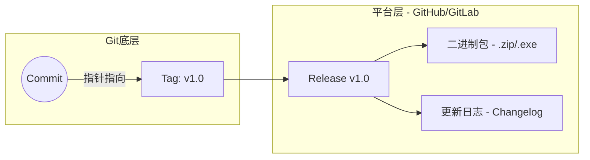

## 0. 核心定义

在 Git 中，分支（Branch）是移动的指针，而标签（Tag）是历史长河中的永久锚点。

- **分支**：代表 " 开发进行时 "，随着新的 Commit 不断向前移动。
- **标签**：代表 " 版本里程碑 "，指向特定的 Commit ID，一旦创建，严禁移动（除非删除重建）。

在生产实践中，Tag 通常用于标记**发布版本**（如 `v1.0.0`），它是回滚代码和构建二进制包的基准。

---

## 1. 语义化版本规范 (SemVer)

打 Tag 不是随心所欲的，工业界通用 **SemVer** (Semantic Versioning) 规范：$X.Y.Z$

| 版本位   | 名称              | 变更规则            | 兼容性   |
| :---- | :-------------- | :-------------- | :---- |
| **X** | **Major** (主版本) | 架构升级、API 不兼容修改  | 不兼容旧版 |
| **Y** | **Minor** (次版本) | 新增功能 (Feature)  | 向下兼容  |
| **Z** | **Patch** (修订号) | 修复 Bug (Bugfix) | 向下兼容  |

- **先行版本**：`v1.0.0-alpha` (内测), `v1.0.0-beta` (公测), `v1.0.0-rc1` (候选发布)。

---

## 2. 实战指令集

Git 标签分为 " 轻量标签 " 和 " 附注标签 "。**生产环境务必使用附注标签**，因为它包含打标人、时间和说明信息。

### 场景一：打标与推送

**目标**：当前代码测试通过，准备发布 v1.0.0。

```bash
# 1. 打附注标签 (Annotated Tag)
# -a: annotated, -m: message
git tag -a v1.0.0 -m "Release version 1.0.0: Add login feature"

# 2. 查看标签详情
git show v1.0.0

# 3. 推送标签到远程
# 注意：普通的 git push 不会推送标签！
git push origin v1.0.0

# 或者一次性推送所有本地标签
git push origin --tags
```

### 场景二：补打标签

**目标**：昨天发布的版本忘了打 Tag，需要补在之前的某个 Commit 上。

```bash
# 1. 找到对应的 commit hash
git log --oneline

# 2. 补打标签
git tag -a v0.9.0 9fceb02 -m "Late tagging for beta version"
```

### 场景三：删除与修正

**目标**：打错了标签，或者需要重新发布。

```bash
# 1. 删除本地标签
git tag -d v1.0.0

# 2. 删除远程标签 (语法较特殊)
git push origin :refs/tags/v1.0.0
# 或者新版语法
git push origin --delete v1.0.0
```

---

## 3. Tag 与 Release 的区别

初学者常混淆 Git Tag 与 GitHub/GitLab 的 Release 功能。

- **Git Tag**: 纯粹的代码仓库标记，指向源代码的一个快照。
- **Release**: 代码托管平台基于 Tag 衍生的**交付物集合**。

**Release 通常包含**：
1. 对应的 Tag 源代码。
2. 编译好的**二进制文件** (如 `.exe`, `.apk`, `.jar`)。
3. **版本日志** (Release Notes / Changelog)。



---

## 4. 自动化发布流 (CI/CD)

在现代 DevOps 中，**Tag 是触发自动构建的信号**。

### 工作流逻辑

1. 开发者在本地运行 `git push origin v1.0.0`。
2. CI 服务器（如 GitHub Actions）监听到 `tags` 事件。
3. CI 自动执行：编译代码 -> 运行测试 -> 打包 -> 上传到 Release 页面。

### GitHub Actions 示例片段

```yaml
name: Publish Release

on:
  push:
    tags:
      - 'v*' # 仅当推送 v 开头的 tag 时触发

jobs:
  build:
    runs-on: ubuntu-latest
    steps:
      - uses: actions/checkout@v2
      - name: Build Binary
        run: npm run build
      - name: Create Release
        uses: softprops/action-gh-release@v1
        with:
          files: dist/my-app.zip # 自动将构建产物上传到 Release 页
```
