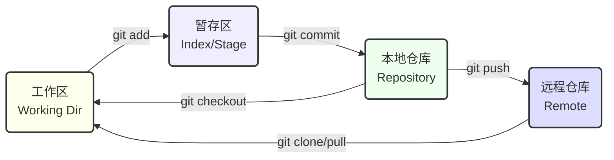

## 0. 核心工作区模型

理解 Git 的核心在于理解它的**三个状态**流转。代码不是直接存入仓库的，而是要经过 " 挑选 " 的过程。



---

## 1. 起步与配置

在写第一行代码前，必须告诉 Git " 你是谁 "。

### 全局身份配置

这是一次性操作，除非换电脑。

```bash
# 设置用户名和邮箱（GitHub/GitLab 统计贡献绿点以此为准）
git config --global user.name "Your Name"
git config --global user.email "email@example.com"

# 推荐：设置默认分支名为 main (替代旧的 master)
git config --global init.defaultBranch main

# 推荐：让输出显示颜色
git config --global color.ui auto
```

### 仓库初始化

**场景**：要开始写一个新的 Python 项目。

```bash
# 方式 A：从零开始
mkdir my-project
cd my-project
git init  # 生成 .git 隐藏目录

# 方式 B：通过http克隆现有项目
git clone https://github.com/user/project.git
```

---

## 2. 代码提交三部曲

这是开发中最最高频的操作循环：**修改 -> 暂存 -> 提交**。

**场景**：刚写完了一个登录页面的 HTML 代码。

```bash
# 1. 查看当前状态（红色的文件表示未被追踪）
git status

# 2. 添加文件到暂存区（挑选要提交的文件）
git add login.html       # 添加指定文件
git add .                # 添加当前目录下所有变动（最常用）

# 3. 提交到本地仓库
# -m 后面是本次提交的说明，严禁写 "update" 这种无意义废话
git commit -m "feat: complete login page layout"

# 进阶：如果只是修改了现有文件（没有新创建文件），可以用一步完成
git commit -am "fix: correct typo in login button"
```

---

## 3. 远程同步

代码写好了，需要存到 GitHub 或 GitLab 上与同事协作。

```bash
# 1. 关联远程仓库（仅在首次需要）
# origin 是远程仓库的别名，约定俗成
git remote add origin https://github.com/user/repo.git

# 2. 推送到远程
# -u 表示 upstream，下次直接敲 git push 即可
git push -u origin main

# 3. 拉取更新（每天开工第一件事）
git pull origin main
```

---

## 4. 回退修改

Git 最大的价值在于 " 不害怕犯错 "。

### 场景 A：改乱了，想丢弃工作区的修改

写了一堆乱七八糟的代码，还没 `add`，想恢复到上次提交的样子。

```bash
# 恢复指定文件
git checkout -- filename.txt
# 或者新版命令
git restore filename.txt
```

### 场景 B：Add 错了，想撤出暂存区

手快敲了 `git add .`，但把不该提交的日志文件也放进去了，还没 `commit`。

```bash
# 撤出暂存区，放回工作区
git reset HEAD filename.txt
# 或者新版命令
git restore --staged filename.txt
```

### 场景 C：Commit 完了，发现注释写错了

```bash
# 修改最近一次提交的注释，不产生新的提交记录
git commit --amend -m "feat: new correct message"
```

---

## 5. 常用指令速查表

| 指令                    | 作用         | 记忆口诀 |
| :-------------------- | :--------- | :--- |
| `git status`          | 查看文件变动     | 没事敲下 |
| `git add .`           | 追踪所有改动     | 一网打尽 |
| `git commit -m "msg"` | 保存快照       | 储存现状 |
| `git log --oneline`   | 查看精简历史记录   | 查历史  |
| `git diff`            | 查看具体改了什么代码 | 找不同  |
| `git remote -v`       | 查看远程地址     | 查源头  |

其中应该养成的常用习惯指令 `git status` 的详情参见：[Git Status - 查看仓库状态](Git%20Status%20-%20查看仓库状态.md)

---

## 6. 忽略文件 (.gitignore)

**极其重要**：不要把垃圾文件（编译中间件、密码、IDE 配置）提交上去。而是在项目根目录创建一个名为 `.gitignore` 的文件。

**代码块：Python 项目常用模板**

```text
# 忽略编译文件
__pycache__/
*.py[cod]

# 忽略环境配置
.env
venv/

# 忽略系统文件
.DS_Store
```

返回 [计算机基础能力](../30_Maps/计算机基础能力.md)
