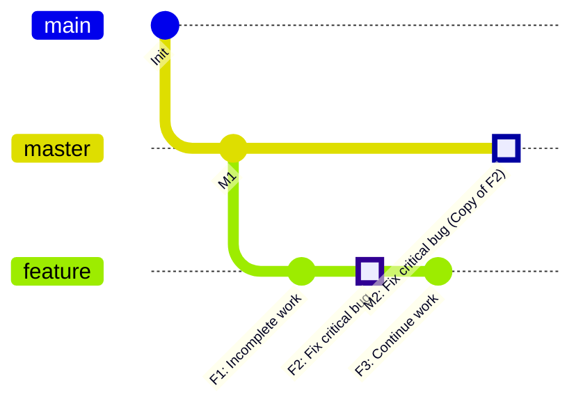
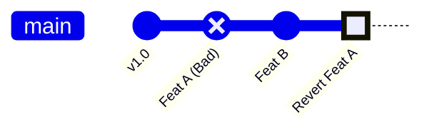

## 0. 核心定位

在 Git 的日常操作中，`merge` 是批量合并，而 `cherry-pick` 和 `revert` 则是**外科手术式**的精准操作。

- **Cherry-Pick**：**复制**。将特定的 Commit 从一个分支摘下来，应用到另一个分支。
- **Revert**：**抵消**。创建一个新的提交，其内容是反向修改指定提交的内容，用于在不破坏历史的前提下撤销更改。

---

## 1. Cherry-Pick：跨分支修补

**场景**：你在 `feature` 分支开发时，顺手修复了一个线上的紧急 Bug。这个 Bug 需要立刻同步给 `master`，但 `feature` 分支上的其他代码还未完成，不能直接 Merge。

### 核心原理

Git 会读取指定 Commit 的变更内容（Diff），并在当前分支重新应用一遍，生成一个新的 Commit Hash。



### 实战指令

```bash
# 1. 在 feature 分支找到修复 Bug 的 Commit Hash
git log --oneline
# 假设找到 Hash 为 a1b2c3d

# 2. 切换到目标分支 (如 master)
git checkout master

# 3. 执行“摘樱桃”
git cherry-pick a1b2c3d

# 4. 推送上线
git push origin master
```

### 常见问题：冲突

Cherry-pick 本质是合并操作，如果基准代码差异过大，会产生冲突。

- 解决冲突后：`git add .` -> `git cherry-pick --continue`
- 放弃操作：`git cherry-pick --abort`

---

## 2. Revert：公开撤销

**场景**：v2.0 版本上线后，发现 Commit A 导致了系统内存泄漏。此时代码已经推送到远程共享分支，**严禁使用 Reset 回退**，因为这会影响其他协作者。

### 核心原理

`revert` 是一次 " 负向提交 "。如果 Commit A 新增了一行代码，Revert A 就会生成一个删除该行代码的 Commit B。

**优势**：
1. **历史可追溯**：保留了 " 犯错 " 和 " 纠错 " 的完整记录。
2. **协作安全**：不改变历史时间轴，不会导致同事拉取代码时报错。



### 实战指令

```bash
# 1. 找到导致 Bug 的 Commit Hash
git log --oneline
# 假设是 bad1234

# 2. 执行撤销
git revert bad1234

# 3. 编辑提交信息
# Git 会自动生成 "Revert 'feat: add user login'…"，保存退出即可

# 4. 推送修复
git push origin master
```

---

## 3. Reset vs Revert：抉择指南

这是面试与实战中最高频的混淆点。

| 特性              | Git Reset (重置)         | Git Revert (还原)    |
| :-------------- | :--------------------- | :----------------- |
| **操作性质**        | **毁灭性**                | **累加性**            |
| **历史记录**        | 直接抹除指定 Commit 后的记录     | 新增一条反向 Commit，保留原记录 |
| **Commit Hash** | 指针直接回退                 | 生成全新的 Hash         |
| **适用场景**        | **本地**开发，代码还没 Push 到远程 | **远程**公共分支，代码已经公开  |
| **安全性**         | 低 (容易丢代码)              | 高 (随时可回滚)          |

---

## 4. 进阶场景：撤销合并 (Revert Merge)

**场景**：将 `feature` 分支合并到了 `master`，结果导致全站崩溃。所以需要撤销这个 Merge Commit。

**难点**：Merge Commit 有两个父节点（Parent），Git 不知道要回滚到哪一条线上。需要使用 `-m` 参数指定 " 主线 "。

```bash
# 1. 找到 Merge Commit 的 Hash (假设是 m3r9e88)
git log --oneline

# 2. 查看详情，确认 Parent 顺序
git show m3r9e88
# 输出：Merge: a1b2c3d e4f5g6h
# 这里 a1b2c3d 是 Parent 1 (原来的 master)，e4f5g6h 是 Parent 2 (feature)

# 3. 撤销合并，保留 Parent 1 (主线)
git revert -m 1 m3r9e88
```

> **注意**：Revert 一个 Merge Commit 后，如果你将来修复了 bug 再次合并该 feature 分支，Git 会认为刚才被 Revert 的代码已经合并过了，从而忽略它们。解决办法是：**Revert the Revert** (即对 " 撤销提交 " 再做一次撤销)，然后再合并。

---

## 5. 最佳实践 Checklist

1. **公共分支禁用 Reset**：只要代码 push 到了 `develop` 或 `master`，修复错误的唯一方式就是 `revert`。
2. **Cherry-pick 慎用**：频繁 Cherry-pick 会导致不同分支出现内容相同但 Hash 不同的提交，造成历史混乱。仅用于 Hotfix 或 提取特定修复。
3. **原子性提交**：保持每个 Commit 只做一件事。否则 Cherry-pick 时会把不需要的代码也带过去。
