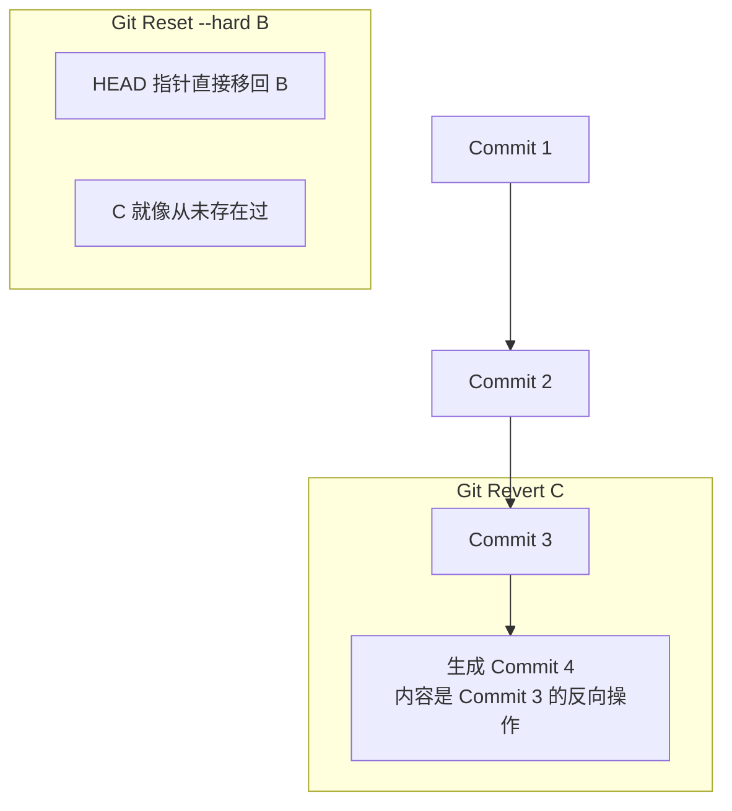

## 0. 核心场景

当掌握了 `add` 和 `commit` 后，进阶操作主要用于解决 "**代码写错了**"、"**提交太乱了**" 或者 "**需要回退到某个版本**" 的问题。

| 需求             | 对应指令          | 风险等级 | 核心作用                         |
| :------------- | :------------ | :--- | :--------------------------- |
| **合并前整理提交记录**  | `rebase -i`   | 中    | 将琐碎的 commit 合并为一个，保持历史整洁     |
| **只想要某个特定提交**  | `cherry-pick` | 低    | 跨分支 " 复制粘贴 " 特定的代码变更         |
| **彻底回退到某个版本**  | `reset`       | 高    | 毁灭性回退（本地使用），指针直接跳跃           |
| **公开分支撤销某次修改** | `revert`      | 低    | 礼貌性回退（公开使用），产生一个新的 " 反向 " 提交 |
| **暂存半成品代码**    | `stash`       | 无    | 冻结当前工作现场，去处理别的事情             |
| **二分法查找 Bug**  | `bisect`      | 无    | 自动化定位哪一次提交导致了报错              |
| **误删代码找回**     | `reflog`      | 无    | **后悔药**，记录所有 HEAD 的移动轨迹      |

---

## 1. 变基与整理历史 (Rebase)

**场景**：在本地开发一个功能，因为手滑或逻辑错误，断断续续提交了 5 次（比如 " 修复拼写错误 "、" 又修复了一个空格 "）。在合并到公共主干前，想把这 5 次提交合并成一个漂亮的 " 完成功能 X"。

### 交互式变基 (Interactive Rebase)

```bash
# 1. 整理最近的 4 次提交
git rebase -i HEAD~4

# 2. 会自动打开编辑器，显示如下内容：
# pick 3a1b2c 完成逻辑 A
# pick 4b2c1d 修复拼写错误  <-- 改为 squash (或 s)
# pick 5c3d2e 调整格式      <-- 改为 squash (或 s)
# pick 6d4e3f 完成逻辑 B

# 3. 保存退出后，Git 会让你重新编辑合并后的 Commit Message
```

### 变基 vs 合并 (Rebase vs Merge)

- **Merge**: 编织历史。保留所有真实发生的时间节点，形成网状结构（真实但混乱）。
- **Rebase**: 编造历史。将你的提交 " 嫁接 " 到最新的主干后面，形成一条直线（整洁但失真）。

> **警告**：严禁对**已经推送到远程**（多人共享）的分支执行 Rebase，这会导致团队成员的历史记录冲突。在使用之前可以先 `git fetch` 看看远程变动，详情参见：[Git Fetch 原理与实战](Git%20Fetch%20原理与实战.md)

---

## 2. 提交搬运工 (Cherry-pick)

**场景**：在 `feature` 分支开发，顺手修复了一个极其严重的 Bug。这个 Bug 必须立刻同步到 `master` 上线，但 `feature` 分支的其他代码还不能上线。

**操作**：只把修 Bug 的那个 Commit 摘出来。

```bash
# 1. 在 feature 分支找到修 Bug 的 commit hash (例如 a1b2c3d)
git log --oneline

# 2. 切换到目标分支 (master)
git checkout master

# 3. 摘取该提交
git cherry-pick a1b2c3d
```

更具体的使用方式参见：[Git 救火队 - Cherry-Pick 与 Revert](Git%20救火队%20-%20Cherry-Pick%20与%20Revert.md)

---

## 3. 现场冻结 (Stash)

**场景**：你正在 `dev` 分支写代码，写到一半，突然想起要去 `hotfix` 分支修一个紧急 Bug。此时代码还跑不通，不想 commit，也不想丢弃。

```bash
# 1. 将工作区和暂存区的所有修改“压栈”保存
git stash save "正在重构登录逻辑，暂存"

# 2. 此时工作区变干净了，可以切换分支去修 Bug
git checkout hotfix
# … (修完 Bug) …

# 3. 切回来，恢复现场
git checkout dev
git stash pop  # 恢复并从堆栈中删除
# 或者使用 git stash list 查看列表， git stash apply 恢复但不删除
```

更多详情参见：[Git Stash - 暂存你的代码](Git%20Stash%20-%20暂存你的代码.md)

---

## 4. 撤销的艺术 (Reset vs Revert)

这两个命令都用于 " 后悔 "，但原理截然不同。



### Reset (时光倒流)

**适用**：本地分支，代码写烂了想重来。

```bash
# 彻底回退到上一个版本，抛弃所有改动
git reset --hard HEAD^

# 回退 commit 记录，但保留文件修改在工作区（软回退）
git reset --soft HEAD^
```

### Revert (负荆请罪)

**适用**：公共分支，某次提交导致了 Bug，需要公开回滚。

```bash
# 撤销指定的 commit，Git 会自动生成一个新的 commit 来抵消它
git revert <commit-hash>
```

---

## 5. 科学捉虫 (Bisect)

**场景**：v1.0 版本是好的，v2.0 版本出 Bug 了。但这期间有 100 次提交，你不知道是哪一次提交搞坏了代码。

**原理**：利用二分查找算法 $O(\log n)$ 快速定位坏的 Commit。

```bash
# 1. 开始捉虫
git bisect start

# 2. 标记当前的坏节点 (v2.0)
git bisect bad HEAD

# 3. 标记已知的某个好节点 (v1.0 的 hash)
git bisect good <v1.0-hash>

# 4. Git 会自动切到中间的 commit
# 你运行代码测试。
# 如果是好的：输入 git bisect good
# 如果是坏的：输入 git bisect bad

# 5. 重复几次，Git 最终会告诉你：
# "b4d3a2c is the first bad commit"

# 6. 结束任务，切回原状
git bisect reset
```

---

## 6. 救命稻草 (Reflog)

**场景**：手滑执行了 `git reset --hard`，把写了一天的代码删没了。以为彻底完了？不，Git 记录了你的**每一次** HEAD 移动。

**原理**：Reflog 是 "Git 的操作日志 "，即使是已经删除的 Commit，在垃圾回收前也能在这里找到。

```bash
# 1. 查看操作记录（包括 reset, checkout 等）
git reflog
# 输出示例：
# b4d3a2c HEAD@{0}: reset: moving to HEAD^
# 9a8b7c6 HEAD@{1}: commit: add new feature (这里是你丢失的提交！)

# 2. 找回丢失的提交
git reset --hard 9a8b7c6
```

> 只要不删 `.git` 目录，Git 里几乎没有真正意义上的 " 永久丢失 "。

返回 [计算机基础能力](../30_Maps/计算机基础能力.md)
