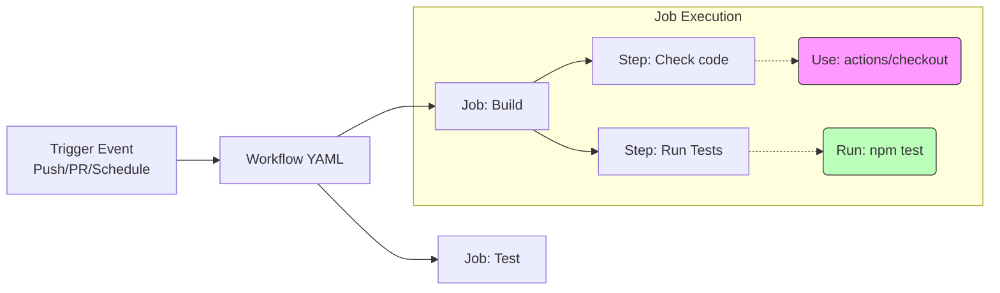

## 0. 核心理念

GitHub Actions (GHA) 将复杂的 CI/CD 逻辑封装为可复用的单元（Actions），从而大幅降低了流水线的构建门槛。

- **传统 CI**：需要精通 Bash/Python，手动编写 `curl`、`ssh`、`sed` 命令。
- **GHA**：需要精通搜索，找到现成的 `actions/checkout` 或 `docker/build-push-action` 进行组合。

---

## 1. 架构层级

GHA 的运行机制是一个事件驱动的层级结构。



- **Runner**：执行流水线的服务器（GitHub 托管或自托管）。
- **Step**：最小执行单位，既可以是 Shell 命令，也可以是封装好的 Action。

---

## 2. 场景演示

**场景**：开发一个 Go 应用，构建 Docker 镜像，推送到 Docker Hub，并发送 Slack 通知。
**痛点**：手动写 Docker login 和 push 脚本非常容易出错且不安全。

**GHA 解决方案**：

```yaml
name: Docker Build & Publish

on:
  push:
    tags: ['v*'] # 仅在打 tag 时触发

jobs:
  push_to_registry:
    name: Push Docker image to Docker Hub
    runs-on: ubuntu-latest
    steps:
      # 积木 1: 拉取代码 (官方)
      - name: Check out the repo
        uses: actions/checkout@v3

      # 积木 2: 处理 Docker 元数据 (官方)
      - name: Extract metadata (tags, labels) for Docker
        id: meta
        uses: docker/metadata-action@v4
        with:
          images: my-org/my-app

      # 积木 3: 登录 DockerHub (官方)
      - name: Log in to Docker Hub
        uses: docker/login-action@v2
        with:
          username: ${{ secrets.DOCKER_USERNAME }}
          password: ${{ secrets.DOCKER_PASSWORD }}

      # 积木 4: 构建并推送 (官方)
      # 这一步如果不通过 Action，需要写十几行 docker build/tag/push 命令
      - name: Build and push Docker image
        uses: docker/build-push-action@v4
        with:
          context: .
          push: true
          tags: ${{ steps.meta.outputs.tags }}
          labels: ${{ steps.meta.outputs.labels }}
      
      # 积木 5: 发送通知 (社区)
      - name: Slack Notification
        uses: rtCamp/action-slack-notify@v2
        env:
          SLACK_WEBHOOK: ${{ secrets.SLACK_WEBHOOK }}
```

---

## 3. 自定义复合动作 (Composite Actions)

当官方或社区的 Action 不满足需求，或者你想在多个 Workflow 之间复用一段逻辑时，可以创建**复合动作**。这相当于将一组积木封装成一个新的大积木。

**文件结构**：`./.github/actions/setup-go-env/action.yml`

```yaml
name: 'Setup Go & Tools'
description: 'Setup Go environment and install common tools'
inputs:
  go-version:
    description: 'Go version to use'
    required: true
    default: '1.20'

runs:
  using: "composite" # 关键标识
  steps:
    - uses: actions/setup-go@v4
      with:
        go-version: ${{ inputs.go-version }}
    
    - run: go install google.golang.org/protobuf/cmd/protoc-gen-go@latest
      shell: bash # 复合动作必须指定 shell
      
    - run: echo "Environment Ready!"
      shell: bash
```

**调用方式**：

```yaml
- uses: ./.github/actions/setup-go-env
  with:
    go-version: '1.21'
```

---

## 4. 安全风险与防御

由于 GHA 极度依赖第三方生态，**供应链攻击**是最大隐患。如果引用的 Action 作者恶意更新了代码，你的 CI 环境可能被盗取密钥。

### 锁定版本策略

| 锁定方式         | 示例                         | 安全性              | 维护成本                  |
| :----------- | :------------------------- | :--------------- | :-------------------- |
| **Branch**   | `uses: xyz/action@main`    | 极低 (随时可能被恶意篡改)   | 低                     |
| **Tag**      | `uses: xyz/action@v1`      | 中等 (Tag 可被覆盖/重打) | 中                     |
| **SHA Hash** | `uses: xyz/action@172239…` | 极高 (内容不可变)       | 高 (需配合 Dependabot 更新) |

**推荐做法**：对于非官方/不信任的 Action，必须使用 SHA 哈希值锁定。

```yaml
- uses: third-party/sketchy-action@a1b2c3d4e5f6… # 使用哈希
  comment: 'Pinned to v1.0.2 to prevent supply chain attack'
```

---

## 5. 高级技巧：矩阵与缓存

充分利用 GHA 的基础设施特性来加速构建。

1. **矩阵构建 (Matrix Strategy)**：
	一次性测试多版本，无需复制粘贴 Job。

	```yaml
    strategy:
      matrix:
        node: [14, 16, 18]
        os: [ubuntu-latest, windows-latest]
    ```

2. **依赖缓存 (Caching)**：
	不要让每次构建都重新下载几百兆的 `node_modules`。

	```yaml
    - uses: actions/setup-node@v3
      with:
        node-version: 18
        cache: 'npm' # 一行代码开启缓存
    ```
