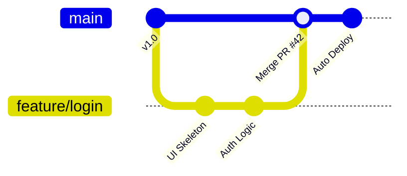

## 0. 核心定义

GitHub Flow 是一个轻量级的分支管理模型。与 Git Flow 复杂的 " 双主干 + 多辅助分支 " 结构不同，GitHub Flow 只有一条长期分支：**main**（或 master）。它的核心是：Main 分支永远是安全的、可部署的。

在这个模型中，**Pull Request** 不仅仅是一个合并请求，它是团队协作、代码审查 (Code Review) 和持续集成 (CI) 的**核心枢纽**。

---

## 1. 循环模型

GitHub Flow 遵循一个非常直观的六步闭环：

1. **创建分支**：从 `main` 创建一个描述性的分支（如 `feature/add-login`）。
2. **提交更改**：在本地进行开发。
3. **发起 PR**：推送到远程并开启 Pull Request（哪怕代码还没写完，也可以开 Draft PR 寻求反馈）。
4. **讨论与审查**：团队成员 Review 代码，CI 机器人自动跑测试。
5. **部署验证**：部分团队会在合并前部署到预览环境（Preview Environment）。
6. **合并**：代码进入 `main`，并自动触发生产环境部署。



---

## 2. PR：不仅仅是合并

在 GitHub Flow 中，PR 是集成的发生地。**PR 即集成 (PR is Integration)** 意味着集成测试不是在合并后才跑，而是在 PR 阶段就跑。

### CI Checks

当你发起 PR 时，GitHub Actions / Jenkins 立即介入：

- [x] 单元测试通过了吗？
- [x] 代码风格 (Lint) 规范吗？
- [x] 构建打包成功吗？

### Code Review

- " 这里是不是少了一个空指针判断？"
- " 这个变量名 `x` 含义不清，建议改为 `userIndex`。"

只有当**机器打钩**且**人点了 Approve**，这个 PR 才有资格点击 "Squash and Merge"。

---

## 3. 场景演示：修复按钮颜色

**目标**：将注册按钮从红色改为蓝色。

### 第一步：创建分支

```bash
git checkout main
git pull origin main
git checkout -b fix/register-btn-color
```

### 第二步：开发与提交

```bash
# 修改 CSS 文件...
git commit -am "style: change btn color to blue"
git push -u origin fix/register-btn-color
```

### 第三步：网页端操作

1. GitHub 页面提示 "Compare & pull request"。
2. 填写描述：" 修复了注册按钮颜色过深的问题，符合新版 UI 规范。"
3. **等待 CI 变绿**：右下角显示 "All checks passed"。
4. **等待同事 Review**：同事留言 "Looks good to me (LGTM)"。
5. **点击 Merge**：代码合并入 `main`。
6. **自动部署**：触发 CI/CD 流水线，线上按钮变蓝。

---

## 4. 部署策略的差异

这是 GitHub Flow 与 Git Flow 最大的区别点。

- **Git Flow**:
	- 合并到 `develop` -> 等待 Release -> 合并到 `master` -> **部署**。
	- 节奏：按版本发布（如两周一次）。
- **GitHub Flow**:
	- PR 合并到 `main` -> **立即部署**。
	- 节奏：持续发布（每天可能发布 10 次）。

> Q：如果合并到 `main` 就会上线，那如何防止 Bug？
>
> A：**自动化测试** 和 **部署预览**。现代工作流（如 Vercel/Netlify）会为每个 PR 生成一个临时的测试网址 `https://pr-123.myapp.com`，验收无误后再合并。

---

## 5. 模型对比表格

| 特性         | Git Flow                  | GitHub Flow      |
| :--------- | :------------------------ | :--------------- |
| **长期分支**   | 2 个 (`master`, `develop`) | 1 个 (`main`)     |
| **复杂度**    | 高                         | 低                |
| **发布频率**   | 周期性 (Sprint Based)        | 持续性 (Continuous) |
| **适合场景**   | 传统软件、App、开源库              | Web 应用、SaaS、初创团队 |
| **CI 介入点** | 主要在 `develop`             | 主要在 **PR** 阶段    |

^d910e3

---

## 6. 适用性总结

**什么时候用 GitHub Flow？**
- 团队维护的是一个 Web 网站或 SaaS 服务。
- 需要快速响应用户反馈。
- 拥有完善的自动化测试套件。

**什么时候不用？**
- 开发的是手机 App（受限于 App Store 审核，无法每天发版）。
- 软件需要极为严格的版本号管理（如嵌入式设备）。
