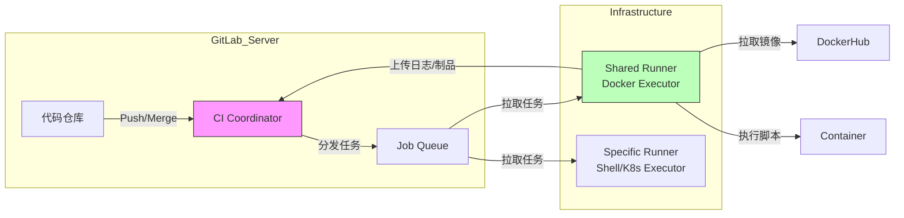

## 0. 核心理念

GitLab CI 看中的是是容器原生与单体集成。与 Jenkins 需要安装大量插件不同，GitLab CI 是 GitLab 平台不可分割的一部分。其运行逻辑基于一个核心假设：**一切环境皆镜像**。

$$
\text{Job Execution} = \text{Docker Image} + \text{Shell Script}
$$

- **环境解耦**：不在 CI 服务器上安装 Java/Node，而是为每个 Job 指定一个 Docker 镜像。
- **上下文一致**：代码仓库与流水线配置在同一个数据库中，权限、分支管理天然打通。

---

## 1. 架构与数据流

GitLab CI 采用了 **Coordinator (协调者)** - **Runner (执行者)** 分离架构。



---

## 2. 场景演示

GitLab CI 的配置文件 `.gitlab-ci.yml` 位于项目根目录。它以 **Job** 为核心单元，通过 **Stage** 控制顺序。

**场景**：构建一个 Java Spring Boot 应用，需要编译、测试，并将 JAR 包传递给下一阶段。

```yaml
# 1. 定义阶段顺序
stages:
  - build
  - test
  - deploy

# 2. 全局默认镜像
image: maven:3.8-openjdk-17

# 3. 缓存策略：加速构建，不作为永久存储
cache:
  paths:
    - .m2/repository

build_app:
  stage: build
  script:
    - echo "开始构建…"
    - mvn clean package -DskipTests
  # 4. 制品传递：将构建产物保存，传给下游 Job
  artifacts:
    paths:
      - target/*.jar
    expire_in: 1 week

unit_test:
  stage: test
  script:
    - mvn test
  # 依赖关系：显式声明依赖 build_app，虽然 Stage 默认线性执行
  needs: ["build_app"]

deploy_prod:
  stage: deploy
  # 5. 环境限制：只在 tag 发布时触发
  only:
    - tags
  script:
    - echo "部署到生产环境…"
    # 可以在这里调用 scp 或 kubectl
```

---

## 3. 高级特性：Services (伴随服务)

这是 GitLab CI 最强的功能之一。当测试需要数据库（MySQL/Redis）时，不需要去配置外部数据库，直接在 CI 中启动一个 " 伴随容器 "。

**场景**：集成测试需要连接真实的 MySQL 数据库。

```yaml
integration_test:
  stage: test
  image: node:16
  
  # 声明伴随服务：GitLab 会自动启动这个容器并链接到 Job 容器
  services:
    - name: mysql:5.7
      alias: db_host # 代码中通过 host: db_host 访问
      
  # 注入环境变量供 MySQL 容器初始化
  variables:
    MYSQL_ROOT_PASSWORD: root
    MYSQL_DATABASE: test_db
    
  script:
    - npm install
    - npm run test:integration # 测试代码连接 db_host:3306
```

---

## 4. Cache vs Artifacts

初学者最容易混淆的两个概念，用错会导致构建极慢或文件丢失。

| 特性 | Cache (缓存) | Artifacts (制品) |
| :--- | :--- | :--- |
| **目的** | **加速构建** (如 `node_modules`, `.m2`) | **数据持久化与传递** (如 `dist/`, `app.jar`) |
| **生命周期** | 尽力而为 (Best Effort)，可能会被清理 | 严格保证，直到过期时间或手动删除 |
| **跨 Job 可见性** | 通常在同一个 Runner 的同一个项目内共享 | 可以跨 Stage 传递，甚至跨项目下载 |
| **服务器上传** | 否 (通常在 Runner 本地或 S3) | 是 (上传回 GitLab Server) |
| **最佳实践** | `npm install` 产生的文件 | `npm run build` 产生的文件 |

---

## 5. 企业级管控：Tags 与 Runner

在大型组织中，GitLab CI 通过 **Tags** 实现物理资源的隔离与调度。

**场景**：
- 普通构建任务 -> 跑在公用的 Linux Runner 上。
- iOS 打包任务 -> **必须** 跑在配备了 Xcode 的 Mac 上。
- 生产环境部署 -> **必须** 跑在能访问生产内网的专用机器上。

**配置示例**：

```yaml
ios_build:
  stage: build
  script:
    - xcodebuild clean archive …
  # 调度指令：只有带有 ios 标签的 Runner 才会领取此任务
  tags:
    - ios
    - mac-mini

deploy_production:
  stage: deploy
  script:
    - ./deploy.sh
  tags:
    - production-network
  # 仅允许受保护的分支（如 main）触发此 Job
  rules:
    - if: $CI_COMMIT_BRANCH == "main"
```

---

## 6. 调试与验证

不像本地脚本，CI 脚本调试比较痛苦。推荐以下手段：

1. **CI Lint**：
	- GitLab 界面提供了 `CI Lint` 工具，粘贴 YAML 内容，可以校验语法错误（如缩进、无效关键字）。
2. **本地 Runner (gitlab-runner exec)**：
	- 可以在本地安装 `gitlab-runner` 并执行 `gitlab-runner exec docker build_job` 来模拟运行某个 Job。
	- *注意*：本地执行无法完全模拟服务器端的 Variables 和 Artifacts 传递。
3. **调试模式**：
	- 在 Variables 中设置 `CI_DEBUG_TRACE: "true"`，可以看到极其详细的 Runner 执行日志，用于排查 Shell 脚本为何挂掉。
