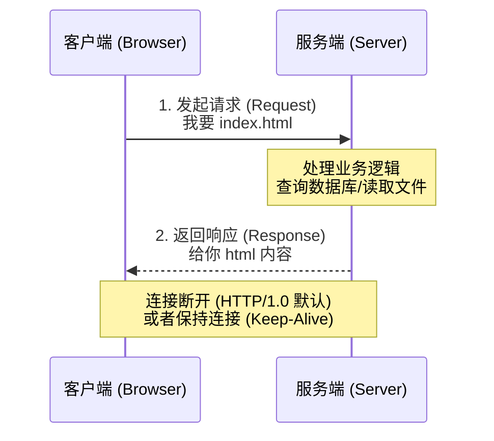
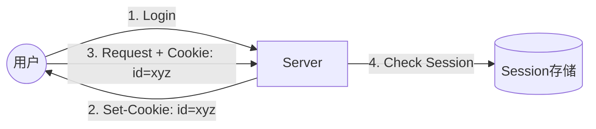

## 0. 核心模型

HTTP (HyperText Transfer Protocol) 是互联网数据传输的快递员。它基于 TCP/IP 协议，采用**请求 - 响应**（Request-Response）模型。

核心特征：

1. **无状态 (Stateless)**：协议本身不记仇也不记恩，服务器记不住你是谁，两次请求之间没有关联（除非使用 Cookie/Session）。
2. **文本传输**：虽然现在传输图片视频，但协议的元数据（头信息）是纯文本的，人眼可读。



---

## 1. 报文解剖

HTTP 报文就像一个快递包裹，分为包裹单（Header）和包裹内容（Body）。

### 场景：用户登录

假设在网页上提交用户名和密码，抓包看到的原始报文如下：

#### 请求报文 (Request)

```http
POST /api/login HTTP/1.1                <-- 1. 起始行 (方法 路径 版本)
Host: www.example.com                   <-- 2. 请求头 (Headers)
Content-Type: application/json
User-Agent: Chrome/90.0
Content-Length: 35

{"user": "admin", "pass": "123456"}     <-- 3. 请求体 (Body)
```

#### 响应报文 (Response)

```http
HTTP/1.1 200 OK                         <-- 1. 状态行 (版本 状态码 原因)
Date: Sat, 03 Jan 2026 12:00:00 GMT     <-- 2. 响应头 (Headers)
Content-Type: application/json
Set-Cookie: session_id=xyz123; Path=/

{"status": "success", "uid": 1001}      <-- 3. 响应体 (Body)
```

---

## 2. 请求方法与动词

HTTP 方法定义了对资源的操作类型，对应数据库的 **CRUD** 操作。

| 方法         | 含义     | 场景示例         | 是否幂等 *   |
| :--------- | :----- | :----------- | :------- |
| **GET**    | 获取资源   | 打开新闻列表、查看图片  | ✅ 是      |
| **POST**   | 新建资源   | 提交表单、下单、发布评论 | ❌ 否      |
| **PUT**    | 更新全量资源 | 覆盖式修改用户个人资料  | ✅ 是      |
| **PATCH**  | 更新局部资源 | 只修改密码，不改昵称   | ❌ 否 (通常) |
| **DELETE** | 删除资源   | 删除购物车商品      | ✅ 是      |

> **幂等性 (Idempotency)**：数学概念。意味着对同一个资源执行一次或多次操作，结果是一样的。例如 `DELETE` 删除一个文件，删一次和删十次，结果都是文件不存在了。但 `POST` 下单十次，就会产生十个订单。

---

## 3. 状态码速查

状态码是服务器告诉客户端 " 刚才那个请求处理得怎么样了 "。可以把它们看作红绿灯。

- **1xx (提示)**: 收到请求，请继续。
- **2xx (成功)**: 操作成功。
- **3xx (重定向)**: 资源搬家了，去别处找。
- **4xx (客户端错误)**: 客户端发的东西有问题，比如地址错了、参数错了。
- **5xx (服务端错误)**: 服务器崩了，不是客户端的错。

### 高频状态码

| 状态码     | 英文描述                  | 人话解释    | 典型场景                       |
| :------ | :-------------------- | :------ | :------------------------- |
| **200** | OK                    | 一切正常    | 网页秒开                       |
| **301** | Moved Permanently     | 永久搬家    | 访问 `http` 自动跳到 `https`     |
| **304** | Not Modified          | 没改过，用缓存 | 刷新页面，图片没变，直接用本地缓存          |
| **400** | Bad Request           | 参数因非法   | 填表单时格式不对                   |
| **401** | Unauthorized          | 没登录     | 访问后台管理页面被拦截                |
| **403** | Forbidden             | 登录了也没权  | 普通用户想删管理员数据                |
| **404** | Not Found             | 找不到     | 输错了网址，或者文章被删了              |
| **500** | Internal Server Error | 代码炸了    | 后端抛出了未捕获的异常                |
| **502** | Bad Gateway           | 上游没反应   | Nginx 还在，但后面的 Java/Node 挂了 |

---

## 4. 关键 Header 解析

Header 是 HTTP 的元数据，决定了传输的规则。

### 常用场景配置

**1. 内容协商 (Content-Type)**
告诉对方数据的格式。
- `text/html`: 我发的是网页。
- `application/json`: 我发的是 JSON 数据（API 常用）。
- `application/x-www-form-urlencoded`: 我发的是普通表单数据。

**2. 保持连接 (Connection: keep-alive)**
- **旧模式 (HTTP/1.0)**: 打开网页 -> 建立 TCP -> 传 HTML -> **断开** -> 建立 TCP -> 传 CSS -> **断开**… (效率极低)
- **新模式 (HTTP/1.1+)**: 打开网页 -> 建立 TCP -> 传 HTML -> 传 CSS -> 传图片 -> … -> **断开**。
- **说明**: 现在默认都是开启 Keep-Alive 的。

**3. 缓存控制 (Cache-Control)**
- `no-cache`: 每次都要向服务器确认一下文件变没变。
- `max-age=3600`: 1 小时内别烦我，直接用本地缓存。

---

## 5. 克服无状态：Cookie 与 Session

因为 HTTP 是无状态的，为了让服务器记住 " 你是刚才那个登录的人 "，引入了 " 补丁 "。

### 工作流程

1. **办卡 (Set-Cookie)**: 客户端第一次登录成功，服务器在响应头里下发 `Set-Cookie: session_id=123`。
2. **出示卡片 (Cookie)**: 客户端浏览器自动把卡片存起来。下次请求同一域名下的接口时，自动在请求头带上 `Cookie: session_id=123`。
3. **验卡**: 服务器拿着 ID 去 Session 库里查，发现是 " 张三 "，于是放行。



---

## 6. HTTP 版本演进简史

| 版本           | 核心痛点解决               | 关键词                     |
| :----------- | :------------------- | :---------------------- |
| **HTTP/1.1** | 解决了连接无法复用的问题         | 长连接 (Keep-Alive), 管道化   |
| **HTTP/2**   | 解决了队头阻塞，提升并发速度       | 多路复用, 二进制分帧, 头部压缩       |
| **HTTP/3**   | 解决了 TCP 握手慢、丢包重传慢的问题 | 基于 UDP (QUIC), 0-RTT 建连 |

返回 [计算机学习](../30_Maps/计算机学习.md)