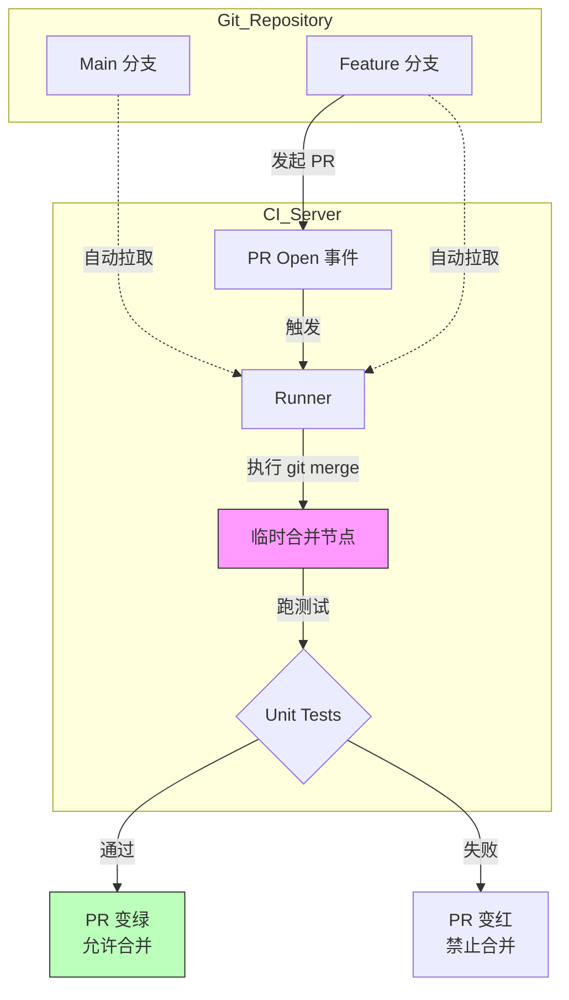

## 0. 概念

PR (Pull Request) 或 MR (Merge Request) 触发与 Push 触发不同，PR 触发的核心目的是预演。它不仅是测试代码，也是测试 **" 代码被合并到主干后，主干会不会爆炸 "**。

---

## 1. 关键机制：Shadow Merge

当你发起一个 PR 时，CI 服务器并没有直接拉取你的分支，而是拉取了一个 **" 模拟合并后的状态 "**。

- **GitHub**: 创建一个特殊的引用 `refs/pull/:id/merge`。
- **行为**: 相当于在 CI 环境里偷偷执行了 `git merge main`。如果这个模拟合并有冲突或跑不通测试，PR 会被标记为失败，从而保护主干。



---

## 2. 实操场景与配置

### 场景一：GitHub Actions 标准配置

**背景**：只在 PR 开启、同步（更新代码）、重新开启时触发。

```yaml
name: PR Checks

on:
  pull_request:
    branches: [ "main" ]
    # 过滤动作，避免只是改个 Label 就重跑流水线
    types: [opened, synchronize, reopened]

jobs:
  test:
    runs-on: ubuntu-latest
    steps:
      - uses: actions/checkout@v3
        # 关键：这会拉取合并后的代码，而不是 PR 分支的头部
        # 此时的 GITHUB_SHA 是一个临时的 merge commit
```

### 场景二：GitLab CI 分离管道

GitLab 有一个独特的痛点：默认情况下，Push 到分支会触发一个 pipeline，发起 MR 又会触发一个，导致双倍资源浪费。需要显式区分。

```yaml
workflow:
  rules:
    # 如果是 MR 事件，总是触发
    - if: $CI_PIPELINE_SOURCE == 'merge_request_event'
    # 如果有开放的 MR，则不要触发分支 Push 流水线 (避免重复)
    - if: $CI_COMMIT_BRANCH && $CI_OPEN_MERGE_REQUESTS
      when: never
    # 普通的分支 Push (没有 MR 的时候)
    - if: $CI_COMMIT_BRANCH
```

---

## 3. 高级策略：Review Apps

PR 触发的最高级形态是**为每个 PR 部署一个独立的临时环境**。

- **目的**：让产品经理和设计师不需要拉代码，直接点开链接就能验收 UI 变更。
- **生命周期**：
	1. `PR Opened` -> 部署环境 `app-pr-42.dev.com`。
	2. `PR Synchronize` -> 更新环境。
	3. `PR Closed/Merged` -> **自动销毁**环境，释放资源。

```
# 伪代码逻辑示意
jobs:
  deploy-preview:
    if: github.event_name == 'pull_request'
    steps:
      - run: helm upgrade --install pr-${{ github.event.number }} ./chart
  
  cleanup-preview:
    if: github.event.action == 'closed'
    steps:
      - run: helm uninstall pr-${{ github.event.number }}
```

---

## 4. 资源优化：并发取消

**场景**：提交了代码，CI 开始跑（预计 10 分钟）。1 分钟后发现有个拼写错误，又提交了一次。现在有两个流水线在跑，前一个已经没意义了。

**解法**：使用并发组自动取消旧任务。

```yaml
# GitHub Actions 配置
concurrency:
  # 组名建议包含 Ref，确保只取消当前 PR 的旧任务，不影响别人的 PR
  group: ${{ github.workflow }}-${{ github.ref }}
  cancel-in-progress: true
```

---

## 5. Push vs PR 触发

| 维度 | Push 触发 (`on: push`) | PR 触发 (`on: pull_request`) |
| :--- | :--- | :--- |
| **触发时机** | 代码推送到远程仓库那一刻 | 创建或更新 Pull Request 时 |
| **代码上下文** | **当前分支的 HEAD** | **当前分支与目标分支的模拟合并结果** |
| **主要用途** | 持续反馈、部署到开发环境 | 准入控制 (Gatekeeping)、代码审查辅助 |
| **权限** | 通常拥有仓库的 Write 权限 | Fork 过来的 PR 通常只有 Read 权限 (安全限制) |
| **推荐检查** | 快速单元测试 | 全量集成测试、Lint、Review App |
