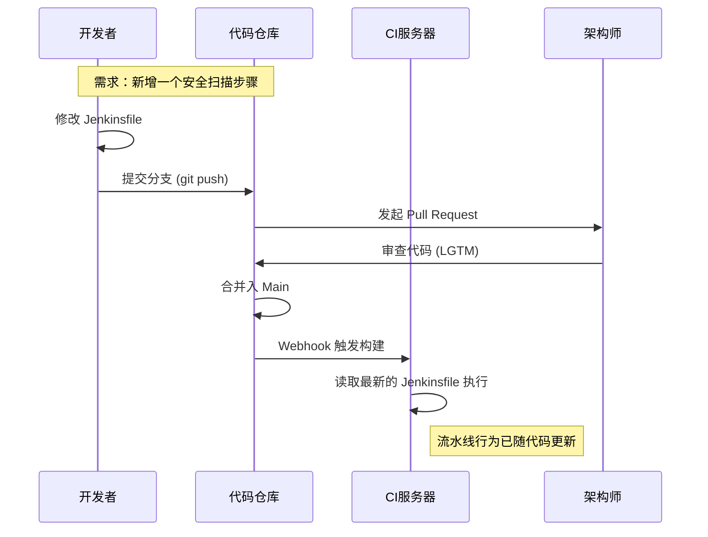

## 0. 定义

Pipeline as Code (PaC) 指将构建、测试、部署的流水线配置，从 CI/CD 工具的**图形界面 (GUI)** 迁移到**代码仓库**中进行版本控制。

这标志着运维从口口相传进入了成文法时代：

$$
\text{Reliability} = \text{Version Control} \times \text{Visibility} \times \text{Reproducibility}
$$

- **GUI 模式 (ClickOps)**：黑盒操作。张三在 Jenkins 网页上点了一个复选框，李四不知道，下周构建挂了没人知道原因。
- **PaC 模式**：白盒操作。流水线逻辑就是仓库里的一个文件（如 `Jenkinsfile` 或 `.gitlab-ci.yml`），任何修改都有 Git 记录。

---

## 1. 模式对比

| 维度       | 传统 UI 配置 (ClickOps) | 配置即代码 (PaC)                 |
| :------- | :------------------ | :-------------------------- |
| **可见性**  | 只有管理员能看到配置细节        | 全员可见，就在代码仓库根目录              |
| **变更记录** | 几乎没有                | 完美的 Git Commit 历史           |
| **复用性**  | 复制/粘贴 Job，极其痛苦      | 引用共享库 (Shared Library) 或 模板 |
| **灾难恢复** | 服务器挂了 = 配置全丢        | 服务器挂了 = 重新拉取代码即可            |
| **审查流程** | 无法审查，改了直接生效         | 走 Pull Request 流程，需同事批准     |

---

## 2. 实操场景与代码演示

### 场景一：Jenkins 声明式流水线

**背景**：团队需要统一构建标准，规定所有项目构建超时时间为 1 小时，且必须归档构建产物。
**文件**：`Jenkinsfile` (存放于项目根目录)

```groovy
pipeline {
    agent any
    
    // 全局配置：代码化的 SLA
    options {
        timeout(time: 1, unit: 'HOURS') 
        buildDiscarder(logRotator(numToKeepStr: '10'))
    }

    environment {
        // 避免硬编码，凭证ID化
        DB_PASSWORD = credentials('prod-db-secret')
    }

    stages {
        stage('Build') {
            steps {
                sh 'npm install'
                sh 'npm run build'
            }
        }
        stage('Test') {
            steps {
                // 具体的测试脚本
                sh 'npm run test:unit'
            }
        }
    }
    
    post {
        always {
            // 无论成功失败，都归档测试报告
            junit 'test-results.xml'
        }
        failure {
            // 失败自动通知
            slackSend channel: '#ops-alerts', message: "Build Failed: ${env.JOB_NAME}"
        }
    }
}
```

### 场景二：GitHub Actions 工作流

**背景**：开源项目，需要针对不同版本的 Node.js 进行矩阵测试。
**文件**：`.github/workflows/ci.yml`

```yaml
name: Node CI

on: [push, pull_request] # 触发事件代码化

jobs:
  build:
    runs-on: ubuntu-latest
    strategy:
      # 矩阵构建：一次配置，多重测试
      matrix:
        node-version: [14.x, 16.x, 18.x]

    steps:
    - uses: actions/checkout@v3
    - name: Use Node.js ${{ matrix.node-version }}
      uses: actions/setup-node@v3
      with:
        node-version: ${{ matrix.node-version }}
    - run: npm ci
    - run: npm test
```

---

## 3. 工作流变更图解

使用 PaC 后，修改流水线本身也变成了一种开发行为，纳入了 Code Review 体系。



---

## 4. 最佳实践

1. **单一事实来源 (Single Source of Truth)**：
	- 禁止在 CI 工具的网页上做任何临时修改。如果网页配置和代码文件冲突，通常代码会覆盖网页，或者导致不可预知的行为。
2. **机密剥离 (Secret Decoupling)**：
	- **严禁**将密码、Token 写在 YAML/Groovy 文件里。
	- **必须**使用变量引用（如 `secrets.AWS_KEY`），真正的值存储在 CI 平台的加密保险箱中。
3. **避免 "YAML Wall of Text"**：
	- 不要在 YAML 里写几百行的 Shell 脚本。
	- **做法**：将复杂的逻辑写入 `./scripts/build.sh`，然后在 YAML 里调用 `sh './scripts/build.sh'`。这样方便在本地调试脚本。

---

## 5. 常见反模式

- **Hardcoding Paths**: 写死了 `/home/jenkins/project`，导致换个节点就跑不起来。应使用相对路径或环境变量 `${WORKSPACE}`。
- **Copy-Paste Reuse**: 几十个微服务的流水线文件完全一样。
	- *修正*：使用 **Shared Libraries (Jenkins)** or **Reusable Workflows (GitHub Actions)**。即 " 流水线的模版化 "。
- **缺乏 Lint**: 提交了格式错误的 YAML，导致流水线直接语法报错。
	- *修正*：使用 `actionlint` 或 `npm run lint` 在本地先校验配置文件。
