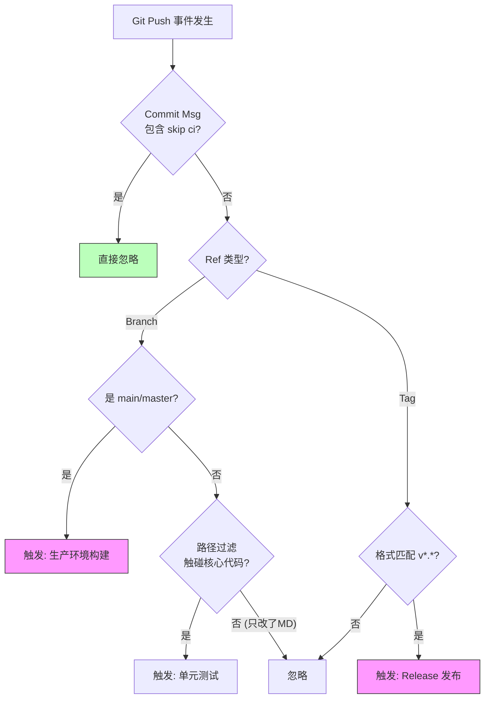

## 0. 概念

Push 触发本质是一个 **Webhook 过滤器**。流水线不仅监听 " 有代码推上来了 "，也判断 " 这次推送是否值得消耗计算资源 "。

- **全量触发**：每 Push 一次就跑一遍（资源浪费）。
- **精准触发**：只在特定分支、特定文件变更或打 Tag 时运行。

---

## 1. 触发过滤

根据团队的开发流，Push 事件通常被细分为以下几种维度：

| 过滤维度 | 典型场景 | 目的 |
| :--- | :--- | :--- |
| **分支过滤 (Branch)** | 只监听 `main` 或 `develop` | 防止开发人员的临时实验性分支占用 Runner 资源。 |
| **标签过滤 (Tag)** | 只有形如 `v1.0.0` 的 Tag 才触发部署 | 区分 " 日常提交 " 与 " 正式发布 "。 |
| **路径过滤 (Path)** | 修改了 `src/` 才跑测试，修改 `docs/` 不跑 | **Monorepo (单体仓库)** 必备，避免改个 README 就重编译整个后端。 |
| **消息过滤 (Message)** | Commit 信息包含 `[skip ci]` | 修改错别字或文档时，主动跳过构建。 |

---

## 2. 场景示例

### 场景一：Monorepo 的路径隔离 (GitHub Actions)

**背景**：前后端在同一个仓库。前端改了代码，不应该触发后端的 Java 构建流水线。

```yaml
on:
  push:
    branches:
      - 'main'
    # 核心：只有 backend 目录下的变化才会触发此 Workflow
    paths:
      - 'backend/**'
    # 反向过滤：如果是纯文档修改，忽略之
    paths-ignore:
      - '**.md'
      - 'docs/**'
```

### 场景二：发布专用的 Tag 触发 (GitLab CI)

**背景**：日常 Push 只跑测试，只有打上 `v` 开头的 Tag 时，才执行构建 Docker 镜像并发布的操作。

```yaml
deploy_prod:
  stage: deploy
  script:
    - ./deploy_script.sh
  rules:
    # 只有当这是个 Tag，且 Tag 名字符合 v1.2.3 格式时触发
    - if: $CI_COMMIT_TAG =~ /^v\d+\.\d+\.\d+$/
      when: always
    # 其他 Push 事件一律不执行此 Job
    - when: never
```

---

## 3. 人工干预

有时开发者需要拥有急停或强制跳过的权力。绝大多数 CI 平台（GHA, GitLab, Jenkins, Travis）都支持在 Commit Message 中通过特殊关键词跳过流水线。

**操作方式**：在提交信息中加入 `[skip ci]` 或 `[ci skip]`。

```bash
# 这种提交由于只是修补文档，不会触发任何 CI/CD，节省几分钟排队时间
git commit -m "docs: fix typo in readme [skip ci]"
git push
```

---

## 4. 判定流程

一个成熟仓库对 Push 事件的处理逻辑示例：



---

## 5. 常见误区与最佳实践

1. **不要同时监听 Push 和 PR**：
	- *问题*：如果你配置了 `on: [push, pull_request]`，当你向一个开启了 PR 的分支 Push 代码时，流水线会跑**两次**（一次是 Branch Push，一次是 PR 更新）。
	- *解法*：在 Push 触发中排除掉非保护分支，或者使用并发组 (Concurrency Group) 自动取消旧任务。
2. **避免宽泛的通配符**：
	- *反例*：`branches: ['*']`。这会导致每个人推的垃圾分支都在跑 Runner，月底账单会爆炸。
	- *建议*：显式白名单机制，只监听有意义的分支。
3. **Tag 触发的陷阱**：
	- Tag 推送也是一种 Push。如果你在 `on: push` 里没有排除 Tag，发布时可能会触发两次构建（一次是代码 merge 进 main，一次是打 tag）。需通过 `if` 逻辑严格区分上下文。
