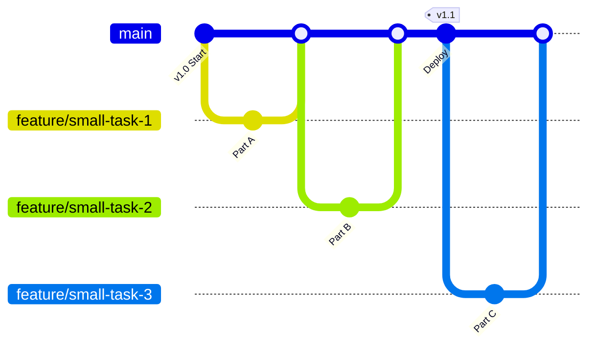

## 0. 核心定义

**主干开发** (Trunk-Based Development, TBD) 是一种源代码管理分支模型。

在这种模式下，开发人员不再维护长周期的特性分支，而是通过**高频次**（每天至少一次）将代码合并到唯一的共享主干（通常是 `master` 或 `main`）。它是实现 **CI/CD**（持续集成/持续交付）和 **DevOps** 的基石。

核心逻辑：**随时可发布**。主干代码永远保持稳定，不再有 " 合并地狱 "。

---

## 1. 核心运作原则

### 单一主干

整个团队依靠一条主干分支（Trunk）运作。除了 Release 分支（用于存档或紧急修复）外，不存在其他长期分支。

### 极短的生命周期

如果必须使用分支（Scaled TBD 模式），分支的寿命通常**不超过 24 小时**。开发人员完成一个小任务（Task）后立即发起 PR 合并，而不是等整个功能（Feature）做完。

### 解耦部署与发布

由于代码还没写完就合并到了主干，为了不影响线上用户，必须严格区分 " 部署 " 和 " 发布 " 两个概念。

- **部署 (Deploy)**：代码跑在生产环境服务器上。
- **发布 (Release)**：用户能看见并使用该功能。
- **手段**：特性开关 (Feature Toggles)。

---

## 2. 工作流模型图解

TBD 的提交历史通常非常平级，呈现线性的形态。



与 Git Flow 相比，TBD 没有复杂的层级结构，强调快速反馈。

---

## 3. 关键技术：特性开关 (Feature Toggles)

这是 TBD 能够运转的核心。当功能未完成时，通过代码逻辑隐藏入口，确保虽然代码在主干，但不会影响用户。

**场景**：要开发一个新的支付页面，预计需要 5 天，但第一天写好的 UI 骨架必须合并进主干。

### 代码实现示例

```javascript
// config/features.js
const features = {
    // 开关配置：默认关闭，仅对内部测试用户开启
    'new-payment-ui': false 
};

// src/components/Checkout.js
function CheckoutPage(user) {
    // 检查开关状态
    if (featureManager.isEnabled('new-payment-ui', user)) {
        // 返回新开发的页面（即使它可能还半成品）
        return renderNewPaymentUI();
    } else {
        // 返回旧的稳定页面
        return renderLegacyPaymentUI();
    }
}
```

**优势**：
1. **消除分支**：不需要为新功能维护单独分支。
2. **黑盒测试**：可以在生产环境对特定用户（如 QA 或 Beta 用户）开启新功能进行测试。
3. **一键回滚**：如果新功能上线后报错，修改配置即可关闭，无需回退代码。

---

## 4. TBD 与 Git Flow 对比

| 维度 | Git Flow | TBD (主干开发) |
| :--- | :--- | :--- |
| **分支寿命** | 长（几天到几周） | 极短（几小时到一天） |
| **集成频率** | 低（功能做完才合并） | 高（写一点合并一点） |
| **冲突风险** | 高（容易出现大规模冲突） | 低（持续解决微小冲突） |
| **代码可见性** | 低（代码藏在分支里） | 高（所有人都能看到最新进展） |
| **依赖设施** | 手动管理为主 | 强依赖自动化测试 (CI) |
| **适用场景** | 传统软件、版本间隔长 | SaaS、互联网应用、持续交付 |

---

## 5. 适用场景与门槛

### 适合场景

- **SaaS 产品**：需要每天甚至每天多次更新。
- **资深团队**：团队成员代码质量高，沟通顺畅。
- **微服务架构**：服务拆分细致，单一仓库代码量可控。

### 实施门槛

TBD 看起来简单，但实际对基础设施要求极高。如果满足不了以下条件，强行上 TBD 会导致主干频繁崩溃：

1. **自动化测试覆盖率高**：必须有可靠的单元测试和集成测试，确保每次 Merge 不会炸毁主干。
2. **快速的 CI 流水线**：提交后必须在几分钟内告知结果，否则会阻塞后续合并。
3. **代码审查响应快**：PR 不能堆积过夜。
