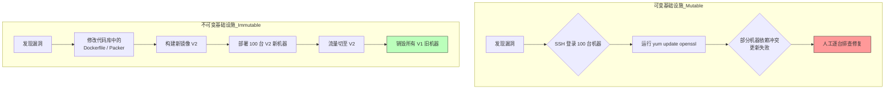

## 0. 核心理念

如果需要更新软件、修复漏洞或修改配置，不是通过 SSH 登录服务器去运行命令，而是构建一个新的服务器镜像，替换掉旧的。

这引入了运维界最著名的比喻：**宠物 vs 牲畜**。

| 模式       | 宠物模式 (Mutable)                  | 牲畜模式 (Immutable)                   |
| :------- | :------------------------------ | :--------------------------------- |
| **对待方式** | 精心起名 (web-server-01)，生病了找医生治好它。 | 只用编号 (k8s-pod-x9d2)，生病了直接杀掉，换一只新的。 |
| **预期寿命** | 数年                              | 数小时 / 数天                           |
| **修改方式** | 原地修补                            | 销毁并重建                              |

$$
\text{System State} = \text{Initial State} \quad (\text{Valid for lifetime})
$$

---

## 1. 痛点：配置漂移 (Configuration Drift)

**场景**：有一个生产环境，包含 10 台服务器。
- **第 1 天**：所有服务器配置一模一样。
- **第 100 天**：运维 A 登录 Server-1 手动安装了一个补丁；运维 B 登录 Server-5 修改了防火墙规则但忘了同步给其他机器。
- **第 200 天**：**配置漂移** 导致环境各不相同。代码在 Server-1 能跑，在 Server-5 报错。

不可变基础设施通过禁止原地修改，从物理上消灭了配置漂移。

---

## 2. 变更工作流对比

两种模式在面对 "OpenSSL 安全漏洞修复 " 时的不同操作路径：



---

## 3. 技术栈与代码实现

实现不可变基础设施通常依赖 **云镜像 (AMI)** 或 **容器 (Docker)**。

### 阶段一：烘焙 (Baking)

将所有依赖、配置、代码打包成一个只读的制品（Artifact）。

**示例：Packer 配置 (构建虚拟机镜像)**

```hcl
// 这是一个构建定义的“蓝图”
source "amazon-ebs" "web-server" {
  ami_name      = "web-server-v1.0-${timestamp()}"
  instance_type = "t2.micro"
  ssh_username  = "ubuntu"
}

build {
  sources = ["source.amazon-ebs.web-server"]

  // 在构建阶段就把软件装好，而不是启动阶段
  provisioner "shell" {
    inline = [
      "sudo apt-get update",
      "sudo apt-get install -y nginx",
      "sudo systemctl enable nginx"
    ]
  }
}
```

### 阶段二：部署 (Provisioning)

使用 Terraform 或 Kubernetes 替换资源。

```hcl
# Terraform 示例
resource "aws_instance" "web" {
  # 每次修改这个 AMI ID，Terraform 都会销毁旧机器，创建新机器
  ami = "ami-0123456789abcdef0" 
  
  lifecycle {
    create_before_destroy = true # 先创建新的，再杀掉旧的（蓝绿部署）
  }
}
```

---

## 4. 关键原则与限制

在实施时，必须遵守以下铁律：

1. **数据与应用分离**：
	- 由于服务器随时可能被销毁，**绝对不能**在本地磁盘存储任何持久化数据（如用户上传的图片、数据库文件）。
	- *解法*：数据必须存放在外部对象存储 (S3) 或托管数据库 (RDS) 中。
2. **日志外发**：
	- 机器销毁后日志就没了。
	- *解法*：应用必须将日志实时流式传输到 ELK / Splunk 等中心化日志系统。
3. **禁止 SSH**：
	- 原则上，生产环境的机器不需要开 SSH 端口。如果一定要排查问题，应当启动一个调试用的临时容器/实例，而不是修改现有的服务节点。

---

## 5. 速度与稳定性

| 维度     | 优势                        | 代价                        |
| :----- | :------------------------ | :------------------------ |
| **回滚** | **极快**。只需将负载均衡指向旧版本的镜像即可。 | 构建镜像需要时间，对于微小配置变更可能显得笨重。  |
| **调试** | 环境一致性极高，杜绝 " 我本地是好的 " 问题。 | 生产环境问题现场排查困难，因为不能随便改文件调试。 |
| **安全** | 攻击者植入的后门会在下一次部署时被自动清除。    | 需要完善的自动化流水线支持。            |
