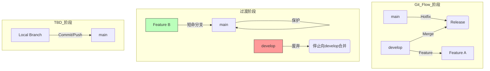

## 0. 基础设施准备

在放弃 `develop` 分支之前，必须建立安全网。如果自动化测试覆盖率低，强制切 TBD 会导致生产事故。

- **建立高频 CI**：确保每次 Commit 在 10 分钟内完成构建和单元测试。
- **自动化部署流水线**：从合并到测试环境（Staging）必须自动化，减少人工运维。

| 检查项      | Git Flow 要求 | TBD 要求      |
| :------- | :---------- | :---------- |
| **测试速度** | 慢点没关系，上线周期长 | 极快，必须阻塞合并   |
| **测试覆盖** | 核心链路覆盖      | 全面覆盖，包含集成测试 |
| **回滚策略** | 重新打 Tag 发布  | 快速修复 或 开关回滚 |

---

## 1. 引入特性开关

这是 TBD 的核心技术依赖。为了让半成品代码能安全地合并进主干，必须将其隐藏。

**场景**：正在开发一个新的 " 黑暗模式 "UI，预计需要 3 天，但主干每天都要发布。

**代码实现（Feature Flag 模式）**：

```javascript
// config/flags.js
const flags = {
  ENABLE_DARK_MODE: false // 生产环境默认为 false，开发环境设为 true
};

// ui/theme_loader.js
function loadTheme() {
  if (flags.ENABLE_DARK_MODE) {
    // 即使这段代码合并到了 main，用户也看不见
    return new DarkTheme(); 
  }
  return new LightTheme();
}
```

---

## 2. 分支结构调整路径

使用 Mermaid 展示从复杂的双主线结构向单主线结构的过渡。



**关键动作**：
1. **锁定 develop**：停止从 Feature 分支向 `develop` 合并，所有 PR 直接指向 `main`。
2. **缩短分支寿命**：规定 Feature 分支存活时间不得超过 24 小时。
3. **移除 Release 分支**：改为直接在 `main` 上打 Tag 进行发布。

---

## 3. 团队协作习惯重构

技术只是阻碍的一半，另一半是人为习惯。

- **小批量提交**：
	- *旧习惯*：写完一个完整功能（50 个文件）才提交。
	- *新习惯*：写完一个函数、改完一个接口就提交（文件级/行级），即使功能没跑通（只要被开关包裹）。
- **同步代码审查**：
	- Code Review 优先级高于写新代码。
- **非阻塞式设计**：
	- 数据库变更需兼容旧代码（例如：先加列，不删列），实现代码与数据库迁移的解耦。

---

## 4. Checklist

1. 保持 Git Flow 结构，但强制 Feature 分支不超过 2 天，开始引入 Feature Flag。
2. 对于紧急修复或小型迭代，允许跳过 `develop` 直接合入 `main`。
3. 将 `develop` 代码全量合并入 `main`。删除 `develop` 分支。
4. CI 脚本将触发源改为仅监听 `main`。
5. 引入 " 主干监控 "，一旦 CI 挂了，全员停止开发直至修复。
