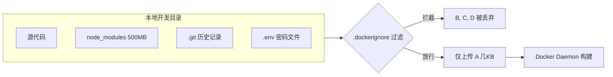

## 0. 机制

`.dockerignore` 的作用类似于 Git 的 `.gitignore`，但它服务的对象是 **Docker Daemon**。

在执行 `docker build` 时，Docker 客户端（Client）做的第一件事并不是读取 Dockerfile，而是**打包当前目录下的所有文件**（Build Context）并发送给 Docker 服务端（Daemon）。

`.dockerignore` 就是这个打包过程中的**过滤器**。它告诉 Docker：" 这些文件不要打包发给服务端，也不要放进镜像里 "。



---

## 1. 为什么它是必须的

如果不写这个文件，新手很容易遇到构建特别慢或泄露密码的问题。

### 1.1 加速构建

**场景**：Node.js 项目里有一个 `node_modules` 文件夹，里面有数万个小文件，总计 300MB。
- **无忽略**：Docker 每次构建都要先把这 300MB 打包上传，光 "Sending build context" 就要等半天。
- **有忽略**：直接跳过该文件夹，瞬间开始构建。

### 1.2 保护安全

**场景**：项目根目录下有一个 `.env` 文件，里面写着 `DB_PASSWORD=secret`。
- **无忽略**：执行 `COPY . .` 时，密码文件被复制进镜像。任何拿到镜像的人都能看到密码。
- **有忽略**：密码文件根本不会进入构建上下文，彻底杜绝泄露。

### 1.3 缓存优化

**场景**：生成了一个 `debug.log` 日志文件。
- **无忽略**：日志变了 -> Docker 认为上下文变了 -> `COPY` 指令缓存失效 -> 后续步骤全部重跑。
- **有忽略**：Docker 无视日志变化，继续使用缓存。

---

## 2. 语法规则

语法与 Git 类似，按行匹配。

| 符号 | 含义 | 示例 | 匹配结果 |
| :--- | :--- | :--- | :--- |
| `#` | 注释 | `# 这是一个注释` | 被忽略 |
| `*` | 通配符 | `*.md` | 所有 Markdown 文件 |
| `?` | 单字符占位 | `temp?` | `tempa`, `tempb` (不匹配 `tempab`) |
| `!` | **例外（反选）** | `!README.md` | 就算忽略了 `*.md`，也要保留 `README.md` |
| `/` | 目录匹配 | `temp/` | 忽略 temp 目录下的所有内容 |
| `**` | 递归匹配 | `**/*.log` | 任意层级目录下的 log 文件 |

---

## 3. 通用模板

以下是一个适用于大多数 Web 项目（Python/Node.js/Go）的标准配置。建议直接保存在项目根目录的 `.dockerignore` 文件中。

```dockerignore
# --- 版本控制与元数据 ---
.git
.gitignore
.dockerignore
README.md
LICENSE

# --- 开发环境依赖 (由容器内重新安装) ---
node_modules/
venv/
__pycache__/
*.pyc
target/
dist/

# --- 敏感信息 (绝对不能进镜像) ---
.env
.env.*
*.pem
*.key
id_rsa
secrets/

# --- IDE 配置文件 ---
.idea/
.vscode/
*.swp

# --- 临时文件与日志 ---
*.log
npm-debug.log
tmp/
coverage/
build/
```

---

## 4. 常见误区辨析

**误区 1：认为有了 `.gitignore` 就够了**
- Docker **不会**自动读取 `.gitignore`。即使在 Git 里忽略了 `node_modules`，Docker 依然会把它拷进去，必须在 `.dockerignore` 里再写一遍。

**误区 2：在 Dockerfile 里删文件**
- **错误做法**：

	```dockerfile
    COPY . .
    RUN rm -rf secret.txt  # 以为这样就删掉了
    ```

- Docker 镜像分层存储。`secret.txt` 依然存在于 `COPY` 那一层里，黑客可以通过回溯历史层找回文件。**必须在源头（.dockerignore）就拦住它。**

**误区 3：文件没被 COPY 进去**
- **场景**：在 `.dockerignore` 里写了 `config.json`，然后试图在 Dockerfile 里 `COPY config.json .`。
- **结果**：构建报错 `file not found`。因为被忽略的文件连 Context 都进不去，Docker Daemon 根本找不到它。
