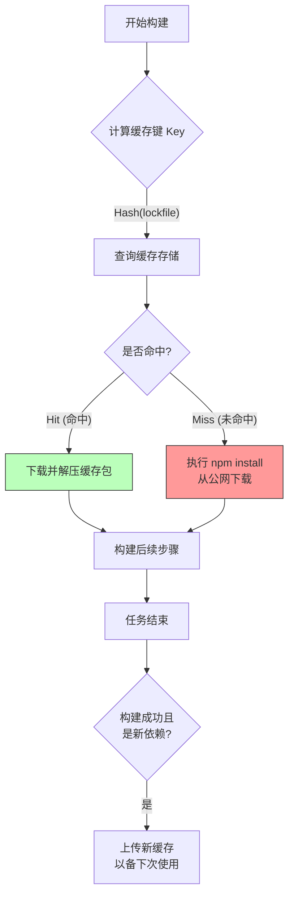

## 0. 关键

在现代 CI/CD 流水线中，依赖安装通常占据了 50% 以上的构建时间。缓存策略的核心是用**存储空间换取时间**。

$$
\text{Total Time} = \text{Compute Time} + \lim_{\text{Cache} \to \text{Hit}} (\text{Network Download Time})
$$

- **无缓存**：每次构建都从 npm/maven 中央仓库下载几百 MB 的包，受限于带宽和网络波动。
- **有缓存**：直接从 CI 运行器的本地或近端对象存储解压文件，耗时通常为秒级。

---

## 1. 缓存命中机制

缓存依赖于指纹比对。其判定流程为：



---

## 2. 平台配置实战

不同平台配置缓存的语法不同，但核心逻辑一致：**声明路径 (Path)** + **声明键 (Key)**。

### 场景一：GitHub Actions

GitHub 提供了极其简便的官方 Action，既可以使用底层的 `actions/cache`，也可以使用封装好的 setup 动作。

**方式 A：集成式 (推荐)**

在配置环境时直接开启，代码最少。

```yaml
steps:
  - uses: actions/checkout@v3
  - uses: actions/setup-node@v3
    with:
      node-version: 18
      # 魔法参数：自动处理 Key 计算和路径配置
      cache: 'npm' 
  - run: npm ci
```

**方式 B：手动精细控制**

适用于非标准环境或需要自定义 Key 的场景。

```yaml
steps:
  - uses: actions/cache@v3
    id: npm-cache
    with:
      # 缓存的具体目录 (npm 在不同系统下路径不同)
      path: ~/.npm
      # 键的设计：系统 + Lock文件哈希
      key: ${{ runner.os }}-node-${{ hashFiles('**/package-lock.json') }}
      # 备用键：如果精确匹配失败，尝试匹配旧版本缓存
      restore-keys: |
        ${{ runner.os }}-node-
```

### 场景二：GitLab CI

GitLab 的缓存通常存储在 S3 或 MinIO 上，需要在 `.gitlab-ci.yml` 中配置。

```yaml
# 全局缓存配置
cache:
  # 关键：以分支为 Key，或者以 lock 文件为 Key
  key:
    files:
      - package-lock.json
  paths:
    - node_modules/
  # 策略：推拉模式 (pull-push)
  policy: pull-push

install_job:
  script:
    - npm ci
```

---

## 3. 缓存键设计策略

缓存键决定了缓存的**复用率**和**准确性**。一个优秀的 Key 设计必须包含以下要素：

| 组成部分 | 示例 | 目的 |
| :--- | :--- | :--- |
| **操作系统** | `Linux`, `macOS` | 二进制依赖 (node-sass, sharp) 通常跨平台不兼容。 |
| **包管理器** | `npm`, `yarn`, `maven` | 区分不同的依赖工具链。 |
| **锁文件哈希** | `hashFiles('yarn.lock')` | **核心**。只有当依赖版本改变时，Key 才会变，从而触发新下载。 |

**最佳实践 Key 模板**：
- `os-pkg_manager-lock_hash`
- Example: `Ubuntu-npm-a1b2c3d4…`

---

## 4. Docker 分层缓存

容器化构建面临特殊挑战：`docker build` 命令在一个干净的环境中执行，无法直接利用 CI 宿主机的 `node_modules`。

**解决方案**：利用 Docker Registry 作为远程缓存源 (Inline Cache / Registry Cache)。

```yaml
# GitHub Actions 使用 Buildx 示例
- name: Build and push
  uses: docker/build-push-action@v4
  with:
    context: .
    push: true
    tags: user/app:latest
    # 导入缓存：尝试从 GitHub Actions 内部缓存读取
    cache-from: type=gha
    # 导出缓存：将新的层写入 GitHub Actions 缓存
    cache-to: type=gha,mode=max
```

>**原理**：BuildKit 会将编译好的 Layer（如 `RUN npm install` 产生的那一层）保存下来。下次构建如果 Dockerfile 这一行没变，直接复用。

---

## 5. 常见反模式

在实施缓存策略时，需规避以下行为：

1. **缓存 `node_modules` 但不使用 Lock 文件**：
	- *后果*：`npm install` 仍会运行并试图更新包，导致缓存和实际安装不一致，出现诡异 Bug。
	- *修正*：始终使用 `npm ci` (Clean Install) 配合 `package-lock.json`。
2. **缓存所有构建产物 (`dist/`)**：
	- *后果*：构建产物每次代码变更都会变，导致缓存命中率几乎为 0，且上传/下载巨大的 `dist` 文件夹反而比重新构建还慢。
	- *原则*：只缓存下载昂贵的第三方依赖，不缓存构建廉价的生成代码。
3. **忽略缓存体积**：
	- *后果*：GitHub 免费版限制 10GB 缓存。如果缓存太大，旧的缓存会被频繁驱逐 (Eviction)，导致命中率抖动。
	- *修正*：定期修剪，使用 `actions/cache` 的 `exclude` 功能排除不必要的大文件。
