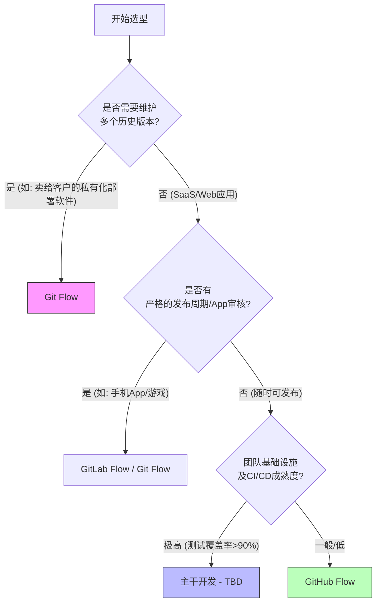

## 0. 权衡模型

在软件工程中，分支策略的选择本质上是在 **研发速度 (Velocity)** 与 **发布稳定性 (Stability)** 之间寻找平衡点。

$$
\text{Delivery Efficiency} \approx \frac{\text{Automation Level}}{\text{Branch Complexity}} \times \text{Team Size}
$$

- **低复杂度**：流程少，合并快，依赖自动化测试兜底。
- **高复杂度**：流程多，人工确认环节多，适合低频发布。

---

## 1. 策略对比

从最简单到最复杂，主流分支策略有以下差异：

| 特性维度     | TBD            | GitHub Flow | GitLab Flow  | Git Flow       |
| :------- | :------------- | :---------- | :----------- | :------------- |
| **复杂度**  | ⭐              | ⭐⭐          | ⭐⭐⭐          | ⭐⭐⭐⭐⭐          |
| **发布频率** | 随时 (每日多次)      | 随时 (每日多次)   | 偶尔 (每周/每冲刺)  | 严格版本号 (每月/每季度) |
| **前置条件** | 极强的自动化测试、特性开关  | 基础 CI/CD    | 多环境部署需求      | 人工 QA 介入深      |
| **回滚成本** | 低              | 中           | 中            | 高              |
| **适用场景** | 互联网大厂、SaaS、微服务 | 开源项目、初创团队   | 企业级应用、ToB 交付 | 传统软件、手机 App    |

---

## 2. 选型决策路径

使用 Mermaid 流程图来辅助团队进行策略选型：



---

## 3. 实操场景与代码演示

### 场景一：TBD

**背景**：一个高频迭代的后端微服务，有完善的单元测试。
**操作**：直接在 `main` 上开发，或者极短命的 Feature 分支（不超过 24 小时）。

```bash
# 1. 拉取最新代码
git checkout main
git pull origin main

# 2. 本地开发（配合 Feature Flag 隐藏未完成功能）
# 代码中：if (FLAGS.new_payment_method) { … }

# 3. 直接提交或快速 PR
git commit -m "feat: add payment logic behind flag"
git push origin main
# 触发 CI 流水线 -> 自动部署到生产环境
```

### 场景二：Git Flow

**背景**：一个每个月发版的 iOS App，需要经过 Apple 审核，且需要同时修复线上 V1.0 的 Bug 并开发 V2.0 的功能。
**操作**：严格区分开发、发布和修补分支。

```bash
# 1. 开始开发新功能
git checkout -b feature/login-v2 develop

# 2. 准备发布 (Code Freeze)
git checkout -b release/1.2.0 develop
# 修改版本号，修复最后几个 Bug，严禁加新功能

# 3. 正式发布
git checkout main
git merge release/1.2.0
git tag -a v1.2.0 -m "Version 1.2.0"

# 4. 同步回开发分支
git checkout develop
git merge release/1.2.0
```

---

## 4. 复杂度演进

不要为了规范而规范，应根据团队规模和项目阶段动态调整：

1. **初创期 (1-5 人)**：**GitHub Flow**。
	- *理由*：没人有空管复杂的 Git 操作，简单最重要。
2. **成长期 (5-20 人)**：**GitLab Flow**。
	- *理由*：开始有了测试环境 (UAT)、预生产环境 (Staging)，需要分支对应环境。
3. **成熟期 (20 人 + 或 强工程文化)**：**TBD**。
	- *理由*：合并冲突成为主要瓶颈，必须消除长分支，利用技术手段（如特性开关）解耦部署与发布。
4. **特殊期 (传统交付)**：**Git Flow**。
	- *理由*：必须维护 v1.0, v2.0, v3.0 同时在线，无法强制用户升级。

---

## 5. 常见错误

在选择策略时，务必规避以下几点：

- **长寿分支 (Long-Lived Branches)**：
	- *现象*：一个分支开发了两周还没合并。
	- *后果*：代码冲突解决时间超过开发时间。
- **环境依赖分支 (Branch per Environment)**：
	- *现象*：严格的 `dev` -> `test` -> `prod` 分支级联，代码必须一级级合并。
	- *后果*：想把 `test` 里的一个急修 Bug 发到 `prod`，却夹带了未测试的新功能。**（推荐使用 Cherry-pick 或 特性开关解决）**
- **过度保护**：
	- *现象*：小团队使用 Git Flow，每次发布都要搞 release 分支、打 tag、双向 merge。
	- *后果*：发布仪式感太重，导致大家都不想发布，堆积代码，风险反而增加。
