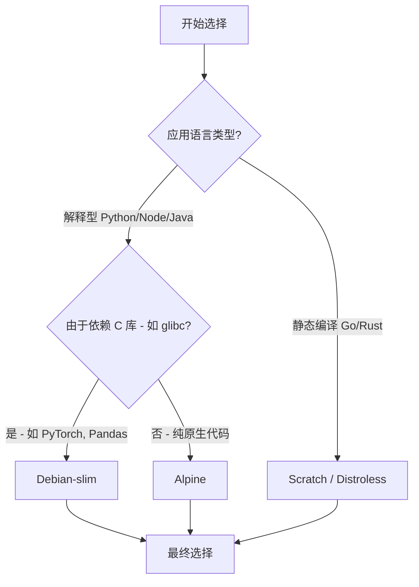

## 0. 维度

选择基础镜像就像盖房子选地基。地基选错了，上层建筑再精美也可能因为兼容性问题倒塌，或者因为体积过大导致部署缓慢。

评估一个基础镜像主要看三个核心指标：

1. **体积**：直接影响传输速度和存储成本。
2. **安全性**：包含的软件越少，攻击面越小（CVE 漏洞越少）。
3. **兼容性**：是否包含标准 C 库 (glibc) 和常用工具。

---

## 1. 常见镜像类型

市面上的镜像主要分为以下五个流派，按体积从大到小排列：

| 类型             | 典型标签                  | 约数大小    | 适用场景              | 优点                  | 缺点                    |
| :------------- | :-------------------- | :------ | :---------------- | :------------------ | :-------------------- |
| **全功能版**       | `ubuntu`, `debian`    | > 100MB | 开发环境、需要大量调试工具     | 兼容性无敌，工具齐全          | 体积臃肿，漏洞潜在多            |
| **精简版**        | `-slim`               | < 50MB  | **大多数生产环境推荐**     | 去除了文档/非必要包，保留 glibc | 缺少部分调试工具              |
| **Alpine**     | `-alpine`             | 5MB     | 微服务、极度追求轻量        | 极致小巧，安全             | 使用 **musl libc**，兼容性差 |
| **Distroless** | `gcr.io/distroless/*` | 20MB    | 高安全需求企业           | 只有运行时，无 Shell，极安全   | **无法进入容器调试**          |
| **Scratch**    | `scratch`             | 0MB     | 静态编译语言 (Go, Rust) | 空白镜像，只放二进制文件        | 需要完全静态编译              |

---

## 2. 决策流程

如果不确定选哪个，请遵循以下决策树：



---

## 3. Alpine 的陷阱

很多新手盲目追求 `alpine` 的 5MB 体积，结果在 Python 或 Node.js 项目中踩了坑。

**核心冲突：glibc vs musl**
- **标准 Linux (Debian/CentOS)** 使用 `glibc` 作为标准 C 库。
- **Alpine** 使用 `musl libc`，它轻量但并非 100% 兼容 glibc。

**错误场景**：正在构建一个 Python 数据科学应用（依赖 numpy, pandas）。
- **使用 Slim**：pip 下载预编译好的 `whl` 包（基于 glibc），安装只需几秒。
- **使用 Alpine**：pip 发现预编译包不兼容 musl，开始**下载源代码并在本地编译**。这需要安装 gcc，编译过程可能持续数十分钟，最终生成的镜像体积反而比 Slim 还大。

**代码对比**：

```dockerfile
# 错误示范：为了省 20MB 空间，导致构建时间增加 10 分钟
FROM python:3.9-alpine
RUN apk add --no-cache build-base  # 被迫安装编译器
RUN pip install pandas             # 开始漫长的本地编译

# 正确示范：直接使用兼容性好的 Slim 版
FROM python:3.9-slim
RUN pip install pandas             # 秒级安装，直接使用 binary wheel
```

---

## 4. 最佳实践

### 场景 A：Node.js / Python Web 应用

**推荐**：`debian-slim` (如 `node:18-slim`, `python:3.10-slim`)

**理由**：这是体积与兼容性的最佳平衡点。它保留了 glibc，避免了复杂的编译问题，同时去除了 man page 等无用文件。

### 场景 B：Golang / Rust 后端服务

**推荐**：`alpine` 或 `scratch`

**理由**：Go 程序编译后是独立的二进制文件，几乎不依赖系统库。

```dockerfile
# 多阶段构建
FROM golang:1.19 AS builder
# … 编译出 app …

# 运行阶段
FROM alpine:latest
# 安装 ca-certificates 以支持 HTTPS 请求
RUN apk --no-cache add ca-certificates
COPY --from=builder /app /app
CMD ["/app"]
```

### 场景 C：高安全级别的金融/支付业务

**推荐**：`Distroless` (Google 推出)

**理由**：在这个镜像里，甚至连 `ls`, `cd`, `sh` 这些命令都没有。黑客即使利用漏洞攻破了应用，也没法在容器里执行命令。

---

## 5. 版本标签规范

在 Dockerfile 中写 `FROM` 指令时，**严禁使用 `latest`**。

| 标签写法                | 安全性 | 稳定性 | 评价                                    |
| :------------------ | :-- | :-- | :------------------------------------ |
| `node:latest`       | 低   | 极差  | **禁止**。今天构建是 v18，明天可能变成 v20，直接搞挂生产环境。 |
| `node:18`           | 中   | 一般  | 不推荐。大版本锁定了，但小版本变动可能引入不兼容。             |
| `node:18.16.0-slim` | 高   | 极佳  | **推荐**。锁死了具体版本和操作系统变种，确保 " 昨天能跑，今天也能跑 "。 |

>**操作系统代号**：有时会看到 `bullseye`, `bookworm`, `buster`。这些是 Debian 的版本代号。如果软件对系统底层依赖极高，建议显式指定：`python:3.9-slim-bullseye`。
