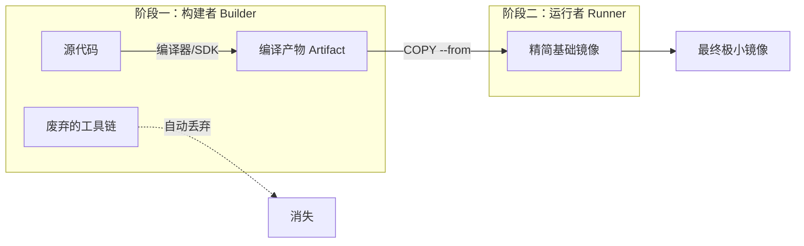

## 0. 机制

多阶段构建（Multi-stage Builds）是 Docker 镜像瘦身的重要方法。

它的核心理念是将**构建环境**（Build）与**运行环境**（Run）彻底分离。

- **构建环境**：需要安装编译器、SDK、源代码、构建工具（如 Maven, Node.js, GCC）。体积通常巨大。
- **运行环境**：只需要能够运行程序的最小库（Runtime）和编译后的二进制文件/静态文件。体积极小。

在多阶段构建中，我们使用前一个阶段生产半成品，然后只把成品复制到下一个阶段，把所有废料（源代码、编译器）留在上一个阶段丢弃。



---

## 1. 语法标准

关键在于在同一个 Dockerfile 中使用多个 `FROM` 指令。

- `AS <name>`：给当前阶段起个别名，方便后面引用。
- `COPY --from=<name>`：从指定阶段复制文件，而不是从本地上下文复制。

```dockerfile
# --- 阶段 1：编译环境 ---
# 使用别名 "builder"
FROM golang:1.19 AS builder
WORKDIR /src
COPY . .
# 这一步会产生一个二进制文件 my-app，但也包含了几百 MB 的 Go SDK
RUN go build -o my-app main.go

# --- 阶段 2：生产环境 ---
# 重新开始一个新的镜像层，之前的层会被丢弃
FROM alpine:latest
WORKDIR /root/
# 关键：只从 builder 阶段把 my-app 拿过来
COPY --from=builder /src/my-app .
CMD ["./my-app"]
```

---

## 2. 效果对比

为什么它是生产环境的标准配置？通过对比可以看出巨大差异。

**场景**：构建一个简单的 Go Web 服务。

| 构建方式      | 包含内容                        | 镜像大小        | 安全性          |
| :-------- | :-------------------------- | :---------- | :----------- |
| **传统构建**  | 源代码 + Go 编译器 + 中间文件 + 二进制程序 | **800 MB+** | 差 (源码泄露风险)   |
| **多阶段构建** | 仅二进制程序 + 最小 Linux 内核        | **10 MB**   | 优 (无源码，攻击面小) |

---

## 3. 实战场景演练

### 场景 A：前端项目 (Vue/React -> Nginx)

这是 Web 开发中最经典的场景。我们需要 Node.js 环境来打包代码（生成 HTML/CSS/JS），但线上运行只需要一个 Nginx 服务器。

```dockerfile
# --- Stage 1: Build (Node.js) ---
FROM node:18 AS build-stage
WORKDIR /app
COPY package*.json ./
RUN npm install
COPY . .
# 生成 dist 目录
RUN npm run build

# --- Stage 2: Serve (Nginx) ---
FROM nginx:stable-alpine AS production-stage
# 从上一阶段复制构建好的静态文件到 Nginx 目录
COPY --from=build-stage /app/dist /usr/share/nginx/html
# 暴露端口
EXPOSE 80
CMD ["nginx", "-g", "daemon off;"]
```

### 场景 B：Java 项目 (Maven -> JRE)

Java 开发通常需要庞大的 Maven 或 Gradle 环境，但运行只需要 JRE（Java Runtime Environment）。

```dockerfile
# --- Stage 1: Build (Maven) ---
FROM maven:3.8-openjdk-17 AS builder
WORKDIR /project
COPY . .
# 编译打包，跳过测试
RUN mvn clean package -DskipTests

# --- Stage 2: Run (JRE) ---
# 使用 distroless 或 slim 版 JRE，体积大幅减小
FROM openjdk:17-jdk-slim
WORKDIR /app
# 复制 jar 包
COPY --from=builder /project/target/my-app.jar app.jar
CMD ["java", "-jar", "app.jar"]
```

---

## 4. 调试与进阶技巧

### 停留在特定阶段

在开发调试时可能不想构建最终镜像，而是想看看编译阶段到底生成了什么文件，或者在编译环境里排查错误。可以使用 `--target` 参数指定构建目标。

```bash
# 只构建到 builder 阶段就停止（不执行后面的 FROM）
docker build --target builder -t my-app-debug .
```

### 从外部镜像复制

`COPY --from` 不仅可以引用 Dockerfile 里的阶段，还可以直接引用**外部存在的镜像**。

**场景**：需要 Nginx 的默认配置文件，但不想自己手写。

```dockerfile
FROM alpine
# 直接从官方 nginx 镜像里把配置文件“偷”出来
COPY --from=nginx:latest /etc/nginx/nginx.conf /etc/nginx/nginx.conf
```
