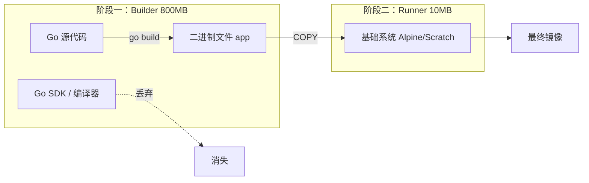

## 0. 机制

Go 语言与 Java、Python 最大的不同在于它是一门**编译型语言**。这意味着 Go 代码可以直接编译成一个**静态二进制文件**。

**Docker 构建优势**：

1. **极小体积**：不需要安装 Python 解释器或 Node.js 运行时，只需要一个二进制文件。
2. **安全性高**：运行环境中不包含源代码，黑客拿到了容器也看不到代码逻辑。
3. **多阶段构建**：是 Go 语言的标配，将 " 编译环境 " 和 " 运行环境 " 彻底分离。



---

## 1. 环境准备

我们需要一个最简单的 HTTP 服务来演示。

**目录结构**：

```text
my-go-app/
├── go.mod
├── go.sum
└── main.go
```

**main.go**:

```go
package main

import (
	"fmt"
	"net/http"
	"os"
)

func main() {
	http.HandleFunc("/", func(w http.ResponseWriter, r *http.Request) {
		hostname, _ := os.Hostname()
		fmt.Fprintf(w, "Hello from Go! Host: %s\n", hostname)
	})

	fmt.Println("Server starting on :8080")
	http.ListenAndServe(":8080", nil)
}
```

---

## 2. 反面教材

新手常犯的错误是将 Go 当作脚本语言来处理，把源代码和编译器都打包进了最终镜像。

**Dockerfile.bad**:

```dockerfile
# 问题1：基础镜像巨大 (golang:1.21 约 800MB)
FROM golang:1.21

WORKDIR /app

# 问题2：源代码泄露，且每次构建都要重新下载依赖
COPY . .
RUN go mod download

# 问题3：直接用 go run 运行，浪费内存且启动慢
CMD ["go", "run", "main.go"]
```

---

## 3. 多阶段构建

使用 `AS` 语法将构建过程分离。利用 Alpine 作为运行底座，体积通常在 15MB 左右。

**Dockerfile.better**:

```dockerfile
# --- 阶段 1: 编译 ---
FROM golang:1.21-alpine AS builder

WORKDIR /app

# 优化：利用缓存层
# 只有 go.mod 变了才重新下载依赖
COPY go.mod go.sum ./
# download 依赖到本地缓存
RUN go mod download

COPY . .
# 编译二进制文件
# -o main: 指定输出文件名
RUN go build -o main .

# --- 阶段 2: 运行 ---
FROM alpine:latest

WORKDIR /root/

# 关键：只从 builder 阶段拿走二进制文件
COPY --from=builder /app/main .

EXPOSE 8080
CMD ["./main"]
```

---

## 4. Scratch 镜像

Go 的静态链接特性允许我们在一个**完全为空**的镜像（Scratch）中运行。这能将镜像压缩到**几 MB**（仅包含二进制文件大小）。

**前置条件：CGO 与 静态链接**

默认情况下，Go 可能会依赖系统 C 库（glibc）。Scratch 镜像里没有 C 库，直接运行会报错 `no such file or directory`。必须在编译时关闭 CGO。

**Dockerfile.pro**:

```dockerfile
FROM golang:1.21-alpine AS builder

WORKDIR /app
COPY . .

# 关键编译参数：
# CGO_ENABLED=0: 禁用 CGO，确保生成纯静态二进制文件
# -ldflags="-s -w": 去除符号表和调试信息，减小体积
RUN CGO_ENABLED=0 GOOS=linux go build -ldflags="-s -w" -o main .

# 使用 scratch (空镜像)
FROM scratch

# 从 builder 复制编译好的文件
COPY --from=builder /app/main /main

EXPOSE 8080
CMD ["/main"]
```

---

## 5. 常见坑点

使用 `scratch` 或 `alpine` 虽然小，但缺了很多基础文件，会导致以下经典问题。

### 坑点 A：HTTPS 请求报错

- **现象**：程序发起 HTTPS 请求时报错 `x509: certificate signed by unknown authority`。
- **原因**：空镜像里没有 CA 根证书。
- **解决**：从 builder 阶段把证书拷过来。

### 坑点 B：时区问题

- **现象**：日志打印的时间差 8 小时（默认 UTC）。
- **原因**：空镜像里没有 `tzdata` 时区数据。
- **解决**：复制时区文件。

### 填坑后的最终模板

这是企业级 Go 项目的标准 Dockerfile 模板。

```dockerfile
# --- Build Stage ---
FROM golang:1.21-alpine AS builder

# 安装 git (有些依赖需要 git 拉取)
RUN apk add --no-cache git

WORKDIR /src

# 1. 缓存依赖
COPY go.mod go.sum ./
RUN go mod download

# 2. 编译
COPY . .
# 编译静态二进制文件
RUN CGO_ENABLED=0 GOOS=linux go build -ldflags="-s -w" -o /app/server main.go

# --- Run Stage ---
# 推荐使用 alpine 而非 scratch，方便排查问题(有 sh)，体积只大 5MB
FROM alpine:latest

# 1. 安装基础依赖 (CA证书 + 时区)
RUN apk --no-cache add ca-certificates tzdata

# 2. 创建非 root 用户
RUN addgroup -S appgroup && adduser -S appuser -G appgroup

# 3. 复制二进制文件
WORKDIR /app
COPY --from=builder /app/server .

# 4. 权限设置
USER appuser

EXPOSE 8080
CMD ["./server"]
```

---

## 6. 构建命令与验证

```bash
# 构建镜像
docker build -t my-go-app:v1 .

# 启动容器
docker run -d -p 8080:8080 my-go-app:v1

# 验证体积
docker images | grep my-go-app
# 结果示例：
# my-go-app  v1   12MB   (如果用 golang 原生镜像则是 800MB+)
```
