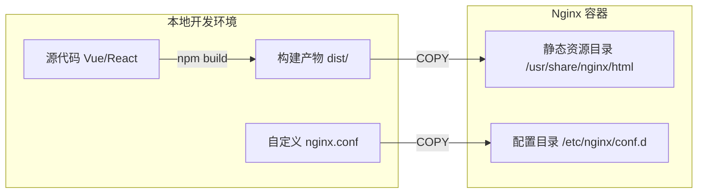

## 0. 场景

构建 Nginx 镜像通常服务于前端项目（Vue, React, Angular）的生产环境部署，或者是纯静态官网的托管。

**核心逻辑**：Nginx 容器本质上是一个 " 文件搬运工 "。我们将本地开发好的 HTML/CSS/JS 文件（通常是 `npm run build` 生成的 `dist` 目录）搬进容器的特定目录，替换掉 Nginx 默认的欢迎页面。



---

## 1. 环境准备

假设我们有一个简单的静态网站项目，或者是一个 Vue 项目打包后的产物。

**目录结构**：

```text
my-static-site/
├── dist/                # 存放 HTML/CSS/JS 的目录
│   ├── index.html
│   └── css/
│       └── style.css
├── nginx.conf           # 自定义配置文件
└── Dockerfile
```

**index.html**：

```html
<h1>Hello Docker!</h1>
```

---

## 2. 基础构建

这是最简单的模式，直接把文件丢进去，使用 Nginx 的默认配置。

**Dockerfile**：

```dockerfile
# 1. 选型：使用 alpine 版本，体积仅约 20MB
FROM nginx:alpine

# 2. 部署：将本地 dist 目录下的所有文件，复制到 Nginx 默认的静态资源路径
# 注意：原有目录下的 index.html 会被覆盖
COPY dist/ /usr/share/nginx/html

# 3. 暴露端口 (仅文档作用，默认就是 80)
EXPOSE 80

# 4. 启动：官方镜像已包含 CMD，通常不需要手动写，除非有特殊需求
```

---

## 3. 自定义配置 (SPA 路由支持)

现代前端框架（Single Page Application）在生产环境最常遇到的问题是：**刷新页面报 404**。

这是因为 Nginx 默认不知道 `/user/profile` 这种路由应该指向 `index.html`。我们需要覆盖默认配置。

**nginx.conf (标准 SPA 模板)**：

```nginx
server {
    listen       80;
    server_name  localhost;

    # 开启 Gzip 压缩，加速传输
    gzip on;
    gzip_types text/plain application/javascript text/css;

    location / {
        root   /usr/share/nginx/html;
        index  index.html index.htm;
        
        # 核心关键点：如果找不到文件，就回退给 index.html
        # 让前端路由接管页面渲染
        try_files $uri $uri/ /index.html;
    }

    # 错误页面处理
    error_page   500 502 503 504  /50x.html;
    location = /50x.html {
        root   /usr/share/nginx/html;
    }
}
```

**Dockerfile**：

```dockerfile
FROM nginx:alpine

# 1. 调整时区 (可选，方便看日志)
RUN apk add --no-cache tzdata \
    && cp /usr/share/zoneinfo/Asia/Shanghai /etc/localtime

# 2. 删除 Nginx 默认的配置文件 (default.conf)
RUN rm /etc/nginx/conf.d/default.conf

# 3. 复制我们自定义的配置文件
COPY nginx.conf /etc/nginx/conf.d/my-site.conf

# 4. 复制静态资源
COPY dist/ /usr/share/nginx/html

# 5. 确保 Nginx在前台运行 (Daemon Off)
# 虽然官方镜像默认就是这个，但显式写出来有助于理解容器原理
CMD ["nginx", "-g", "daemon off;"]
```

---

## 4. 动态配置 (envsubst)

**场景**：前端代码打包好了，但后端 API 地址 (`API_URL`) 在测试环境和生产环境不一样。我们不想为了改一个 URL 就重新打包镜像。

**解决方案**：利用 Docker 启动时的环境变量，动态修改 `nginx.conf`。

**步骤 1：修改 nginx.conf 模板**
- 使用 `${API_URL}` 占位符。

```nginx
location /api {
    proxy_pass ${API_URL};
}
```

**步骤 2：修改 Dockerfile**
- 使用 `envsubst` 命令在容器启动时替换变量。

```dockerfile
FROM nginx:alpine

COPY nginx.conf /etc/nginx/conf.d/default.template
COPY dist/ /usr/share/nginx/html

# 启动脚本：先替换变量，生成最终配置，再启动 nginx
CMD envsubst '${API_URL}' < /etc/nginx/conf.d/default.template > /etc/nginx/conf.d/default.conf && nginx -g 'daemon off;'
```

**步骤 3：启动时传参**

```bash
docker run -d -p 80:80 -e API_URL=http://backend:8080 my-website
```

---

## 5. 常见坑点排查

| 现象                 | 原因                | 解决方案                                                                        |
| :----------------- | :---------------- | :-------------------------------------------------------------------------- |
| 容器启动后立即退出          | Nginx 在后台运行了      | 确保 CMD 中包含 `daemon off;`                                                    |
| Vue/React 路由刷新 404 | 缺少 `try_files` 配置 | 修改 `nginx.conf` 添加 `try_files $uri $uri/ /index.html;`                      |
| 403 Forbidden      | 文件权限不足            | 确保宿主机 dist 目录有读取权限，或在 Dockerfile 中 `RUN chmod -R 755 /usr/share/nginx/html` |
| 修改配置不生效            | 配置文件没放对位置         | 确认是用 `COPY` 覆盖了 `/etc/nginx/conf.d/default.conf` 还是新建了文件                    |

---

## 6. 操作命令速查

```bash
# 1. 构建镜像
docker build -t my-web:v1 .

# 2. 启动容器 (映射本地 8080 到容器 80)
docker run -d --name web -p 8080:80 my-web:v1

# 3. 验证
# 浏览器访问 http://localhost:8080
```
